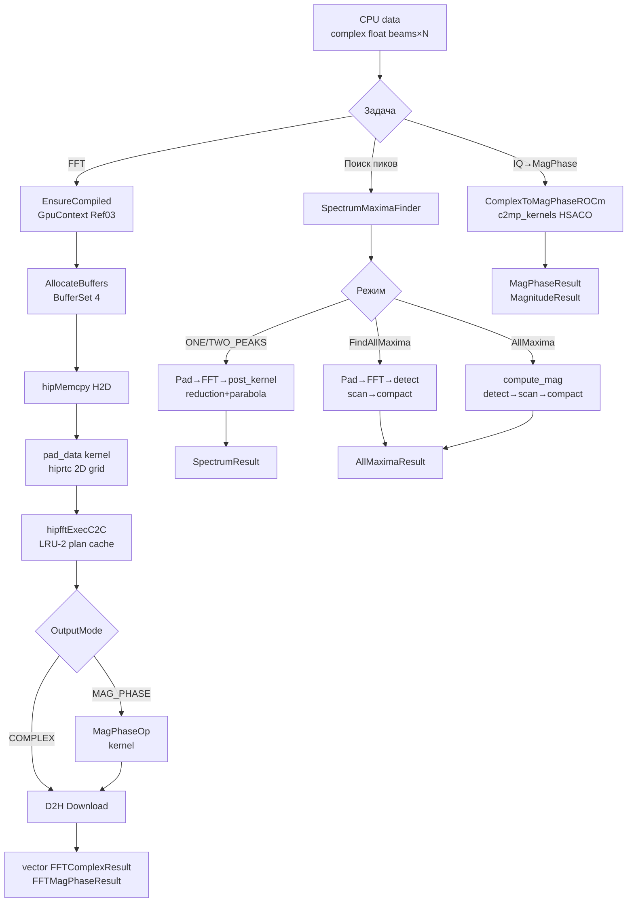
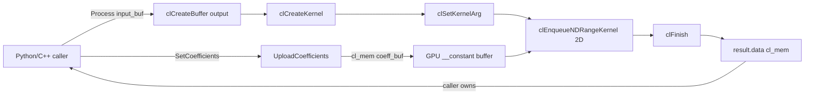
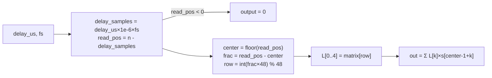

# Spectrum — Full (объединённый: FFT + Filters + LCH Farrow)

> Репо `spectrum` объединяет три компонента из DSP-GPU: **fft_func** (БПФ-пайплайн), **filters** (FIR/IIR/адаптивные) и **lch_farrow** (LCH + Farrow дробная задержка).

---

## Компонент: FFT Pipeline


> Объединённый GPU-модуль: пакетное FFT + поиск максимумов спектра

**Namespace**: `fft_processor` (FFT-классы) + `antenna_fft` (SpectrumMaximaFinder)
**Каталог**: `spectrum/`
**Зависимости**: core (`IBackend*`), ROCm/hipFFT, hiprtc (ENABLE_ROCM=1, ветка `main`); OpenCL/clFFT только в ветке `nvidia`

---

#### Содержание

1. [Обзор и история](#1-обзор-и-история)
2. [Математика](#2-математика)
3. [Пошаговые pipeline'ы](#3-пошаговые-pipelines)
4. [Kernels](#4-kernels)
5. [Архитектура C4](#5-архитектура-c4)
6. [API (C++ и Python)](#6-api)
7. [Тесты](#7-тесты)
8. [Бенчмарки](#8-бенчмарки)
9. [Файловое дерево](#9-файловое-дерево)
10. [Важные нюансы](#10-важные-нюансы)

---

#### 1. Обзор и история

##### История: слияние двух модулей

Модуль `fft_func` появился в результате **слияния** двух независимых модулей:

| Исходный модуль | Статус | Что перешло в fft_func |
|-----------------|--------|------------------------|
| `fft_processor` | Упразднён | `FFTProcessorROCm`, `ComplexToMagPhaseROCm` |
| `fft_maxima` | Упразднён | `SpectrumMaximaFinder`, `SpectrumProcessorROCm`, `AllMaximaPipelineROCm` |

Старая документация сохранена в `Doc/Modules/~!/fft_processor/` и `Doc/Modules/~!/fft_maxima/` — только как исторический архив. Все пути к файлам, инклюдам и тестам изменились.

##### Назначение

`fft_func` — GPU-модуль для двух задач:

1. **FFT-обработка** (`FFTProcessorROCm`): пакетный 1D комплексный FFT для нескольких лучей с zero-padding. Возвращает спектр в трёх форматах: комплексный, mag+phase, mag+phase+частоты.

2. **Поиск максимумов** (`SpectrumMaximaFinder`): нахождение одного/двух/всех пиков в FFT-спектре с параболической интерполяцией и stream compaction.

3. **Вспомогательный** (`ComplexToMagPhaseROCm`): прямое преобразование IQ → амплитуда+фаза без FFT.

**Платформа**: ветка `main` — только ROCm/hipFFT (Linux, AMD GPU, RDNA4+ gfx1201+). Ветка `nvidia` — OpenCL/clFFT.

**Классы модуля**:

| Класс | Namespace | Назначение |
|-------|-----------|------------|
| `FFTProcessorROCm` | `fft_processor` | Пакетный FFT (hipFFT + hiprtc) |
| `ComplexToMagPhaseROCm` | `fft_processor` | IQ → mag+phase без FFT |
| `SpectrumMaximaFinder` | `antenna_fft` | Поиск пиков: 1/2/все максимумы |
| `SpectrumProcessorROCm` | `antenna_fft` | ROCm реализация ISpectrumProcessor |
| `AllMaximaPipelineROCm` | `antenna_fft` | Detect+Scan+Compact pipeline (ROCm) |
| `SpectrumProcessorFactory` | `antenna_fft` | Фабрика процессоров по BackendType |

---

#### 2. Математика

##### 2.1 DFT

$$
X[k] = \sum_{n=0}^{N-1} x[n] \cdot e^{-j 2\pi k n / N}, \quad k = 0, 1, \ldots, N-1
$$

где $N = \text{nFFT}$, $x[n]$ — zero-padded вход. hipFFT реализует 1D C2C FFT по алгоритму Cooley–Tukey (radix-2/4/8).

##### 2.2 Zero-padding

$$
\text{nFFT} = \text{nextPow2}(n\_point) \times \text{repeat\_count}
$$

$$
\tilde{x}[n] = \begin{cases} x[n], & 0 \le n < n\_point \\ 0, & n\_point \le n < \text{nFFT} \end{cases}
$$

Пример: `n_point=1000`, `repeat_count=2` → `nFFT = 1024 × 2 = 2048`.

##### 2.3 Частота бина

$$
f_k = k \cdot \frac{f_s}{\text{nFFT}}, \quad k = 0, 1, \ldots, \text{nFFT}-1
$$

##### 2.4 Амплитуда и фаза

$$
|X[k]| = \sqrt{\operatorname{Re}(X[k])^2 + \operatorname{Im}(X[k])^2}
$$

$$
\angle X[k] = \operatorname{atan2}\!\big(\operatorname{Im}(X[k]),\; \operatorname{Re}(X[k])\big)
$$

GPU: `__fsqrt_rn(re*re + im*im)` (fast sqrt intrinsic), `atan2f(im, re)`.

##### 2.5 Нормализация

hipFFT возвращает **ненормализованный** FFT — без деления на $N$. Для физической амплитуды:

$$|X_{\text{norm}}[k]| = \frac{|X[k]|}{N}$$

`FFTMagPhaseResult.phase` — в **радианах** (диапазон [-π, π]).

##### 2.6 Параболическая интерполяция (SpectrumMaximaFinder)

Для пика на бине $k$:

$$y_L = |FFT[k-1]|, \quad y_C = |FFT[k]|, \quad y_R = |FFT[k+1]|$$

$$\delta = \frac{1}{2} \cdot \frac{y_L - y_R}{y_L - 2y_C + y_R}, \quad \delta \in [-0.5,\; +0.5]$$

$$f_{refined} = (k + \delta) \cdot \frac{f_s}{N_{FFT}}$$

**Применяется только к peak[0]** (главному пику). Остальные пики: $f = k \cdot f_s / N_{FFT}$.

`MaxValue.phase` — в **градусах** (не радианах!). Это важное отличие от `FFTMagPhaseResult.phase`.

##### 2.7 Условие локального максимума (AllMaxima)

$$\text{isMax}(i) = \begin{cases} 1 & \text{если } m_i > m_{i-1} \text{ и } m_i > m_{i+1} \\ 0 & \text{иначе} \end{cases}$$

##### 2.8 Blelloch Exclusive Scan

Scan превращает массив флагов $[0, 1, 1, 0, 1, ...]$ в массив позиций $[0, 0, 1, 2, 2, ...]$:

- **Up-sweep** (reduce): $O(\log N)$ шагов, суммирование снизу вверх
- **Down-sweep**: $O(\log N)$ шагов, распространение префикса
- Итог: каждый максимум пишет результат в уникальную позицию, без race conditions

##### 2.9 Точность float32

| nFFT | log₂(N) стадий | Ожидаемая ошибка | Порог в тестах |
|------|----------------|-----------------|----------------|
| 1024 | 10 | < 1e-4 (relative) | 1e-4 |
| 4096 | 12 | < 1e-4 (relative) | 1e-4 |
| MagPhase (fast intrinsics) | — | < 1e-2 | 1e-2 |

---

#### 3. Пошаговые pipeline'ы

##### 3.1 FFTProcessorROCm — пакетный FFT

```
INPUT: CPU vector<complex<float>>[beam_count × n_point]
    │
    ▼
┌────────────────────────────────────────────────┐
│ 1. EnsureCompiled (lazy, one-time)             │  hiprtc: pad_data + complex_to_mag_phase
│    GpuContext per-module (Ref03 Layer 1)       │
└────────────────────────────────────────────────┘
    │
    ▼
┌────────────────────────────────────────────────┐
│ 2. AllocateBuffers (reuse if same size)        │  BufferSet<4>: input/fft_input/output/magphase
└────────────────────────────────────────────────┘
    │
    ▼
┌────────────────────────────────────────────────┐
│ 3. hipMemcpy H2D (Upload)                      │  CPU → kInputBuf
│   (пропускается при GPU-input overload)        │
└────────────────────────────────────────────────┘
    │
    ▼
┌────────────────────────────────────────────────┐
│ 4. pad_data kernel (hiprtc, PadDataOp)         │  kInputBuf → kFftInput
│    2D grid: (ceil(nFFT/256), beam_count)       │  n_point → nFFT, нули сверху
└────────────────────────────────────────────────┘
    │
    ▼
┌────────────────────────────────────────────────┐
│ 5. hipfftExecC2C (HIPFFT_FORWARD)              │  kFftInput → kFftOutput
│    LRU-2 plan cache                            │  batch FFT: beam_count планов
└────────────────────────────────────────────────┘
    │
    ├── если MAGNITUDE_PHASE / MAGNITUDE_PHASE_FREQ:
    ▼
┌────────────────────────────────────────────────┐
│ 6. complex_to_mag_phase kernel (MagPhaseOp)    │  kFftOutput → kMagPhaseInterleaved
│    interleaved: out[i].x=mag, out[i].y=phase  │  __fsqrt_rn, atan2f
└────────────────────────────────────────────────┘
    │
    ▼
┌────────────────────────────────────────────────┐
│ 7. hipMemcpy D2H (Download)                    │  GPU → CPU, repack per-beam
└────────────────────────────────────────────────┘
    │
    ▼
OUTPUT: vector<FFTComplexResult> или vector<FFTMagPhaseResult>
```

##### 3.2 ComplexToMagPhaseROCm — без FFT

```
INPUT: CPU/GPU complex<float>[beam_count × n_point]
    │
    ▼
┌────────────────────────────────────────────────┐
│ 1. Upload (если CPU)   или CopyGpuData (GPU→GPU)│
└────────────────────────────────────────────────┘
    │
    ▼
┌────────────────────────────────────────────────┐
│ 2. complex_to_mag_phase / complex_to_magnitude │  per-element: |z|, atan2
│    hiprtc kernel (c2mp_kernels HSACO)          │  norm_coeff контролирует нормализацию
└────────────────────────────────────────────────┘
    │
    ├── Process()      → D2H → CPU vector<MagPhaseResult> / vector<MagnitudeResult>
    └── ProcessToGPU() → возвращает void* GPU (CALLER OWNS!)
```

##### 3.3 SpectrumMaximaFinder: Process (ONE_PEAK / TWO_PEAKS)

```
INPUT: flat complex<float>[antennas × n_point]
    │
    ▼
┌────────────────────────────────────────────────┐
│ 1. PrepareParams                               │  nFFT = nextPow2(n_point) × repeat_count
│    search_range = nFFT/4 (если 0)             │
└────────────────────────────────────────────────┘
    │
    ▼
┌────────────────────────────────────────────────┐
│ 2. Upload / CopyGpuData                        │  CPU/GPU → input_buffer_
└────────────────────────────────────────────────┘
    │
    ▼
┌────────────────────────────────────────────────┐
│ 3. pad kernel (hiprtc)                         │  n_point → nFFT (zero-padding)
└────────────────────────────────────────────────┘
    │
    ▼
┌────────────────────────────────────────────────┐
│ 4. hipfftExecC2C (HIPFFT_FORWARD)              │  fft_input → fft_output
└────────────────────────────────────────────────┘
    │
    ▼
┌────────────────────────────────────────────────┐
│ 5. post_kernel (ONE_PEAK/TWO_PEAKS)            │  256 WI/луч, reduction → top-N пиков
│    параболическая интерполяция для peak[0]    │
└────────────────────────────────────────────────┘
    │
    ▼
┌────────────────────────────────────────────────┐
│ 6. ReadResults D2H                             │  → vector<SpectrumResult>[antennas]
└────────────────────────────────────────────────┘
```

##### 3.4 SpectrumMaximaFinder: FindAllMaxima (все пики из сырого сигнала)

```
INPUT: flat complex<float>[antennas × n_point]
    │
    ▼
┌────────────────────────────────────────────────┐
│ 1. Pad → hipFFT → compute_magnitudes           │  fft_output → |FFT[i]|
└────────────────────────────────────────────────┘
    │
    ▼
┌────────────────────────────────────────────────┐
│ 2. detect_all_maxima                           │  flags[i] = mag[i]>mag[i-1] && mag[i]>mag[i+1]
│    2D NDRange: global=(nFFT, beam_count)       │  диапазон [search_start, search_end)
└────────────────────────────────────────────────┘
    │
    ▼
┌────────────────────────────────────────────────┐
│ 3. Blelloch Exclusive Scan (block_scan+add)    │  флаги → позиции (без race conditions)
│    BLOCK_SIZE=512, LDS +1 padding              │
└────────────────────────────────────────────────┘
    │
    ▼
┌────────────────────────────────────────────────┐
│ 4. compact_maxima                              │  пишет MaxValue в уникальную позицию
└────────────────────────────────────────────────┘
    │
    ▼
AllMaximaResult (CPU или GPU буферы)
```

##### 3.5 SpectrumMaximaFinder: AllMaxima (из готового FFT-спектра)

```
INPUT: FFT-спектр complex<float>[beams × nFFT]    ← n_point = nFFT !
    │
    ▼
┌────────────────────────────────────────────────┐
│ compute_magnitudes kernel                      │  |FFT[i]| (отдельный kernel, без FFT)
└────────────────────────────────────────────────┘
    │
    ▼
detect → scan → compact (те же шаги 2-4)
```

##### Диаграмма (mermaid)



---

#### 4. Kernels

##### 4.1 pad_data (hiprtc, FFTProcessorROCm)

**Файл**: `include/kernels/fft_processor_kernels_rocm.hpp` (`GetHIPKernelSource()`)
**HSACO cache**: `kernels/bin/FFTProc_kernels_rocm.hsaco`

Zero-padding входных данных перед hipFFT. 2D grid: `blockIdx.y = beam_id` — без операций div/mod.

```hip
__launch_bounds__(256)
__global__ void pad_data(
    const float2* __restrict__ in,
    float2* __restrict__ out,
    int n_point, int nFFT)
{
    int beam = blockIdx.y;
    int k    = blockIdx.x * blockDim.x + threadIdx.x;
    if (k >= nFFT) return;
    out[beam * nFFT + k] = (k < n_point) ? in[beam * n_point + k] : make_float2(0.0f, 0.0f);
}
```

**Grid**: `dim3(ceil(nFFT/256), beam_count)`. blockDim = 256.

##### 4.2 complex_to_mag_phase (hiprtc, FFTProcessorROCm + ComplexToMagPhaseROCm)

**Файл**: `include/kernels/fft_processor_kernels_rocm.hpp` + `include/kernels/complex_to_mag_phase_kernels_rocm.hpp`
**HSACO**: `kernels/bin/FFTProc_kernels_rocm.hsaco` (FFTProcessorROCm) и `kernels/bin/c2mp_kernels_rocm.hsaco` (ComplexToMagPhaseROCm — отдельный)

```hip
__launch_bounds__(256)
__global__ void complex_to_mag_phase(
    const float2* __restrict__ in,
    float2* __restrict__ out,
    int total)
{
    int i = blockIdx.x * blockDim.x + threadIdx.x;
    if (i >= total) return;
    float re = in[i].x, im = in[i].y;
    out[i].x = __fsqrt_rn(re * re + im * im);  // fast sqrt intrinsic
    out[i].y = atan2f(im, re);                  // phase [radians]
}
```

**Interleaved layout**: `out[i].x = magnitude`, `out[i].y = phase` (радианы).

##### 4.3 Kernels SpectrumProcessorROCm

**Файл**: `include/kernels/fft_kernel_sources_rocm.hpp`
**HSACO**: `kernels/bin/spectrum_kernels_rocm.hsaco`

Три кернела в одном hiprtc-модуле:

| Kernel | Назначение |
|--------|-----------|
| `pad_data` | Zero-padding n_point → nFFT (такой же как в 4.1) |
| `compute_magnitudes` | `|FFT[i]|` → magnitudes_buffer |
| `post_kernel` | ONE_PEAK/TWO_PEAKS: reduction (256 WI/луч) + параболическая интерполяция |

**post_kernel**: один work-group на луч, 256 потоков, local memory reduction:
- Стадия 1: 256 WI — каждый находит локальный максимум в диапазоне `[0, search_range)`
- Стадия 2: Thread 0 — top-N пиков последовательно (удаляет найденные)
- Стадия 3: Thread 0 — записывает MaxValue[] с параболической интерполяцией для peak[0]

##### 4.4 AllMaxima pipeline kernels

**Файл**: `include/kernels/all_maxima_kernel_sources_rocm.hpp`
**HSACO**: `kernels/bin/all_maxima_kernels_rocm.hsaco`

| Kernel | Назначение |
|--------|-----------|
| `detect_all_maxima` | 2D NDRange `global=(nFFT, beam_count)`: флаги локальных максимумов |
| `block_scan` | Blelloch up-sweep+down-sweep, LDS +1 padding против bank conflicts |
| `block_add` | Добавление сумм предыдущих блоков |
| `compact_maxima` | Stream compaction: пишет MaxValue по позиции из scan |

**BLOCK_SIZE = 512** (2 × LOCAL_SIZE=256). LDS: `(BLOCK_SIZE+1)*sizeof(uint32_t)` — +1 для устранения bank conflicts.

`compact_maxima` заполняет `MaxValue`: index, real, imag, magnitude, **phase в градусах**, refined_frequency (без параболической интерполяции — `index × fs/nFFT`).

##### 4.5 Op-классы — Ref03 Layer 5

Все HIP-ядра оборачиваются в Op-классы (наследники `drv_gpu_lib::GpuKernelOp`). Каждый Op — отдельный заголовочный файл в `include/operations/`, один ответственный за один kernel.

| Op-класс | Namespace | Файл | Kernel | Используется в |
|----------|-----------|------|--------|----------------|
| `PadDataOp` | `fft_processor` | `pad_data_op.hpp` | `pad_data` (2D grid) | `FFTProcessorROCm` |
| `MagPhaseOp` | `fft_processor` | `mag_phase_op.hpp` | `complex_to_mag_phase` (interleaved) | `FFTProcessorROCm`, `ComplexToMagPhaseROCm` |
| `MagnitudeOp` | `fft_processor` | `magnitude_op.hpp` | `complex_to_magnitude` (float + inv_n) | `ComplexToMagPhaseROCm` |
| `SpectrumPadOp` | `antenna_fft` | `spectrum_pad_op.hpp` | `pad_data` (с `beam_offset`) | `SpectrumProcessorROCm` |
| `ComputeMagnitudesOp` | `antenna_fft` | `compute_magnitudes_op.hpp` | `compute_magnitudes` | `SpectrumProcessorROCm` |
| `SpectrumPostOp` | `antenna_fft` | `spectrum_post_op.hpp` | `post_kernel` (ONE/TWO_PEAKS) | `SpectrumProcessorROCm` |

**MagnitudeOp** (добавлен 2026-03-22) — отдельный Op для пути "только амплитуда без фазы". Принимает `inv_n` для нормировки прямо в kernel:

```hip
__global__ void complex_to_magnitude(
    const float2* __restrict__ in, float* __restrict__ out,
    float inv_n, int total)
{
    int i = blockIdx.x * blockDim.x + threadIdx.x;
    if (i >= total) return;
    out[i] = __fsqrt_rn(in[i].x * in[i].x + in[i].y * in[i].y) * inv_n;
}
```

**SpectrumPadOp** отличается от `PadDataOp` параметром `beam_offset` для batch-обработки. Перед padding выполняет `hipMemsetAsync` всего FFT-буфера.

---

#### 5. Архитектура C4

##### Ref03 Unified Architecture (Layer 1-6)

**FFTProcessorROCm** — полностью на Ref03:

| Слой | Что используется |
|------|-----------------|
| 1 — GpuContext | `GpuContext ctx_` — per-module, компилирует pad_data + complex_to_mag_phase |
| 3 — GpuKernelOp | `PadDataOp`, `MagPhaseOp` |
| 4 — BufferSet\<3\> | `kInputBuf / kFftBuf / kMagPhaseInterleaved` |
| 5 — Concrete Ops | `PadDataOp`, `MagPhaseOp` |
| 6 — Facade | `FFTProcessorROCm` (тонкий facade, API неизменен) |

**Важно**: `kFftBuf` — in-place буфер: служит и padded-входом, и FFT-выходом. `hipfftExecC2C(idata==odata)` поддерживается. Уменьшает аллокации с 4 до 3 буферов.

**ComplexToMagPhaseROCm** — переведён на Ref03:

| Слой | Что используется |
|------|-----------------|
| 1 — GpuContext | `GpuContext ctx_` — компилирует complex_to_mag_phase + complex_to_magnitude |
| 3 — GpuKernelOp | `MagPhaseOp`, `MagnitudeOp` |
| 4 — BufferSet\<3\> | `kInput / kOutput / kMagOnly` |
| 5 — Concrete Ops | `MagPhaseOp` (Process/ProcessToGPU), `MagnitudeOp` (ProcessMagnitude*) |
| 6 — Facade | `ComplexToMagPhaseROCm` |

**SpectrumProcessorROCm** — частично Ref03 (GpuContext + Op-классы, буферы ещё raw `void*`):

| Слой | Что используется |
|------|-----------------|
| 1 — GpuContext | `GpuContext ctx_` — компилирует pad + compute_magnitudes + post_kernel |
| 5 — Concrete Ops | `SpectrumPadOp`, `ComputeMagnitudesOp`, `SpectrumPostOp` |
| 6 — Facade (Strategy) | `SpectrumProcessorROCm` реализует `ISpectrumProcessor` |

GPU буферы `SpectrumProcessorROCm` (input_buffer_, fft_input_, fft_output_, maxima_output_, magnitudes_buffer_) остаются raw `void*` — планируется миграция на `BufferSet<N>` в будущем.

##### C1 — System Context

```
┌────────────────────────────────────────────────────────────────┐
│  DSP-GPU                                                     │
│                                                                  │
│  [Приложение / тест]                                            │
│        │ vector<complex<float>>[beams × n_point]                │
│        ▼                                                         │
│  [fft_func module]  ─────────────────────► [AMD GPU, ROCm]     │
│    FFTProcessorROCm                         hipFFT, hiprtc      │
│    ComplexToMagPhaseROCm                    gfx1201+            │
│    SpectrumMaximaFinder                                          │
│        │                                                         │
│        │ spectrum / AllMaximaResult                              │
│        ▼                                                         │
│  [heterodyne / statistics / strategies / ...]                   │
└────────────────────────────────────────────────────────────────┘
```

##### C2 — Container

```
┌────────────────────────────────────────────────────────────────┐
│  spectrum/                                              │
│                                                                  │
│  [FFTProcessorROCm]          → GpuContext, BufferSet<4>        │
│       PadDataOp + MagPhaseOp → hiprtc compiled                 │
│       hipfftHandle LRU-2 cache                                  │
│                                                                  │
│  [ComplexToMagPhaseROCm]     → hipModule_t (c2mp_kernels)      │
│       HSACO disk cache        → KernelCacheService             │
│                                                                  │
│  [SpectrumMaximaFinder]      → Facade                          │
│       SpectrumProcessorFactory → Create(BackendType, backend)  │
│       SpectrumProcessorROCm  → hipFFT + hiprtc (3 kernels)     │
│       AllMaximaPipelineROCm  → detect+scan+compact (4 kernels) │
└────────────────────────────────────────────────────────────────┘
```

##### C3 — Component

```
┌────────────────────────────────────────────────────────────────┐
│  FFTProcessorROCm (Ref03, Facade)                               │
│    ├── EnsureCompiled()    — lazy hiprtc + GpuContext           │
│    ├── AllocateBuffers()   — BufferSet<4> reuse                 │
│    ├── CreateFFTPlan()     — LRU-2 cache (plan_ + plan_last_)  │
│    ├── PadDataOp::Launch() — pad_data 2D grid                  │
│    ├── hipfftExecC2C       — batch FFT                          │
│    └── MagPhaseOp::Launch()— c2mp interleaved                  │
│                                                                  │
│  SpectrumMaximaFinder (Facade)                                  │
│    ├── Process<T>()        — ONE_PEAK / TWO_PEAKS               │
│    │   SpectrumProcessorROCm → pad+FFT+post_kernel             │
│    ├── FindAllMaxima<T>()  — полный pipeline                    │
│    │   SpectrumProcessorROCm → pad+FFT+detect+scan+compact     │
│    └── AllMaxima<T>()      — только detect+scan+compact         │
│        (требует FFT уже посчитан, n_point=nFFT!)               │
└────────────────────────────────────────────────────────────────┘
```

---

#### 6. API

##### 6.1 Типы данных FFTProcessorROCm

```cpp
// Параметры запуска
struct FFTProcessorParams {
    uint32_t beam_count   = 1;
    uint32_t n_point      = 0;
    float    sample_rate  = 1000.0f;
    FFTOutputMode output_mode = FFTOutputMode::COMPLEX;
    uint32_t repeat_count = 1;       // nFFT = nextPow2(n_point) × repeat_count
    float    memory_limit = 0.80f;
};

enum class FFTOutputMode { COMPLEX, MAGNITUDE_PHASE, MAGNITUDE_PHASE_FREQ };

struct FFTBeamResult {
    uint32_t beam_id;
    uint32_t nFFT;
    float    sample_rate;
};

struct FFTComplexResult : FFTBeamResult {
    std::vector<std::complex<float>> spectrum;  // [nFFT], ненормализован
};

struct FFTMagPhaseResult : FFTBeamResult {
    std::vector<float> magnitude;  // [nFFT], |X[k]|
    std::vector<float> phase;      // [nFFT], atan2 в РАДИАНАХ [-π, π]
    std::vector<float> frequency;  // [nFFT], Hz (только MAGNITUDE_PHASE_FREQ)
};

struct FFTProfilingData {
    double upload_time_ms, fft_time_ms,
           post_processing_time_ms, download_time_ms, total_time_ms;
};

// ROCm профилирование по стадиям
using ROCmProfEvents = std::vector<std::pair<const char*, drv_gpu_lib::ROCmProfilingData>>;
// stages: "Upload", "PadData", "FFT", "MagPhase", "Download"
```

##### 6.2 FFTProcessorROCm — C++ API

```cpp
#include <spectrum/fft_processor_rocm.hpp>

// Создать (ENABLE_ROCM=1)
fft_processor::FFTProcessorROCm fft(backend);

fft_processor::FFTProcessorParams params;
params.beam_count  = 64;
params.n_point     = 1024;
params.sample_rate = 1e6f;
params.output_mode = fft_processor::FFTOutputMode::COMPLEX;
params.repeat_count = 1;   // nFFT = nextPow2(1024) × 1 = 1024

// CPU вход → комплексный спектр
std::vector<std::complex<float>> data(64 * 1024);
auto results = fft.ProcessComplex(data, params);

// CPU вход → mag+phase
params.output_mode = fft_processor::FFTOutputMode::MAGNITUDE_PHASE_FREQ;
auto mp = fft.ProcessMagPhase(data, params);
// mp[b].magnitude[k], mp[b].phase[k] (радианы!), mp[b].frequency[k]

// GPU вход (void* — без upload)
void* gpu_ptr = backend->Allocate(byte_size);
auto results2 = fft.ProcessComplex(gpu_ptr, params, byte_size);

// С ROCm профилированием
fft_processor::ROCmProfEvents events;
fft.ProcessComplex(data, params, &events);
for (const auto& [stage, ev] : events) {
    double ms = (ev.end_ns - ev.start_ns) / 1e6;
    // stage: "Upload", "PadData", "FFT", "MagPhase", "Download"
}

// LRU-2 plan cache: два размера — планы не пересоздаются
fft.ProcessComplex(data_1024, params_1024);
fft.ProcessComplex(data_4096, params_4096);
fft.ProcessComplex(data_1024, params_1024);  // переиспользует план 1024

// Информация
uint32_t nfft = fft.GetNFFT();
auto prof = fft.GetProfilingData();
```

##### 6.3 ComplexToMagPhaseROCm — C++ API

```cpp
#include <spectrum/complex_to_mag_phase_rocm.hpp>

fft_processor::ComplexToMagPhaseROCm converter(backend);
fft_processor::MagPhaseParams params;
params.beam_count = 4;
params.n_point    = 2048;
params.norm_coeff = 1.0f;  // 0=без норм, -1=÷n_point, >0=умножить

// CPU → CPU
auto results = converter.Process(data, params);
// results[b].magnitude[k], .phase[k] (РАДИАНЫ!)

// GPU → CPU
auto results2 = converter.Process(gpu_data, params, byte_size);

// CPU → GPU (результат на GPU, CALLER OWNS!)
void* gpu_out = converter.ProcessToGPU(data, params);
// gpu_out: interleaved float2[beam_count × n_point]
//   gpu_out[i].x = magnitude[i],  gpu_out[i].y = phase[i]
backend->Free(gpu_out);  // ОБЯЗАТЕЛЬНО!

// GPU → GPU (zero-copy)
void* gpu_out2 = converter.ProcessToGPU(gpu_data, params, byte_size);
backend->Free(gpu_out2);

// Magnitude only (GPU → CPU)
params.norm_coeff = -1.0f;  // нормировать на n_point
auto mag = converter.ProcessMagnitude(gpu_data, params, byte_size);
// mag[b].magnitude[k] = |z[k]| / n_point

// GPU → GPU magnitude only (CALLER OWNS!)
void* mag_gpu = converter.ProcessMagnitudeToGPU(gpu_data, params, byte_size);
backend->Free(mag_gpu);

// GPU → GPU magnitude zero-alloc (заполнить чужой буфер)
converter.ProcessMagnitudeToBuffer(gpu_complex_in, gpu_magnitude_out, params);
```

##### 6.4 Типы данных SpectrumMaximaFinder

```cpp
// Входные данные
template<typename T>
struct InputData {  // из core/interface/input_data.hpp
    uint32_t antenna_count = 0;
    uint32_t n_point = 0;         // для AllMaxima: n_point = nFFT!
    T data{};                     // CPU vector или GPU void*/cl_mem
    size_t gpu_memory_bytes = 0;
    uint32_t repeat_count = 2;    // nFFT = nextPow2(n_point) × repeat_count
    float sample_rate = 1000.0f;
    uint32_t search_range = 0;    // 0 = auto = nFFT/4
    float memory_limit = 0.80f;
    size_t max_maxima_per_beam = 1000;
};

// Один максимум спектра (32 байта с pad)
struct MaxValue {
    uint32_t index;            // бин FFT [0, nFFT)
    float real, imag;          // Re/Im FFT[index]
    float magnitude;           // |FFT[index]|
    float phase;               // arg(FFT[index]) в ГРАДУСАХ (не радианы!)
    float freq_offset;         // δ ∈ [-0.5, +0.5] (параболическая интерп.)
    float refined_frequency;   // (index + δ) × sample_rate / nFFT [Hz]
    uint32_t pad;
};

// Результат одной антенны (ONE_PEAK / TWO_PEAKS)
struct SpectrumResult {
    uint32_t antenna_id;
    MaxValue interpolated;   // главный пик (параболически уточнён)
    MaxValue left_point;     // FFT[peak_bin - 1]
    MaxValue center_point;   // FFT[peak_bin]
    MaxValue right_point;    // FFT[peak_bin + 1]
};

// Все максимумы одного луча
struct AllMaximaBeamResult {
    uint32_t antenna_id;
    uint32_t num_maxima;
    std::vector<MaxValue> maxima;  // пусто при Dest=GPU
};

// Выходной контейнер FindAllMaxima/AllMaxima
struct AllMaximaResult {
    std::vector<AllMaximaBeamResult> beams;
    OutputDestination destination;
    void* gpu_maxima = nullptr;  // CALLER OWNS при GPU/ALL!
    void* gpu_counts = nullptr;  // CALLER OWNS при GPU/ALL!
    size_t total_maxima = 0;
    size_t gpu_bytes = 0;
    size_t TotalMaxima() const { return total_maxima; }
};

enum class PeakSearchMode { ONE_PEAK, TWO_PEAKS, ALL_MAXIMA };
using DriverType = drv_gpu_lib::BackendType;  // OPENCL, ROCm, AUTO
```

##### 6.5 SpectrumMaximaFinder — C++ API

```cpp
#include <spectrum/interface/spectrum_maxima_types.h>
#include <spectrum/interface/spectrum_input_data.hpp>

// Создать (актуальный конструктор)
antenna_fft::SpectrumMaximaFinder finder(backend);
// Initialize() вызывается автоматически при первом Process

// Process — один или два пика
antenna_fft::InputData<std::vector<std::complex<float>>> input{
    .antenna_count = 5,
    .n_point = 100000,
    .data = my_signal,           // flat: antennas × n_point
    .repeat_count = 4,           // nFFT = nextPow2(100000) × 4 = 524288
    .sample_rate = 1000.0f,
    .memory_limit = 0.80f
};

auto results = finder.Process(input,
    antenna_fft::PeakSearchMode::ONE_PEAK,
    antenna_fft::DriverType::ROCm);

for (const auto& r : results) {
    float freq = r.interpolated.refined_frequency;  // Hz
    float mag  = r.interpolated.magnitude;
    float phase_deg = r.interpolated.phase;  // ГРАДУСЫ!
}

// FindAllMaxima — все пики из сырого сигнала
antenna_fft::InputData<std::vector<std::complex<float>>> input2{
    .antenna_count = 64,
    .n_point = 1024,
    .data = raw_signal,
    .sample_rate = 1000.0f,
    .max_maxima_per_beam = 1000
};

auto result = finder.FindAllMaxima(input2, antenna_fft::OutputDestination::CPU);
for (const auto& beam : result.beams) {
    for (uint32_t i = 0; i < beam.num_maxima; ++i) {
        const auto& mv = beam.maxima[i];
        // mv.index, mv.refined_frequency, mv.magnitude
    }
}

// FindAllMaxima из готового GPU FFT (низкоуровневый)
auto result = finder.FindAllMaxima(
    gpu_fft_result, beam_count, nFFT, sample_rate,
    antenna_fft::OutputDestination::CPU,
    /*search_start=*/1,   // пропуск DC
    /*search_end=*/0      // 0 = auto = nFFT/2
);

// AllMaxima — только detect+scan+compact, без FFT
antenna_fft::InputData<void*> fft_input{
    .antenna_count = 5,
    .n_point = 1024,    // ВАЖНО: n_point = nFFT (размер FFT, не сигнала!)
    .data = gpu_fft_result,
    .sample_rate = 1000.0f
};
auto result2 = finder.AllMaxima(fft_input, antenna_fft::OutputDestination::CPU);

// OutputDestination::GPU — caller освобождает!
if (result.gpu_maxima) hipFree(result.gpu_maxima);
if (result.gpu_counts) hipFree(result.gpu_counts);
```

##### 6.6 Python API — FFTProcessorROCm

Биндинг: `python/py_fft_processor_rocm.hpp` → класс `dsp_spectrum.FFTProcessorROCm`

```python
import dsp_spectrum
import numpy as np

ctx = dsp_spectrum.ROCmGPUContext(0)
fft = dsp_spectrum.FFTProcessorROCm(ctx)

### Данные: flat complex64 [beam_count × n_point] или 2D [B, N]
beam_count, n_point = 8, 1024
fs = 1e6
signal = np.zeros(beam_count * n_point, dtype=np.complex64)

### Комплексный спектр
### ВАЖНО: sample_rate — второй ПОЗИЦИОННЫЙ аргумент
spectrum = fft.process_complex(signal, fs)
spectrum = fft.process_complex(signal, fs, beam_count=8, n_point=1024)

### 2D массив — автоопределение beam_count и n_point
signal_2d = signal.reshape(beam_count, n_point)
spectrum = fft.process_complex(signal_2d, fs)

### Амплитуда + фаза
result = fft.process_mag_phase(signal, fs, beam_count=8, n_point=1024)
### result — dict:
###   'magnitude'   : ndarray float32 [beam_count × nFFT]
###   'phase'       : ndarray float32 [beam_count × nFFT] — РАДИАНЫ
###   'frequency'   : ndarray float32 (если include_freq=True)
###   'nFFT'        : int
###   'sample_rate' : float

result = fft.process_mag_phase(signal, fs, include_freq=True)

### nFFT (property, read-only)
nfft = fft.nfft
```

**Сигнатуры**:
```python
FFTProcessorROCm(ctx: ROCmGPUContext)

process_complex(
    data: ndarray,        # flat или 2D, dtype=complex64
    sample_rate: float,   # позиционный!
    beam_count: int = 0,  # 0 → автоопределение
    n_point: int = 0
) -> ndarray[complex64]

process_mag_phase(
    data: ndarray,
    sample_rate: float,
    beam_count: int = 0,
    n_point: int = 0,
    include_freq: bool = True
) -> dict

nfft: int  # property read-only
```

##### 6.7 Python API — SpectrumMaximaFinder

Биндинг в `python/gpu_worklib_bindings.cpp` → класс `dsp_spectrum.SpectrumMaximaFinder`.

**Важно**: Python принимает FFT-спектр (не сырой сигнал). FFT нужно сделать заранее.

```python
import dsp_spectrum
import numpy as np

ctx = dsp_spectrum.ROCmGPUContext(0)
fft = dsp_spectrum.FFTProcessorROCm(ctx)
finder = dsp_spectrum.SpectrumMaximaFinderROCm(ctx)

fs = 1000.0
nFFT = 1024
t = np.arange(nFFT, dtype=np.float32)
signal = (np.sin(2 * np.pi * 100 * t / fs) +
          np.sin(2 * np.pi * 200 * t / fs)).astype(np.complex64)

### Шаг 1: FFT
spectrum = fft.process_complex(signal, sample_rate=fs)

### Шаг 2: поиск всех максимумов
result = finder.find_all_maxima(spectrum, sample_rate=fs)

### Один луч → dict
print(result['num_maxima'])   # int
print(result['positions'])    # np.array uint32: бины
print(result['magnitudes'])   # np.array float32
print(result['frequencies'])  # np.array float32 [Hz]

### Несколько лучей: signals shape = (beam_count, nFFT)
beam_count = 5
signals = np.zeros((beam_count, nFFT), dtype=np.complex64)
spectra = fft.process_complex(signals, sample_rate=fs)
result = finder.find_all_maxima(spectra, sample_rate=fs)
### Несколько лучей → list[dict]
for i, beam in enumerate(result):
    print(f"Beam {i}: {beam['num_maxima']} peaks")
    print(f"  frequencies: {beam['frequencies']}")
```

**Сигнатуры**:
```python
SpectrumMaximaFinderROCm(ctx)  # GPUContext или ROCmGPUContext

find_all_maxima(
    fft_data: ndarray,    # complex64, 1D или 2D — FFT-спектр!
    sample_rate: float,
    beam_count: int = 0,  # 0 = auto
    nFFT: int = 0,        # 0 = auto
    search_start: int = 0, # 0 = auto = 1 (пропуск DC)
    search_end: int = 0    # 0 = auto = nFFT/2
) -> dict или list[dict]
```

---

#### 7. Тесты

##### 7.1 C++ тесты — активные (ROCm, ENABLE_ROCM=1)

Все тесты вызываются через `spectrum/tests/all_test.hpp` → `fft_func_all_test::run()`.

**test_fft_processor_rocm.hpp** — `test_fft_processor_rocm::run()`

| # | Тест | Параметры | Что проверяет | Почему такие входные данные | Порог |
|---|------|-----------|---------------|-----------------------------|-------|
| 1 | `single_beam_complex` | f=100 Hz, N=1024, fs=1000 | hipFFT пик на ожидаемом бине | 100/1000×1024=102.4 — точный бин без интерполяции; простейший базовый случай | peak_bin == expected_bin |
| 2 | `multi_beam_batch` | 8 beams, f₀=50 Hz, Δf=25 Hz, N=1024, fs=1000 | Каждый луч в правильном бине | Разные частоты (Δf=25 Hz, ≈25 бин) — ловит cross-beam pollution при неверном смещении буфера | \|peak − expected\| ≤ 1 |
| 3 | `mag_phase_consistency` | f=200 Hz, N=512, fs=1000 | GPU intrinsics (`__fsqrt_rn`, `atan2f`) vs CPU (`std::abs`, `std::arg`) | N=512 (nextPow2=512) — тест без zero-padding; порог 1e-2 из-за fast math vs IEEE double | max_err < 1e-2 |
| 4 | `mag_phase_freq` | f=150 Hz, N=1024, fs=1000 | freq[k] = k×fs/nFFT — точность частотной оси | Проверяет формулу freq-массива, построенного на CPU; ошибка 1e-4 — предел float32 | \|freq − expected\| < 1e-4 |
| 5 | `gpu_input` | f=100 Hz, N=1024, fs=1000 | void* device pointer вход без H2D upload | Ловит баг неверного смещения при GPU-входе в ProcessComplex(void*) | peak_bin == expected_bin |

**test_complex_to_mag_phase_rocm.hpp** — `test_complex_to_mag_phase_rocm::run()`

| # | Тест | Параметры | Что проверяет | Почему такие входные данные | Порог |
|---|------|-----------|---------------|-----------------------------|-------|
| 1 | `single_beam_cpu` | amp=2.5, f=100 Hz, N=4096, fs=1000 | CPU→CPU: GPU `__fsqrt_rn`/`atan2f` vs `std::abs`/`std::arg` | amp=2.5 (не 1.0) — ловит ошибку нормировки; N=4096 — большой буфер | mag < 1e-3, phase < 1e-3 |
| 2 | `multi_beam_cpu` | 8 beams, N=4096, f=500 Hz, fs=12000, amp=0.5+b×0.5 | 8 лучей с разными амплитудами | Возрастающие амплитуды — ловит смещение буфера луча (beam×n_point) | max_mag_err < 1e-3 |
| 3 | `gpu_input` | f=200 Hz, N=2048, fs=1000 | GPU void* вход → CPU выход | Минимальный путь D2D copy + kernel | max_mag_err < 1e-3 |
| 4 | `cpu_to_gpu` | amp=3.0, f=300 Hz, N=1024, fs=2000 | CPU→GPU: interleaved `{raw[k*2]=mag, raw[k*2+1]=phase}` | Проверяет interleaved-раскладку вручную скачанного float-массива | mag < 1e-3, phase < 1e-3 |
| 5 | `gpu_to_gpu` | 4 beams, N=2048, f=150 Hz, amp=1..4 | GPU→GPU: ProcessToGPU(void*) zero-copy | amp=1..4 — ловит смешение лучей при GPU-GPU пути | max_mag_err < 1e-3 |
| 6 | `accuracy` | 16 специальных значений | Граничные: (0,0), (±1,0), (0,±1), {3,4,5}, 1e-6, 1000+2000j | `__fsqrt_rn(0)` может дать -0/NaN; {3,4}: mag должна быть ровно 5 | mag < 1e-2; mag{3,4}=5 ±1e-3 |

**test_process_magnitude_rocm.hpp** — `test_process_magnitude_rocm::run()` (Ref03 ProcessMagnitude)

| # | Тест | Параметры | Что проверяет | Почему такие входные данные | Порог |
|---|------|-----------|---------------|-----------------------------|-------|
| 1 | `gpu_input_no_norm` | N=4096, amp=2.5, norm=1.0, hipMalloc | GPU void* вход, inv_n=1.0 без нормировки | hipMalloc (не managed) — тест non-unified memory path; amp=2.5 проверяет non-unit амплитуду | AllClose(atol=1e-4) |
| 2 | `managed_norm_by_n` | N=2048, amp=3.0, norm=-1.0, hipMallocManaged | Managed memory, div by N (inv_n=1/N) | Managed memory проходит другой код-путь в `ProcessMagnitude(void*)` | AllClose(atol=1e-4) |
| 3 | `norm_zero_signal` | N=512, zeros, norm=0.0 | Нулевой вход → все magnitude=0 | Проверяет что `norm_coeff=0` работает как ×1, не как "всё в ноль" | sum < 1e-6 |
| 4 | `to_gpu` | N=1024, amp=1.0, norm=1.0 | ProcessMagnitudeToGPU: float[] остаётся на GPU | CALLER OWNS: проверяет что указатель валиден и данные корректны | AllClose(atol=1e-4) |
| 5 | `multi_beam_managed` | B=4, N=4096, amp=0.5..2.0, norm=-1.0 | 4 луча managed memory + нормировка на N | Комбинация multi-beam + managed + division by N — тест пути для pipeline статистики | AllClose(atol=1e-4) |
| 6 | `to_buffer` | B=2, N=2048, amp=1.5, norm=0.0 | ProcessMagnitudeToBuffer vs ProcessMagnitudeToGPU | Zero-alloc путь должен давать идентичный результат с allocating путём | AllClose(buf vs ref) |

**test_fft_matrix_rocm.hpp** — `test_fft_matrix_rocm::run()`

Матричный бенчмарк производительности. 20 значений beam_count (20, 40, ..., 400) × 13 значений nFFT (2⁴–2¹⁶) = 260 ячеек.

| Таблица | Что измеряет |
|---------|-------------|
| 1. FFT-only | `hipfftExecC2C` (мс) |
| 2. Pad+FFT | `pad_data` + `hipfftExecC2C` |
| 3. Full cycle | Upload + Pad + FFT + Download |

Результаты: `Results/Profiler/FFT_Matrix/fft_matrix_YYYY-MM-DD_HH-MM-SS.md`

**test_spectrum_maxima_rocm.hpp** — `test_spectrum_maxima_rocm::run()`

| # | Тест | Параметры | Что проверяет | Порог |
|---|------|-----------|---------------|-------|
| 1 | `one_peak` | N=1000, fs=10000, 4 ant, 100 Hz | ONE_PEAK, частота vs эталон | error < 5 Hz |
| 2 | `two_peaks` | N=1000, fs=10000, 2 ant, [100,300] Hz | TWO_PEAKS: results.size()==4 | count == 4 |
| 3 | `find_all_maxima` | N=1024, fs=1000, 2 ant, [50,120,200] Hz | FindAllMaximaFromCPU ≥3 peaks | num_maxima ≥ 3 |
| 4 | `all_maxima_fft` | nFFT=1024, синтетич. спектр (бины 50/120/200) | AllMaximaFromCPU (без FFT): detect+scan+compact | total_maxima ≥ 3 |
| 5 | `batch_16_beams` | 16 ant, N=1000, freq=100+b×10 Hz, fs=10000 | Batch 16 лучей, каждый на своей частоте | error < 10 Hz/луч |
| 6 | `compare_opencl` | — | SkipTest (OpenCL не доступен в этом тесте) | — |

##### 7.2 C++ тесты — только ветка nvidia / ENABLE_CLFFT

| Файл | Описание |
|------|----------|
| `test_fft_processor.hpp` | FFTProcessor OpenCL, 4 теста (закомментированы — clFFT не работает на gfx1201) |
| `test_fft_vs_cpu.hpp` | GPU vs pocketfft, 5 тестов (закомментированы) |
| `test_spectrum_maxima.hpp` | SpectrumMaximaFinder OpenCL (закомментированы) |
| `test_find_all_maxima.hpp` | FindAllMaxima/AllMaxima полный pipeline |
| `test_gpu_generator_integration.hpp` | CwGenerator → SpectrumMaximaFinder GPU→GPU |

##### 7.3 Python тесты

Размещены в `Python_test/fft_func/`.

| Файл | Классы | Кол-во тестов | Описание |
|------|--------|---------------|----------|
| `test_process_magnitude_rocm.py` | `TestProcessMagnitude` | 7 | `ComplexToMagROCm.process_magnitude` vs NumPy; pipeline → statistics; pipeline → median |
| `test_spectrum_find_all_maxima_rocm.py` | 2 функции | 2 | ROCmGPUContext создаётся; косвенная проверка spectrum pipeline через HeterodyneDechirp |
| `test_spectrum_maxima_finder_rocm.py` | `TestNumPyReference` + `TestSpectrumMaximaFinderROCm` | 8+6 | NumPy-эталон (всегда) + GPU тесты (skip без `SpectrumMaximaFinderROCm`) |

**TestNumPyReference** (8 тестов, GPU не нужен — математический эталон):

| # | Тест | Что проверяет |
|---|------|---------------|
| 1 | `test_single_tone_peak_position` | FFT единичного тона: пик в правильном бине |
| 2 | `test_two_tones_peaks_found` | scipy.find_peaks находит оба тона |
| 3 | `test_noise_floor_no_strong_peaks` | Белый шум: нет пика > 25×mean |
| 4 | `test_freq_resolution_formula` | Δf = fs/nFFT (точная формула) |
| 5 | `test_parabolic_interpolation` | δ ≈ 0 для точного тона (пик ровно в бине) |
| 6 | `test_all_maxima_count` | Двухтональный: ≥ 2 пика через scipy.find_peaks |
| 7 | `test_single_tone_magnitude` | \|FFT\|_peak = N (ненормализованный FFT) |
| 8 | `test_multi_beam_independence` | Каждый луч независим: 3 луча × 3 частоты |

**TestSpectrumMaximaFinderROCm** (6 GPU тестов, skip без `SpectrumMaximaFinderROCm`):

| # | Тест | Что проверяет | Порог |
|---|------|---------------|-------|
| 1 | `test_process_single_beam_peak_freq` | ONE_PEAK: freq_hz близка к эталону | < 2% |
| 2 | `test_process_multi_beam_list` | multi-beam → list[dict] | len == beams |
| 3 | `test_process_result_fields` | Поля: freq_hz, magnitude, phase, index, freq_offset | все присутствуют |
| 4 | `test_find_all_maxima_two_tones` | Двухтональный спектр → num_maxima ≥ 2 | ≥ 2 |
| 5 | `test_find_all_maxima_opencl_compat_format` | Поля: positions, magnitudes, frequencies, num_maxima | все присутствуют |
| 6 | `test_find_all_maxima_peak_frequency` | Найденная частота < 2×Δf от эталона | min_err < 2×(fs/N) |

Запуск:
```bash
python Python_test/fft_func/test_process_magnitude_rocm.py
python Python_test/fft_func/test_spectrum_maxima_finder_rocm.py
PYTHONPATH=./DSP/Python/lib python run_tests.py -m fft_func
```

**Python_test/integration/test_fft_integration.py** — интеграционные тесты FFT.

---

#### 8. Бенчмарки

##### Файлы бенчмарков

| Файл | Backend | Runner |
|------|---------|--------|
| `tests/fft_processor_benchmark_rocm.hpp` | ROCm | `tests/test_fft_benchmark_rocm.hpp` |
| `tests/test_fft_maxima_benchmark_rocm.hpp` | ROCm | — |

Запуск в `all_test.hpp` — закомментировано (долго):
```cpp
// test_fft_benchmark_rocm::run();
// test_fft_maxima_benchmark_rocm::run();
```

##### Стадии профилирования

| Стадия | Описание |
|--------|----------|
| Upload | `hipMemcpy H2D` |
| PadData | `pad_data` hiprtc kernel |
| FFT | `hipfftExecC2C` |
| MagPhase | `complex_to_mag_phase` hiprtc kernel |
| Download | `hipMemcpy D2H` |

Результаты: `Results/Profiler/GPU_00_FFTFunc/`

##### Матричный бенчмарк (test_fft_matrix_rocm)

Для matrix benchmark с 13 разными nFFT — создавать отдельный экземпляр `FFTProcessorROCm` на каждый размер (обход LRU-2 cache).

---

#### 9. Файловое дерево

```
spectrum/
├── CMakeLists.txt                              # ROCm/hipFFT only (ветка main)
├── include/
│   ├── fft_processor_rocm.hpp                 # FFTProcessorROCm (Ref03, Facade)
│   ├── fft_processor_types.hpp                # Агрегатор: include types/
│   ├── complex_to_mag_phase_rocm.hpp          # ComplexToMagPhaseROCm
│   ├── interface/
│   │   ├── spectrum_maxima_types.h            # Обёртка над spectrum_types.hpp
│   │   ├── i_spectrum_processor.hpp           # Strategy interface
│   │   ├── i_all_maxima_pipeline.hpp          # Pipeline interface
│   │   └── spectrum_input_data.hpp            # InputData<T>, DriverType = BackendType
│   ├── factory/
│   │   └── spectrum_processor_factory.hpp     # Create(BackendType, IBackend*)
│   ├── operations/
│   │   ├── pad_data_op.hpp                    # Ref03 Layer 5: PadDataOp (2D grid)
│   │   ├── mag_phase_op.hpp                   # Ref03 Layer 5: MagPhaseOp (interleaved {mag,phase})
│   │   ├── magnitude_op.hpp                   # Ref03 Layer 5: MagnitudeOp (float, inv_n) [2026-03-22]
│   │   ├── spectrum_pad_op.hpp                # Ref03 Layer 5: SpectrumPadOp (с beam_offset)
│   │   ├── compute_magnitudes_op.hpp          # Ref03 Layer 5: ComputeMagnitudesOp
│   │   └── spectrum_post_op.hpp               # Ref03 Layer 5: SpectrumPostOp (ONE/TWO_PEAKS)
│   ├── pipelines/
│   │   └── all_maxima_pipeline_rocm.hpp       # Detect+Scan+Compact (ROCm)
│   ├── processors/
│   │   └── spectrum_processor_rocm.hpp        # ROCm impl + stub (!ENABLE_ROCM)
│   ├── types/
│   │   ├── fft_params.hpp                     # FFTProcessorParams
│   │   ├── fft_modes.hpp                      # FFTOutputMode enum
│   │   ├── fft_results.hpp                    # FFTBeamResult, FFTComplexResult,
│   │   │                                      # FFTMagPhaseResult, FFTProfilingData
│   │   ├── fft_types.hpp                      # Агрегатор types/
│   │   ├── mag_phase_types.hpp                # MagPhaseParams, MagPhaseResult, MagnitudeResult
│   │   ├── spectrum_modes.hpp                 # PeakSearchMode enum
│   │   ├── spectrum_params.hpp                # SpectrumParams
│   │   ├── spectrum_result_types.hpp          # MaxValue, SpectrumResult,
│   │   │                                      # AllMaximaBeamResult, AllMaximaResult
│   │   ├── spectrum_profiling.hpp             # ProfilingData
│   │   └── spectrum_types.hpp                 # Агрегатор types/ (spectrum)
│   └── kernels/
│       ├── fft_processor_kernels_rocm.hpp     # pad_data + c2mp HIP source (FFTProcessorROCm)
│       ├── complex_to_mag_phase_kernels_rocm.hpp # C2MP standalone (ComplexToMagPhaseROCm)
│       ├── fft_kernel_sources_rocm.hpp        # pad + compute_mag + post_kernel (SpectrumProcessorROCm)
│       └── all_maxima_kernel_sources_rocm.hpp # detect + scan + compact (AllMaximaPipelineROCm)
├── src/
│   ├── fft_processor_rocm.cpp                 # FFTProcessorROCm реализация
│   ├── complex_to_mag_phase_rocm.cpp          # ComplexToMagPhaseROCm реализация
│   ├── spectrum_processor_rocm.cpp            # SpectrumProcessorROCm реализация
│   ├── all_maxima_pipeline_rocm.cpp           # AllMaximaPipelineROCm реализация
│   └── spectrum_processor_factory.cpp         # Factory impl
├── kernels/
│   ├── all_maxima_kernels.cl                  # OpenCL kernels (ветка nvidia)
│   ├── spectrum_kernels.cl                    # OpenCL post_kernel (ветка nvidia)
│   ├── fft_processor_kernels.hip              # HIP kernels source (для справки)
│   ├── c2mp_kernels.hip                       # HIP C2MP kernels source (для справки)
│   ├── manifest.json                          # HSACO cache manifest
│   └── bin/                                   # Скомпилированные HSACO кеши
│       ├── FFTProc_kernels_rocm.hsaco         # pad_data + c2mp (FFTProcessorROCm)
│       ├── c2mp_kernels_rocm.hsaco            # C2MP standalone
│       ├── spectrum_kernels_rocm.hsaco        # pad + compute_mag + post
│       └── all_maxima_kernels_rocm.hsaco      # detect + scan + compact
└── tests/
    ├── all_test.hpp                            # Точка входа из main.cpp
    ├── README.md                               # Обзор тестов
    ├── test_fft_processor_rocm.hpp             # 5 ROCm тестов FFTProcessorROCm (активны)
    ├── test_complex_to_mag_phase_rocm.hpp      # 6 тестов ComplexToMagPhaseROCm (активны)
    ├── test_process_magnitude_rocm.hpp         # ProcessMagnitude тесты (активны)
    ├── test_fft_matrix_rocm.hpp                # Матричный бенчмарк (активен)
    ├── test_spectrum_maxima_rocm.hpp           # 6 ROCm тестов SpectrumMaximaFinder (активны)
    ├── test_fft_benchmark_rocm.hpp             # Benchmark (закомментирован)
    ├── test_fft_maxima_benchmark_rocm.hpp      # Benchmark (закомментирован)
    ├── test_fft_benchmark.hpp                  # OpenCL benchmark
    ├── test_fft_benchmark_rocm.hpp             # ROCm benchmark runner
    ├── fft_maxima_benchmark_rocm.hpp           # SpectrumMaximaFinder ROCm benchmark
    ├── fft_processor_benchmark_rocm.hpp        # FFTProcessorROCm benchmark
    ├── test_fft_processor.hpp                  # OpenCL (закомментированы)
    ├── test_fft_vs_cpu.hpp                     # GPU vs pocketfft (закомментированы)
    ├── test_fft_maxima_benchmark_rocm.hpp      # Benchmark maxima (закомментирован)
    ├── test_helpers_rocm.hpp                   # Вспомогательные функции для тестов
    └── test_spectrum_maxima_rocm.hpp           # SpectrumMaximaFinder ROCm (активен)

python/
└── py_fft_processor_rocm.hpp                   # pybind11: FFTProcessorROCm (PyFFTProcessorROCm)
                                                 # (биндинг SpectrumMaximaFinder — в gpu_worklib_bindings.cpp)

Python_test/fft_func/
├── conftest.py                                  # Фикстуры: gw, rocm_ctx, mag_proc
├── test_process_magnitude_rocm.py               # 7 тестов ComplexToMagROCm
├── test_spectrum_find_all_maxima_rocm.py        # SpectrumMaximaFinder AllMaxima
└── test_spectrum_maxima_finder_rocm.py          # SpectrumMaximaFinder OnePeak/TwoPeaks

Doc/Modules/~!/                                  # Архив старой документации
├── fft_processor/Full.md                        # Исходная документация fft_processor
└── fft_maxima/Full.md                           # Исходная документация fft_maxima
```

##### Смежные модули

- `modules/heterodyne/` — использует `SpectrumMaximaFinder` и `FFTProcessorROCm`
- `modules/statistics/` — pipeline: ProcessMagnitudeToBuffer → compute_statistics
- `modules/strategies/` — использует fft_func для FFT+MaximaFinder pipeline'ов
- `modules/signal_generators/` — генерирует тестовые сигналы для fft_func тестов

---

#### 10. Важные нюансы

1. **MaxValue.phase — в ГРАДУСАХ, FFTMagPhaseResult.phase — в РАДИАНАХ.** Это критическое отличие двух классов одного модуля. `compact_maxima` kernel вычисляет `atan2(imag, real) * 180/π` (градусы). `complex_to_mag_phase` kernel возвращает `atan2f(im, re)` (радианы). Никогда не смешивай.

2. **AllMaxima требует `n_point = nFFT`**, а не `n_point` сигнала. При передаче сырого сигнала вместо FFT-спектра `compute_magnitudes` посчитает `|Re + j*Im|` исходных данных, что бессмысленно.

3. **Python принимает FFT-спектр**, а не сырой сигнал. `find_all_maxima(fft_data, fs)` ждёт комплексный FFT-спектр. Сначала вызвать `fft.process_complex(signal, fs)`.

4. **clFFT мёртв на AMD RDNA4+ (gfx1201)**. На Radeon RX 9070 использовать только ROCm тесты. Все OpenCL тесты закомментированы в `all_test.hpp`. Ветка `main` — только ROCm.

5. **HSACO дисковый кеш**: первый запуск hiprtc JIT ~100–500 мс. Последующие загружают `.hsaco` из `kernels/bin/` за ~1 мс. Кеш генерируется автоматически на целевом GPU. Файлы `kernels/bin/*.hsaco` не нужно коммитить в git — они архитектурно-специфичны.

6. **ProcessToGPU — caller owner**: метод возвращает `void*` на GPU. Caller обязан вызвать `backend->Free(ptr)` или `hipFree(ptr)`. Утечка не поймана RAII.

7. **OutputDestination::GPU в SpectrumMaximaFinder**: при `dest=GPU` буферы `gpu_maxima` и `gpu_counts` принадлежат caller'у. ROCm: `hipFree(result.gpu_maxima)`.

8. **LRU-2 plan cache в FFTProcessorROCm**: хранит два hipFFT плана (`plan_` и `plan_last_`). При чередовании двух размеров план не пересоздаётся. При трёх и более разных `n_point` вытесняется более старый. Для matrix benchmark — создавать отдельный экземпляр на каждый размер.

9. **search_start=0 → auto=1** в SpectrumMaximaFinder — ноль-бин (DC) пропускается автоматически. При `search_end=0` конец = `nFFT/2`. Для явного пропуска DC всегда использовать `search_start=1`.

10. **n_point=0 в Python**: автоопределение из формы массива. 2D array `[B, N]` → `beam_count=B`, `n_point=N`. 1D без `beam_count` → 1 луч, весь массив.

11. **Нормализация ComplexToMagPhaseROCm**: `norm_coeff=0` → без нормировки (×1); `norm_coeff=-1` → делить на n_point; `norm_coeff>0` → умножить на значение. Не путать: 0 и 1.0 дают одинаковый результат (×1), `0.0` не означает «по умолчанию».

12. **Deprecated конструктор SpectrumMaximaFinder**: `SpectrumMaximaFinderROCm(SpectrumParams, IBackend*)` помечен `[[deprecated]]`. Использовать `SpectrumMaximaFinderROCm(IBackend*)`.

13. **BackendType::ROCm** — строчная `m`. `BackendType::ROCM` не компилируется.

14. **Параболическая интерполяция только для peak[0]** — в `post_kernel` интерполяция применяется только к первому (наибольшему) пику. `compact_maxima` в AllMaxima НЕ применяет интерполяцию — только `index × fs/nFFT`.

---

*Обновлено: 2026-03-28*

*См. также: [Quick.md](Quick.md) — краткий справочник | [API.md](API.md) — API-справочник*

---

## Компонент: Filters


> FIR и IIR фильтры на GPU (OpenCL + ROCm/HIP): прямая свёртка, biquad-каскад, скользящие средние (SMA/EMA/MMA/DEMA/TEMA), 1D Kalman, KAMA — для комплексных multi-channel сигналов

**Namespace**: `filters`
**Каталог**: `spectrum/`
**Зависимости**: core (`IBackend*`), OpenCL, ROCm/HIP (опционально, `ENABLE_ROCM=1`)

---

#### Содержание

1. [Обзор и назначение](#1-обзор-и-назначение)
2. [Когда GPU-фильтры выгодны](#2-когда-gpu-фильтры-выгодны)
3. [Математика алгоритмов](#3-математика-алгоритмов)
4. [Архитектура kernel](#4-архитектура-kernel)
5. [Pipeline](#5-pipeline)
6. [C4 — Архитектурные диаграммы](#6-c4--архитектурные-диаграммы)
7. [API (C++ и Python)](#7-api)
8. [JSON формат конфигурации](#8-json-формат-конфигурации)
9. [KernelCacheService и FilterConfigService](#9-kernelcacheservice-и-filterconfigservice)
10. [Тесты — описание и ратionale](#10-тесты)
11. [Профилирование (бенчмарки)](#11-профилирование)
12. [Файловое дерево модуля](#12-файловое-дерево)
13. [Важные нюансы](#13-важные-нюансы)
14. [Ссылки](#14-ссылки)

---

#### 1. Обзор и назначение

Модуль `filters` — GPU-фильтрация **комплексных** multi-channel сигналов в формате `float2` (complex64). Каждый канал обрабатывается параллельно.

| Класс | Backend | Алгоритм | Конфигурация |
|-------|---------|----------|--------------|
| **FirFilter** | OpenCL | Direct-form convolution (2D NDRange) | `SetCoefficients()`, JSON |
| **IirFilter** | OpenCL | Biquad cascade DFII-T (1D NDRange) | `SetBiquadSections()`, JSON |
| **FirFilterROCm** | ROCm/HIP | Direct-form + hiprtc | `SetCoefficients()` |
| **IirFilterROCm** | ROCm/HIP | Biquad cascade DFII-T + hiprtc | `SetBiquadSections()` |
| **MovingAverageFilterROCm** | ROCm/HIP | SMA/EMA/MMA/DEMA/TEMA | `SetParams(MAType, N)` |
| **KalmanFilterROCm** | ROCm/HIP | 1D scalar Kalman (Re/Im независимо) | `SetParams(Q, R, x0, P0)` |
| **KaufmanFilterROCm** | ROCm/HIP | KAMA (адаптивная MA по ER) | `SetParams(er_period, fast, slow)` |

**Workflow Stage 1**: scipy → коэффициенты → GPU (Python генерирует, передаёт в C++).
**Workflow Stage 3**: Natural language → AI → scipy params → GPU → plot.

---

#### 2. Когда GPU-фильтры выгодны

GPU эффективен **только при multi-channel** (≥ 8 каналов):

| Тип | Каналов | Ускорение GPU vs CPU |
|-----|---------|----------------------|
| FIR direct | 1 | ~1× (нет выигрыша) |
| FIR direct | 64 | ~40–60× |
| IIR cascade | 1 | ~0.5× (CPU быстрее!) |
| IIR cascade | 64 | ~50–80× |
| MovingAverage (ROCm) | 256 | ~100–200× |
| Kalman 1D (ROCm) | 256 | ~80–150× |
| KAMA (ROCm) | 256 | ~60–120× |

**Вывод**: Single-channel IIR — лучше на CPU. Multi-channel — GPU даёт значительный выигрыш.
ROCm-only фильтры (MA, Kalman, KAMA) — 1 thread per channel, эффективны при ≥ 64 каналах.

---

#### 3. Математика алгоритмов

##### 3.1 FIR (Finite Impulse Response)

$$
y[ch][n] = \sum_{k=0}^{N-1} h[k] \cdot x[ch][n-k]
$$

- **Прямая форма** (direct-form convolution): каждый выходной отсчёт — свёртка с импульсной характеристикой $h[k]$.
- **Тип**: линейно-фазовый (симметричные коэффициенты → линейная фаза).
- **Параллелизм**: по каналам и по семплам (2D NDRange).
- **Нулевые граничные условия**: при $n - k < 0$ отсчёт считается нулевым (causal filtering).

```
FIR kernel (OpenCL):
  work-item (ch, n) вычисляет y[ch][n]
  for k = 0..N-1:
    if (n - k >= 0): acc += h[k] * x[ch, n-k]
  output[ch * P + n] = acc
```

##### 3.2 IIR (Infinite Impulse Response) — Biquad cascade

Передаточная функция одной секции (second-order section, SOS):

$$
H(z) = \frac{b_0 + b_1 z^{-1} + b_2 z^{-2}}{1 + a_1 z^{-1} + a_2 z^{-2}}
$$

**Direct Form II Transposed** (численно стабильная форма):

$$
y[n] = b_0 \cdot x[n] + w_1[n-1]
$$
$$
w_1[n] = b_1 \cdot x[n] - a_1 \cdot y[n] + w_2[n-1]
$$
$$
w_2[n] = b_2 \cdot x[n] - a_2 \cdot y[n]
$$

- **Параллелизм**: только по каналам (1D NDRange, 1 work-item = 1 канал).
- **Последовательность**: внутри канала зависимость по времени — $y[n]$ зависит от $y[n-1]$.
- **Cascade**: несколько секций обрабатываются последовательно в одном kernel.
  - Секция 0 читает из `input`, пишет в `output`.
  - Секции 1..N читают из `output` (переиспользование буфера).

**SOS матрица** (буфер на GPU): `[num_sections × 5]` float:

```
sos[sec * 5 + 0] = b0
sos[sec * 5 + 1] = b1
sos[sec * 5 + 2] = b2
sos[sec * 5 + 3] = a1
sos[sec * 5 + 4] = a2
```

##### 3.3 Скользящие средние (ROCm)

**SMA (Simple MA)** — равновесное взвешивание, ring buffer (max N ≤ 128):

$$\text{SMA}[n] = \frac{1}{N} \sum_{k=0}^{N-1} x[n-k]$$

**EMA (Exponential MA)** — экспоненциальное взвешивание, $\alpha = \frac{2}{N+1}$:

$$\text{EMA}[n] = \alpha \cdot x[n] + (1 - \alpha) \cdot \text{EMA}[n-1]$$

**MMA (Modified / Wilder)** — $\alpha = \frac{1}{N}$:

$$\text{MMA}[n] = \frac{1}{N} \cdot x[n] + \frac{N-1}{N} \cdot \text{MMA}[n-1]$$

**DEMA (Double EMA)**:

$$\text{DEMA}[n] = 2 \cdot \text{EMA}_1[n] - \text{EMA}_2[n], \quad \text{где EMA}_2 = \text{EMA of EMA}_1$$

**TEMA (Triple EMA)** — минимальная задержка:

$$\text{TEMA}[n] = 3 \cdot \text{EMA}_1 - 3 \cdot \text{EMA}_2 + \text{EMA}_3$$

**Параллелизм**: 1D NDRange — 1 thread per channel, последовательный цикл по семплам внутри.
**Ограничение SMA**: ring buffer `N ≤ 128` (хранится в thread-local регистрах/LDS).

##### 3.4 Kalman 1D scalar (ROCm)

Скалярный Kalman применяется **независимо к Re и Im** частям каждого канала.

**Predict:**

$$\hat{x}^{-}[n] = \hat{x}[n-1], \quad P^{-}[n] = P[n-1] + Q$$

**Update:**

$$K[n] = \frac{P^{-}[n]}{P^{-}[n] + R}$$

$$\hat{x}[n] = \hat{x}^{-}[n] + K[n] \cdot (z[n] - \hat{x}^{-}[n])$$

$$P[n] = (1 - K[n]) \cdot P^{-}[n]$$

**Параметры** (`KalmanParams`):

| Параметр | По умолчанию | Описание |
|----------|-------------|----------|
| `Q` | 0.1 | Process noise variance. Q/R ≪ 1: сильное сглаживание |
| `R` | 25.0 | Measurement noise variance. Стартовое: R = (FFT_bin_size)² / 12 |
| `x0` | 0.0 | Начальное состояние |
| `P0` | 25.0 | Начальная ковариация ошибки (обычно = R) |

**Параллелизм**: 1 thread per channel, последовательный predict-update цикл.

##### 3.5 KAMA — Kaufman Adaptive Moving Average (ROCm)

KAMA автоматически адаптирует скорость сглаживания по **Efficiency Ratio (ER)**:

$$\text{ER}[n] = \frac{|x[n] - x[n-N]|}{\sum_{k=1}^{N} |x[n-k+1] - x[n-k]|}$$

$$\text{SC}[n] = \left(\text{ER}[n] \cdot (\alpha_\text{fast} - \alpha_\text{slow}) + \alpha_\text{slow}\right)^2$$

$$\text{KAMA}[n] = \text{KAMA}[n-1] + \text{SC}[n] \cdot (x[n] - \text{KAMA}[n-1])$$

где $\alpha_\text{fast} = \frac{2}{\text{fast\_period}+1}$, $\alpha_\text{slow} = \frac{2}{\text{slow\_period}+1}$.

**Интерпретация**:
- ER ≈ 1 (чистый тренд) → SC ≈ α_fast → быстрое следование за сигналом
- ER ≈ 0 (шум) → SC ≈ α_slow → KAMA почти заморожен

**Параметры стандарта Kaufman**: `er_period=10, fast_period=2, slow_period=30`
**Ограничение**: `er_period ≤ 128` (ring buffer в thread-local регистрах).

---

#### 4. Архитектура kernel

##### FIR kernel

| Параметр | Значение |
|----------|----------|
| NDRange | 2D `(channels, ceil(points/256)×256)` |
| Local size | `(1, 256)` |
| Work-item | 1 выходной отсчёт `(ch, n)` |
| Коэффициенты | `__constant float*` (≤ 16 000 тапов) или `__global float*` (авто-fallback) |
| Флаги компиляции | `-cl-fast-relaxed-math` |

**Лимит**: `kMaxConstantTaps = 16000` (~64 KB). При `num_taps > 16000` → автоматически `fir_filter_cf32_global` (коэффициенты в `__global`).

**Два kernel в одном `.cl` файле**:
- `fir_filter_cf32` — константная память
- `fir_filter_cf32_global` — глобальная память (при большом количестве тапов)

##### IIR kernel

| Параметр | Значение |
|----------|----------|
| NDRange | 1D `(channels,)` |
| Work-item | 1 канал (все семплы + все секции последовательно) |
| SOS буфер | `__constant float*` `[num_sections × 5]` |
| Флаги компиляции | `-cl-fast-relaxed-math` |

##### Формат данных (layout)

**Channel-sequential** (рекомендуется, coalesced access):

```
Buffer: [ch0_s0, ch0_s1, ..., ch0_sN-1,  ch1_s0, ch1_s1, ...]
Access: input[channel * points + sample]
```

---

#### 5. Pipeline

##### FIR Pipeline (OpenCL)

```
    ┌─────────────────────────────────────────────────────────────────┐
    │ Host (C++ / Python)                                             │
    │                                                                 │
    │  SetCoefficients(h)                                             │
    │    └─► UploadCoefficients() → coeff_buf_ (cl_mem, __constant) │
    │                                                                 │
    │  Process(input_buf, ch, pts)                                    │
    │    ├─► clCreateBuffer(output_buf)                               │
    │    ├─► clCreateKernel("fir_filter_cf32" | "_global")            │
    │    ├─► clSetKernelArg(0..4)                                     │
    │    ├─► clEnqueueNDRangeKernel [channels, ⌈pts/256⌉×256]        │
    │    ├─► clFinish()                                               │
    │    └─► CollectOrRelease(kernel_event, "Kernel", pe)             │
    │                                                                 │
    │  result.data = output_buf  ← caller clReleaseMemObject!         │
    └─────────────────────────────────────────────────────────────────┘
```

##### IIR Pipeline (OpenCL)

```
    ┌─────────────────────────────────────────────────────────────────┐
    │ Host (C++ / Python)                                             │
    │                                                                 │
    │  SetBiquadSections(sections)                                    │
    │    └─► UploadSosMatrix() → sos_buf_ [S×5 float]                │
    │                                                                 │
    │  Process(input_buf, ch, pts)                                    │
    │    ├─► clCreateBuffer(output_buf)                               │
    │    ├─► clCreateKernel("iir_biquad_cascade_cf32")                │
    │    ├─► clSetKernelArg(0..4)                                     │
    │    ├─► clEnqueueNDRangeKernel [channels]  ← 1D!                │
    │    ├─► clFinish()                                               │
    │    └─► CollectOrRelease(kernel_event, "Kernel", pe)             │
    │                                                                 │
    │  result.data = output_buf  ← caller clReleaseMemObject!         │
    └─────────────────────────────────────────────────────────────────┘
```

##### Mermaid (полный pipeline FIR)



---

#### 6. C4 — Архитектурные диаграммы

##### C1 — System Context

```
┌─────────────────────────────────────────────────────────────────┐
│ DSP-GPU System                                               │
│                                                                 │
│  ┌─────────────────────────────┐                               │
│  │  filters module             │                               │
│  │  FIR/IIR GPU filtering      │◄──── Python / C++ App         │
│  └─────────────────────────────┘                               │
│              │                                                  │
│              ▼                                                  │
│  ┌─────────────────────────────┐                               │
│  │  core                     │                               │
│  │  OpenCL / ROCm backend      │                               │
│  └─────────────────────────────┘                               │
└─────────────────────────────────────────────────────────────────┘
```

##### C2 — Container

```
┌─────────────────── filters module ─────────────────────────────┐
│                                                                 │
│  ┌────────────────────────┐   ┌────────────────────────────┐   │
│  │  FirFilter (OpenCL)    │   │  IirFilter (OpenCL)        │   │
│  │  fir_filter.hpp/.cpp   │   │  iir_filter.hpp/.cpp       │   │
│  └────────────┬───────────┘   └────────────┬───────────────┘   │
│               │                            │                   │
│  ┌────────────┴────────────────────────────┴───────────────┐   │
│  │  FirFilterROCm / IirFilterROCm (ROCm/HIP, ENABLE_ROCM) │   │
│  └─────────────────────────────────────────────────────────┘   │
│                                                                 │
│  ┌────────────────────────────────────────────────────────┐     │
│  │  types: BiquadSection, FirParams, IirParams,           │     │
│  │         FilterConfig (JSON), filter_modes.hpp          │     │
│  └────────────────────────────────────────────────────────┘     │
│                                                                 │
│  ┌────────────────────────────────────────────────────────┐     │
│  │  kernels: fir_filter_cf32.cl, iir_filter_cf32.cl       │     │
│  │  + kernels/bin/ (KernelCacheService)                   │     │
│  └────────────────────────────────────────────────────────┘     │
└────────────────────────────────────────────────────────────────┘
                        │
            ┌───────────▼────────────────┐
            │  core                    │
            │  IBackend / OpenCLBackend  │
            │  ROCmBackend               │
            │  KernelCacheService        │
            └────────────────────────────┘
```

##### C3 — Component (FirFilter, OpenCL)

```
FirFilter
├── Constructor(IBackend*)
│     ├── GetNativeContext/Queue/Device
│     ├── KernelCacheService::Load("fir_filter_cf32")
│     └── CompileKernel() ← clCreateProgramWithSource + clBuildProgram
│
├── SetCoefficients(h[])
│     ├── coefficients_ = h
│     ├── use_global_coeffs_ = (size > 16000)
│     └── UploadCoefficients() → coeff_buf_ (cl_mem)
│
├── Process(input_buf, ch, pts, prof_events)
│     ├── clCreateBuffer(output_buf)
│     ├── clCreateKernel("fir_filter_cf32" | "_global")
│     ├── clSetKernelArg(input, output, coeffs, num_taps, points)
│     ├── clEnqueueNDRangeKernel [ch, ⌈pts/256⌉×256] local=[1,256]
│     ├── clFinish()
│     └── CollectOrRelease(ev, "Kernel", pe)
│
└── ProcessCpu(input, ch, pts) → CPU reference (validation)
```

##### C4 — Code (Kernel)

```opencl
// fir_filter_cf32.cl (упрощённо)
__kernel void fir_filter_cf32(
    __global const float2* restrict input,   // [ch * pts + n]
    __global       float2* restrict output,
    __constant     float*  coeffs,           // h[0..N-1]
    const uint num_taps,
    const uint points)
{
    const uint ch = get_global_id(0);  // канал
    const uint n  = get_global_id(1);  // семпл
    if (n >= points) return;

    float2 acc = (float2)(0.0f, 0.0f);
    for (uint k = 0; k < num_taps; k++) {
        int idx = (int)n - (int)k;
        if (idx >= 0) {
            float2 x = input[ch * points + (uint)idx];
            acc.x += coeffs[k] * x.x;
            acc.y += coeffs[k] * x.y;
        }
    }
    output[ch * points + n] = acc;
}
```

---

#### 7. API

##### 7.1 C++ — OpenCL

```cpp
#include <spectrum/filters/fir_filter.hpp>
#include <spectrum/filters/iir_filter.hpp>

// ─── FirFilter ───────────────────────────────────────────────────
filters::FirFilter fir(backend);

// Из кода:
fir.SetCoefficients(std::vector<float>{ 0.1f, 0.2f, 0.4f, 0.2f, 0.1f });

// Из JSON:
fir.LoadConfig("spectrum/configs/lowpass_64tap.json");

// GPU processing
drv_gpu_lib::InputData<cl_mem> result = fir.Process(input_buf, channels, points);
// result.data — cl_mem, caller must clReleaseMemObject(result.data)

// CPU reference (validation)
auto cpu_ref = fir.ProcessCpu(input_vector, channels, points);

// Getters
uint32_t n_taps = fir.GetNumTaps();
const auto& coeffs = fir.GetCoefficients();
bool ready = fir.IsReady();

// ─── IirFilter ───────────────────────────────────────────────────
filters::IirFilter iir(backend);

// Из кода:
filters::BiquadSection sec;
sec.b0 = 0.02008337f;  sec.b1 = 0.04016673f;  sec.b2 = 0.02008337f;
sec.a1 = -1.56101808f; sec.a2 = 0.64135154f;
iir.SetBiquadSections({ sec });

// Из JSON:
iir.LoadConfig("spectrum/configs/butterworth4.json");

// GPU processing
auto result = iir.Process(input_buf, channels, points);
clReleaseMemObject(result.data);  // caller owns!

// CPU reference
auto cpu_ref = iir.ProcessCpu(input_vector, channels, points);

uint32_t n_sec = iir.GetNumSections();
```

##### 7.2 C++ — ROCm/HIP (`ENABLE_ROCM=1`, Linux)

```cpp
#include <spectrum/filters/fir_filter_rocm.hpp>
#include <spectrum/filters/iir_filter_rocm.hpp>

// ─── FirFilterROCm ───────────────────────────────────────────────
filters::FirFilterROCm fir_rocm(rocm_backend);
fir_rocm.SetCoefficients(coeffs);

// Из GPU-указателя (void* device ptr)
drv_gpu_lib::InputData<void*> res = fir_rocm.Process(
    gpu_input_ptr, channels, points);
hipFree(res.data);  // caller owns!

// Из CPU данных (upload + process)
auto res2 = fir_rocm.ProcessFromCPU(cpu_data, channels, points);
hipFree(res2.data);

// CPU reference
auto cpu_ref = fir_rocm.ProcessCpu(cpu_data, channels, points);

// ─── IirFilterROCm ───────────────────────────────────────────────
filters::IirFilterROCm iir_rocm(rocm_backend);
iir_rocm.SetBiquadSections({ sec0, sec1 });

auto res = iir_rocm.ProcessFromCPU(cpu_data, channels, points);
hipFree(res.data);
```

##### 7.3 Python — OpenCL

```python
import dsp_spectrum as gw
import scipy.signal as sig
import numpy as np

ctx = gw.ROCmGPUContext(0)

### ─── FirFilter ───────────────────────────────────────────────────
fir = gw.FirFilter(ctx)

### Дизайн через scipy
taps = sig.firwin(64, 0.1).astype(np.float32)
fir.set_coefficients(taps.tolist())

### Фильтрация: signal.shape = (channels, points) complex64
result = fir.process(signal)   # возвращает (channels, points) complex64

### Или 1D:
result_1d = fir.process(signal[0])   # ndarray shape (points,)

### Properties
print(fir.num_taps)              # int
print(fir.coefficients)          # list[float]
print(repr(fir))                 # "FirFilter(num_taps=64)"

### ─── IirFilter ───────────────────────────────────────────────────
iir = gw.IirFilter(ctx)

sos = sig.butter(2, 0.1, output='sos').astype(np.float64)
sections = [
    {'b0': float(r[0]), 'b1': float(r[1]), 'b2': float(r[2]),
     'a1': float(r[4]), 'a2': float(r[5])}
    for r in sos
]
iir.set_sections(sections)

result = iir.process(signal)  # (channels, points) complex64

print(iir.num_sections)        # int
print(iir.sections)            # list[dict]
```

##### 7.4 Python — ROCm

```python
import dsp_spectrum as gw
import scipy.signal as sig

ctx = gw.ROCmGPUContext(0)

fir = gw.FirFilterROCm(ctx)
coeffs = sig.firwin(64, 0.1).tolist()
fir.set_coefficients(coeffs)

result = fir.process(data)   # data: np.ndarray complex64 1D или 2D

print(fir.num_taps)
print(repr(fir))   # "FirFilterROCm(num_taps=64)"
```

##### 7.5 C++ — MovingAverageFilterROCm (`ENABLE_ROCM=1`, Linux)

```cpp
#include <spectrum/filters/moving_average_filter_rocm.hpp>

filters::MovingAverageFilterROCm ma(rocm_backend);

// Из структуры
filters::MovingAverageParams p;
p.type = filters::MAType::EMA;
p.window_size = 10;
ma.SetParams(p);

// Или напрямую
ma.SetParams(filters::MAType::SMA, 8);   // SMA N=8

// GPU processing
auto res = ma.Process(gpu_input_ptr, channels, points);  // void* out
hipFree(res.data);  // caller owns!

// Из CPU данных
auto res2 = ma.ProcessFromCPU(cpu_data, channels, points);
hipFree(res2.data);

// CPU reference
auto ref = ma.ProcessCpu(cpu_data, channels, points);

// Getters
filters::MAType t   = ma.GetType();        // MAType::EMA
uint32_t        win = ma.GetWindowSize();  // 10
bool            rdy = ma.IsReady();

// MAType enum: SMA, EMA, MMA, DEMA, TEMA
```

##### 7.6 C++ — KalmanFilterROCm (`ENABLE_ROCM=1`, Linux)

```cpp
#include <spectrum/filters/kalman_filter_rocm.hpp>

filters::KalmanFilterROCm kalman(rocm_backend);

// Из структуры
filters::KalmanParams kp;
kp.Q = 0.1f;   // process noise variance
kp.R = 25.0f;  // measurement noise variance
kp.x0 = 0.0f; kp.P0 = 25.0f;
kalman.SetParams(kp);

// Или напрямую: SetParams(Q, R, x0, P0)
kalman.SetParams(0.001f, 0.09f, 0.0f, 0.09f);  // LFM radar tuning

// GPU processing
auto res = kalman.Process(gpu_input_ptr, channels, points);
hipFree(res.data);

auto res2 = kalman.ProcessFromCPU(cpu_data, channels, points);
hipFree(res2.data);

// CPU reference
auto ref = kalman.ProcessCpu(cpu_data, channels, points);

const auto& params = kalman.GetParams();  // KalmanParams
bool rdy = kalman.IsReady();
```

##### 7.7 C++ — KaufmanFilterROCm (`ENABLE_ROCM=1`, Linux)

```cpp
#include <spectrum/filters/kaufman_filter_rocm.hpp>

filters::KaufmanFilterROCm kauf(rocm_backend);

// Из структуры
filters::KaufmanParams kp;
kp.er_period   = 10;   // N — период Efficiency Ratio (max 128)
kp.fast_period = 2;    // fast EMA period (ER≈1)
kp.slow_period = 30;   // slow EMA period (ER≈0)
kauf.SetParams(kp);

// Или напрямую
kauf.SetParams(10, 2, 30);   // стандартные параметры Kaufman

// GPU processing
auto res = kauf.Process(gpu_input_ptr, channels, points);
hipFree(res.data);

auto res2 = kauf.ProcessFromCPU(cpu_data, channels, points);
hipFree(res2.data);

// CPU reference
auto ref = kauf.ProcessCpu(cpu_data, channels, points);

const auto& params = kauf.GetParams();  // KaufmanParams
bool rdy = kauf.IsReady();
```

---

#### 8. JSON формат конфигурации

##### FIR

```json
{
  "type": "fir",
  "description": "Low-pass FIR, fc=0.1 (normalized), 64 taps, Hamming window",
  "coefficients": [0.0008, 0.0012, ..., 0.0012, 0.0008]
}
```

##### IIR (SOS)

```json
{
  "type": "iir",
  "description": "Butterworth 4th order low-pass, fc=0.1",
  "sections": [
    {"b0": 0.0675, "b1": 0.1349, "b2": 0.0675, "a1": -1.1430, "a2": 0.4128},
    {"b0": 1.0000, "b1": 2.0000, "b2": 1.0000, "a1": -1.5529, "a2": 0.6562}
  ]
}
```

**`a0` всегда 1.0** (нормированная форма SciPy: `sos = butter(N, Wn, output='sos')`).

Парсинг реализован без внешних зависимостей (`FilterConfig::LoadJson` — minimal parser, no nlohmann).

---

#### 9. KernelCacheService и FilterConfigService

##### KernelCacheService — on-disk кэш скомпилированных kernel

FirFilter и IirFilter используют core `KernelCacheService`:

| Этап | Действие |
|------|----------|
| **Первый запуск** | `CompileKernel()` → JIT из source → `Save()` в `spectrum/kernels/bin/` |
| **Повторный** | `Load()` binary (~1 мс вместо ~50 мс компиляции) |
| **Fallback** | При отсутствии/ошибке cache — компиляция из source |

**Cache key:** `fir_filter_cf32` / `iir_filter_cf32`.
**Бинари:** `kernels/bin/fir_filter_cf32_opencl.bin`, `kernels/bin/iir_filter_cf32_opencl.bin`.
**Примечание:** ROCm (hiprtc) использует другой механизм кэширования — HSACO в `kernels/bin/`.

##### FilterConfigService — сохранение конфигов фильтров

core `FilterConfigService` — сохранение/загрузка коэффициентов в JSON:
- **FIR:** type, coefficients[]
- **IIR:** type, sections[] (b0,b1,b2,a1,a2)
- **Ключи:** `filters/{name}.json`
- **Версионирование:** при перезаписи → `name_00.json`, `name_01.json`

**⚠️ Интеграция** `SaveFilterConfig`/`LoadFilterConfig` в FirFilter/IirFilter — планируется (TASK-006). Пока используется `FilterConfig::LoadJson` напрямую.

---

#### 10. Тесты

##### 10.1 C++ тесты (OpenCL)

Вызов: `filters_all_test::run()` из `main.cpp` через `spectrum/tests/all_test.hpp`

| # | Файл | Функция | Сигнал | Порог | Что проверяет и почему |
|---|------|---------|--------|-------|------------------------|
| 1 | `test_fir_basic.hpp` | `run_fir_basic()` | 8 ch × 4096 pts, CW 100 Hz + CW 5000 Hz, fs=50 kHz, 64-tap LP FIR (Hamming) | < 1e-3 | **GPU ≈ CPU reference.** Два тона: 100 Hz должен пройти, 5000 Hz — подавиться. Выбран Hamming window (good stopband attenuation). Порог 1e-3 учитывает `-cl-fast-relaxed-math` (float32 precision ~1e-6, т.к. суммирование 64 членов). Ловит ошибки индексации в kernel, неверную раскладку буфера. |
| 2 | `test_iir_basic.hpp` | `run_iir_basic()` | 8 ch × 4096 pts, то же CW-сигнал, Butterworth 2nd order LP, fc=0.1, 1 секция | < 1e-3 | **GPU biquad ≈ CPU DFII-T reference.** Butterworth — минимально-пульсирующий АЧХ. 1 секция проверяет базовый цикл state-machine. Порог 1e-3 — граница float32 precision при каскадном накоплении ошибки. Ловит баги в state переменных w1/w2, ошибку в порядке операций DFII-T. |

**Коэффициенты теста FIR**: `kTestFirCoeffs64` — предвычислены из `scipy.signal.firwin(64, 0.1, window='hamming')`.

##### 10.2 C++ тесты (ROCm, `test_filters_rocm.hpp`)

Запуск: `test_filters_rocm::run()`. На Windows — compile-only (ENABLE_ROCM не определён). На Linux + AMD GPU — 6 тестов:

| # | Функция | Сигнал | Порог | Что проверяет и почему |
|---|---------|--------|-------|------------------------|
| 1 | `test_fir_basic` | 8 ch × 4096 pts, 64-tap LP, hipMemcpy | < 1e-3 | ROCm FIR basic: GPU (HIP) ≈ CPU reference. Аналог OpenCL теста #1, верифицирует hiprtc-компиляцию и HIP NDRange. |
| 2 | `test_fir_large` | 16 ch × 8192 pts, 256-tap LP (sinc×Hamming, синтезируется в тесте) | < 1e-3 | **Масштабируемость**: 256 тапов — проверяет производительность при больших фильтрах. Коэффициенты синтезируются в тесте (sinc × Hamming window), что исключает зависимость от scipy. |
| 3 | `test_fir_gpu_ptr` | 4 ch × 2048 pts, ручной hipMalloc+hipMemcpyHtoDAsync | < 1e-3 | **`Process(void* gpu_ptr, ...)` overload** — GPU pipeline без лишнего upload. Ловит ошибки в overload, принимающем уже-на-GPU данные (без пере-upload). |
| 4 | `test_iir_basic` | 8 ch × 4096 pts, Butterworth 2nd order (1 секция) | < 1e-3 | ROCm IIR basic: GPU (HIP) biquad ≈ CPU reference. |
| 5 | `test_iir_multi_section` | 8 ch × 4096 pts, Butterworth 4th order (2 секции) | < 1e-3 | **Cascade**: 2 секции → Butterworth 4th order. Проверяет корректность цикла по секциям, правильный re-read из output при sec>0. |
| 6 | `test_iir_gpu_ptr` | 4 ch × 2048 pts, ручной hipMalloc | < 1e-3 | **`Process(void*, ...)` overload для IIR** — аналог теста #3. |

##### 10.3 C++ бенчмарки (GpuBenchmarkBase)

| Файл | Класс | Стейджи | Результаты |
|------|-------|---------|------------|
| `filters_benchmark.hpp` | `FirFilterBenchmark` | `Kernel` | `Results/Profiler/GPU_00_FirFilter/` |
| `filters_benchmark.hpp` | `IirFilterBenchmark` | `Kernel` | `Results/Profiler/GPU_00_IirFilter/` |
| `filters_benchmark_rocm.hpp` | `FirFilterROCmBenchmark` | `Upload + Kernel` | `Results/Profiler/GPU_00_FirFilter_ROCm/` |
| `filters_benchmark_rocm.hpp` | `IirFilterROCmBenchmark` | `Upload + Kernel` | `Results/Profiler/GPU_00_IirFilter_ROCm/` |

Вызов benchmark: `test_filters_benchmark::run()` (закомментирован в `all_test.hpp`).

##### 10.4 Python тесты (OpenCL)

**Файл**: `Python_test/filters/test_filters_stage1.py`
**Запуск**: `python Python_test/filters/test_filters_stage1.py`

| # | Функция | Сигнал | Порог | Что проверяет и почему |
|---|---------|--------|-------|------------------------|
| 1 | `test_fir_gpu_vs_scipy` | 8 ch × 4096 pts, CW 100+5000 Hz, firwin(64, 0.1) | < 1e-2 | **GPU FIR ≈ scipy.lfilter**. Внешний эталон (не CPU-reference класса). Порог 1e-2 шире 1e-3 из-за разницы в boundary conditions (`lfilter` vs GPU causal). |
| 2 | `test_fir_basic_properties` | — | `num_taps == 64` | Проверяет Python API: `fir.num_taps`, `fir.coefficients`, `repr(fir)`. |
| 3 | `test_fir_single_channel` | 1D input (4096 pts), firwin(32, 0.2) | `ndim==1` | 1D input — выход тоже 1D. Ловит ошибки binding'а при одноканальном случае. |
| 4 | `test_iir_gpu_vs_scipy` | 8 ch × 4096 pts, butter(2, 0.1, sos) | < 5e-2 | **GPU IIR ≈ scipy.sosfilt**. Порог 5e-2 — IIR больше накапливает ошибку из-за рекурсии. |
| 5 | `test_iir_basic_properties` | 1 секция | `num_sections == 1` | Проверяет `iir.num_sections`, `iir.sections`, `repr(iir)`. |

**Результаты (типичные)**: FIR err ≈ 4.77e-7 ✅ | IIR err ≈ 1.31e-6 ✅

##### 10.5 Python тесты (ROCm, Linux)

**Файл**: `Python_test/filters/test_fir_filter_rocm.py` и `test_iir_filter_rocm.py`
**Context**: `gw.ROCmGPUContext(0)`, класс `gw.FirFilterROCm` / `gw.IirFilterROCm`

**FIR ROCm тесты** (`test_fir_filter_rocm.py`):

| # | Функция | Что проверяет | Порог |
|---|---------|---------------|-------|
| 1 | `test_fir_single_channel_basic` | 1D complex, GPU vs scipy.lfilter | atol=1e-4 |
| 2 | `test_fir_multi_channel` | 2D (8ch × 4096pts), per-channel vs scipy | atol=1e-4 |
| 3 | `test_fir_all_pass` | Delta-filter [1.0] → output == input | atol=1e-4 |
| 4 | `test_fir_lowpass_attenuation` | Two-tone: power ratio < 0.9 после LP | energy |
| 5 | `test_fir_properties` | `num_taps`, `coefficients`, `repr` | exact |

**Ключевые идеи ROCm Python тестов**:
- Тест 3 (delta): `h=[1.0]` → `y[n] = x[n]` — идентичное преобразование. Ловит ошибки инициализации kernel (case h→0).
- Тест 4 (attenuation): физическая проверка без точного эталона: высокочастотная компонента должна ослабляться, `ratio < 0.9`.
- Порог `atol=1e-4` (строже 1e-2 OpenCL) — ROCm не использует `-cl-fast-relaxed-math`, точность выше.

**Другие Python тесты**:

| Файл | Назначение |
|------|------------|
| `test_iir_filter_rocm.py` | IIR ROCm: multi-section, GPU ptr, properties |
| `test_iir_plot.py` | IIR order 2/4/8: сравнение АЧХ, сохраняет граф |
| `test_ai_filter_pipeline.py` | Stage 3: natural language → AI → scipy → GPU → plot |
| `test_ai_fir_demo.py` | AI demo: описание фильтра в тексте → GPU |

##### 10.6 C++ тесты — MovingAverageFilterROCm (`test_moving_average_rocm.hpp`)

Запуск: `test_moving_average_rocm::run()`. На Windows — compile-only. На Linux + AMD GPU — 6 тестов:

| # | Функция | Сигнал | Порог | Что проверяет и почему |
|---|---------|--------|-------|------------------------|
| 1 | `test_ema()` | 8 ch × 4096 pts, random complex, EMA(N=10) | < 1e-4 | **GPU EMA ≈ CPU reference.** Random signal обеспечивает все граничные случаи (разные начальные состояния). Порог 1e-4 — ROCm без fast-relaxed-math, точность выше OpenCL. |
| 2 | `test_sma()` | 8 ch × 4096 pts, random complex, SMA(N=8) | < 1e-4 | **GPU SMA ≈ CPU reference** с ring buffer. Ловит ошибки wraparound в кольцевом буфере SMA. |
| 3 | `test_mma()` | 8 ch × 4096 pts, MMA(N=10) | < 1e-4 | Wilder smoothing: α=1/N. Проверяет корректность отличного от EMA alpha. |
| 4 | `test_dema()` | 8 ch × 4096 pts, DEMA(N=10) | < 1e-4 | **DEMA = 2×EMA1 - EMA2**: проверяет правильность двойного EMA-прохода. Ловит ошибки в двуступенчатом вычислении. |
| 5 | `test_tema()` | 8 ch × 4096 pts, TEMA(N=10) | < 1e-4 | **TEMA = 3×EMA1 - 3×EMA2 + EMA3**: тройной EMA. Ловит ошибки знаков в формуле TEMA. |
| 6 | `test_step_response()` | 1 ch × 120 pts, step: 20 нулей / 50 единиц / 50 нулей | plateau @ t=55 < 5% | **Step demo** для всех 5 типов: все должны достичь ~1.0 на плато и TEMA должен реагировать быстрее EMA на фронте (t=23). Наглядно проверяет скорость реакции разных MA. |

**Ключевая идея test 6**: ступенчатый сигнал — классический способ сравнить задержку фильтров. TEMA должен иметь меньшую задержку чем EMA — это свойство тройного EMA. Если нарушено — ошибка в формуле.

##### 10.7 C++ тесты — KalmanFilterROCm (`test_kalman_rocm.hpp`)

Запуск: `test_kalman_rocm::run()`. На Linux + AMD GPU — 5 тестов:

| # | Функция | Сигнал | Критерий | Что проверяет и почему |
|---|---------|--------|----------|------------------------|
| 1 | `test_gpu_vs_cpu()` | 8 ch × 4096 pts, random, Q=0.1 R=25 | max_err < 1e-4 | **GPU ≈ CPU Kalman.** Случайный сигнал гарантирует разнообразие значений K[n]. Ловит ошибки в HIP predict-update цикле. |
| 2 | `test_const_signal()` | 8 ch × 1024 pts, const + AWGN(σ=5), Q=0.01 R=25 | improvement > 10 dB | **Convergence**: Kalman должен сходиться к константе и уменьшить шум на >10 дБ. Константа с шумом — идеальный случай для Kalman (Q≪R). Если <10 дБ — неверная настройка или баг в Update. |
| 3 | `test_channel_independence()` | 256 ch × 512 pts, ch_i = i×10 + noise(σ=0.1), Q=0.1 R=1 | err < 1.0 для всех 256 | **Channel isolation**: каждый канал имеет свою уникальную константу. Ловит race condition или перекрёстное загрязнение состояний между каналами. |
| 4 | `test_step_response()` | 1 ch × 1024 pts, step at n=512 (0→100), Q=1 R=25 | val@612 > 60, val@end ≈ 100 | **Step tracking**: после 100 отсчётов должны достичь >60% от уровня (реакция) и ≈100 к концу (сходимость). Проверяет Q/R ratio для быстрого отслеживания. |
| 5 | `test_lfm_radar_demo()` | 5 ch × 16384 pts, beat signal + AWGN(σ=0.3), Q=0.001 R=0.09 | > 5 dB per channel | **LFM radar application demo**: 5 антенн, 5 целей (50–250 км), beat signal + AWGN. Kalman должен дать >5 дБ улучшения SNR на каждой антенне. Демонстрирует реальный use-case. |

**Ключевая идея test 5 (LFM demo)**: Kalman в ЛЧМ-радаре применяется для сглаживания огибающей/фазы перед FFT. Параметры Q=0.001, R=0.09 настроены для beat signal с σ_noise=0.3.

##### 10.8 C++ тесты — KaufmanFilterROCm (`test_kaufman_rocm.hpp`)

Запуск: `test_kaufman_rocm::run()`. На Linux + AMD GPU — 5 тестов:

| # | Функция | Сигнал | Критерий | Что проверяет и почему |
|---|---------|--------|----------|------------------------|
| 1 | `test_gpu_vs_cpu()` | 8 ch × 4096 pts, random, er=10 fast=2 slow=30 | max_err < 1e-4 | **GPU KAMA ≈ CPU reference.** Random signal — ER меняется случайно, проверяет все ветви SC-вычисления. |
| 2 | `test_trend()` | 1 ch × 256 pts, линейный тренд x[n]=n×0.1 | max_lag < 2.0 после warmup | **Fast tracking при ER≈1**: линейный тренд → ER≈1 → SC≈α_fast. KAMA должен следовать с минимальным лагом. Если лаг большой — ошибка в ER или SC вычислении. |
| 3 | `test_noise()` | 1 ch × 512 pts, white noise σ=1 | std(KAMA)/std(signal) < 0.2 | **Freezing при ER≈0**: белый шум → ER≈0 → SC≈α_slow → KAMA почти неподвижен. std ratio < 0.2 означает что KAMA в 5× стабильнее входного. |
| 4 | `test_adaptive_transition()` | 1 ch × 2048 pts: тренд[0..511] + шум[512..1023] + тренд[1024..2047] | err_trend<0.5, delta_noise<3.0, err_recover<1.0 | **Адаптивность**: 3 фазы — KAMA должен (1) отслеживать тренд, (2) быть стабильным на шуме, (3) восстановить слежение после шума. Ловит баги в ring buffer ER-периода при смене режима. |
| 5 | `test_step_kama_demo()` | Step signal 120 pts + trend-noise-step 120 pts | plateau<1%, noise_delta<0.5, GPU err<1e-4 | **Комбо-демо**: (a) ступенчатый сигнал — KAMA должен достичь плато; (b) trend→noise→step демонстрирует адаптивность; (c) GPU vs CPU verificationна шаговом сигнале. |

##### 10.9 Python тесты — MovingAverage, Kalman, KAMA (ROCm, Linux)

| Файл | Что тестирует |
|------|---------------|
| `test_moving_average_rocm.py` | Python bindings: `gw.MovingAverageFilterROCm`, все 5 типов MA |
| `test_kalman_rocm.py` | Python bindings: `gw.KalmanFilterROCm`, GPU vs CPU, convergence |
| `test_kaufman_rocm.py` | Python bindings: `gw.KaufmanFilterROCm`, adaptive behavior |

---

#### 11. Профилирование

##### OpenCL стейджи

| Бенчмарк | Класс | Стейджи | Описание |
|----------|-------|---------|----------|
| FirFilter | `FirFilterBenchmark` | `Kernel` | Время выполнения NDRange kernel |
| IirFilter | `IirFilterBenchmark` | `Kernel` | Время выполнения biquad cascade kernel |

##### ROCm стейджи

| Бенчмарк | Класс | Стейджи | Описание |
|----------|-------|---------|----------|
| FirFilterROCm | `FirFilterROCmBenchmark` | `Upload`, `Kernel` | H2D + kernel через `ProcessFromCPU` |
| IirFilterROCm | `IirFilterROCmBenchmark` | `Upload`, `Kernel` | H2D + kernel через `ProcessFromCPU` |

##### Запуск бенчмарка

```cpp
// ⚠️ OpenCL queue нужен с CL_QUEUE_PROFILING_ENABLE!
cl_command_queue queue = clCreateCommandQueue(
    context, device, CL_QUEUE_PROFILING_ENABLE, &err);

auto backend = std::make_unique<drv_gpu_lib::OpenCLBackend>();
backend->InitializeFromExternalContext(context, device, queue);

filters::FirFilter fir(backend.get());
fir.SetCoefficients(kTestFirCoeffs64);

test_filters::FirFilterBenchmark bench(
    backend.get(), fir, input_buf, 8, 4096,
    {.n_warmup = 5, .n_runs = 20,
     .output_dir = "Results/Profiler/GPU_00_FirFilter"});

bench.Run();
bench.Report();
```

---

#### 12. Файловое дерево

```
spectrum/
├── CMakeLists.txt
├── include/
│   ├── filters/
│   │   ├── fir_filter.hpp              # OpenCL FIR filter class
│   │   ├── iir_filter.hpp              # OpenCL IIR biquad cascade class
│   │   ├── fir_filter_rocm.hpp         # ROCm FIR (hiprtc), stub на Windows
│   │   ├── iir_filter_rocm.hpp         # ROCm IIR (hiprtc), stub на Windows
│   │   ├── moving_average_filter_rocm.hpp  # ROCm MA: SMA/EMA/MMA/DEMA/TEMA
│   │   ├── kalman_filter_rocm.hpp      # ROCm 1D scalar Kalman (Re/Im)
│   │   └── kaufman_filter_rocm.hpp     # ROCm KAMA (er_period ≤ 128)
│   ├── kernels/
│   │   ├── fir_kernels.hpp             # GetFirDirectSource_opencl()
│   │   ├── fir_kernels_rocm.hpp        # GetFirDirectSource_rocm()
│   │   ├── iir_kernels.hpp             # GetIirBiquadSource_opencl()
│   │   ├── iir_kernels_rocm.hpp        # GetIirBiquadSource_rocm()
│   │   ├── moving_average_kernels_rocm.hpp  # GetMASource_rocm() (5 kernels)
│   │   ├── kalman_kernels_rocm.hpp     # GetKalmanSource_rocm()
│   │   └── kaufman_kernels_rocm.hpp    # GetKaufmanSource_rocm()
│   └── types/
│       ├── filter_params.hpp       # BiquadSection, FirParams, IirParams, FilterConfig (JSON),
│       │                           # MAType, MovingAverageParams, KalmanParams, KaufmanParams
│       ├── filter_types.hpp        # ProfEvents, ROCmProfEvents
│       └── filter_modes.hpp        # FilterMode enum
├── kernels/
│   ├── fir_filter_cf32.cl          # FIR OpenCL kernel (2 kernels: __constant + __global)
│   ├── iir_filter_cf32.cl          # IIR biquad cascade OpenCL kernel
│   ├── manifest.json               # KernelCacheService manifest
│   └── bin/                        # On-disk binary cache (создаётся при первом запуске)
│       ├── fir_filter_cf32_opencl.bin
│       └── iir_filter_cf32_opencl.bin
├── src/
│   ├── fir_filter.cpp              # FirFilter implementation
│   ├── iir_filter.cpp              # IirFilter implementation
│   ├── fir_filter_rocm.cpp         # FirFilterROCm (hiprtc, Linux only)
│   └── iir_filter_rocm.cpp         # IirFilterROCm (hiprtc, Linux only)
└── tests/
    ├── all_test.hpp                     # Entry point: filters_all_test::run()
    ├── test_fir_basic.hpp               # OpenCL FIR test (kTestFirCoeffs64)
    ├── test_iir_basic.hpp               # OpenCL IIR test (Butterworth 2nd order)
    ├── test_filters_rocm.hpp            # ROCm: 6 тестов FIR/IIR (Linux + AMD GPU)
    ├── test_moving_average_rocm.hpp     # ROCm: 6 тестов MA (SMA/EMA/MMA/DEMA/TEMA + step demo)
    ├── test_kalman_rocm.hpp             # ROCm: 5 тестов Kalman (GPU vs CPU, convergence, LFM demo)
    ├── test_kaufman_rocm.hpp            # ROCm: 5 тестов KAMA (trend/noise/adaptive)
    ├── filters_benchmark.hpp            # OpenCL benchmark classes (FirFilterBenchmark, IirFilterBenchmark)
    ├── test_filters_benchmark.hpp       # OpenCL benchmark runner
    ├── filters_benchmark_rocm.hpp       # ROCm benchmark classes
    ├── test_filters_benchmark_rocm.hpp  # ROCm benchmark runner
    └── README.md                        # Tests overview

Python_test/filters/
├── test_filters_stage1.py          # FIR + IIR vs scipy (5 тестов)
├── test_fir_filter_rocm.py         # FirFilterROCm: 5 тестов (Linux)
├── test_iir_filter_rocm.py         # IirFilterROCm: multi-section, GPU ptr
├── test_moving_average_rocm.py     # MovingAverageFilterROCm: все 5 типов MA (Linux)
├── test_kalman_rocm.py             # KalmanFilterROCm: GPU vs CPU, convergence (Linux)
├── test_kaufman_rocm.py            # KaufmanFilterROCm: adaptive behavior (Linux)
├── test_iir_plot.py                # IIR order 2/4/8 сравнение (графики)
├── test_ai_filter_pipeline.py      # Stage 3: NL → AI → scipy → GPU → plot
└── test_ai_fir_demo.py             # AI demo

Doc/Modules/filters/
├── Full.md                         # Этот файл
├── Quick.md                        # Краткий справочник
├── README.md                       # Overview
└── gpu_filters_research.md         # Исследование: Overlap-Save/Add, tiled FIR, будущие алгоритмы
```

---

#### 13. Важные нюансы

| # | Нюанс |
|---|-------|
| ⚠️ | **`result.data` — caller owns**: `clReleaseMemObject(result.data)` (OpenCL) или `hipFree(result.data)` (ROCm). Не забыть! |
| ⚠️ | **GPU IIR одноканальный — медленнее CPU**: Single-channel IIR вычисляется лучше на CPU. GPU оправдан только при ≥8 каналах. |
| ⚠️ | **`-cl-fast-relaxed-math`**: точность GPU ~1e-4..1e-6, а не IEEE 754. Если нужна точность — убрать флаг. |
| ⚠️ | **`SetCoefficients` vs `SetBiquadSections`**: вызов загружает буфер на GPU немедленно. При повторном вызове предыдущий буфер освобождается и создаётся новый. |
| ⚠️ | **`kMaxConstantTaps = 16000`**: при num_taps > 16000 автоматически переключается на `fir_filter_cf32_global` (глобальная память — медленнее). |
| ⚠️ | **IIR boundary conditions**: нулевые начальные условия (w1=w2=0). Первые `num_taps/order` отсчётов — переходный процесс. |
| ⚠️ | **SOS формат scipy**: `sos = butter(N, Wn, output='sos')`. Row: `[b0, b1, b2, a0, a1, a2]`, но `a0=1` пропускается. Передавать `a1=row[4], a2=row[5]`. |
| ⚠️ | **ROCm FirFilter**: компиляция hiprtc занимает ~100–500 мс при первом запуске. На Windows — compile-only stub (throws). |
| ⚠️ | **CL_QUEUE_PROFILING_ENABLE**: для бенчмарков OpenCL обязателен флаг при создании queue. Иначе `cl_event` timing вернёт 0. |
| ⚠️ | **Граничные условия FIR**: sample `n-k < 0` считается 0 (causal). Результат первых `num_taps-1` семплов отличается от `scipy.lfilter` не из-за бага, а из-за метода (`lfilter` тоже нулевые IC). Расхождение мало (< 1e-3). |
| ⚠️ | **SMA max N = 128**: ring buffer SMA хранится в thread-local регистрах/LDS. При N > 128 — undefined behavior или compilation error. |
| ⚠️ | **KAMA er_period max = 128**: ring buffer ER тоже ограничен 128. Стандартный Kaufman (er_period=10) безопасен. |
| ⚠️ | **Kalman независимо Re/Im**: 1D scalar Kalman применяется к Re и Im независимо. Для комплексного сигнала это корректно если Re/Im статистически независимы (AWGN). |
| ⚠️ | **Kalman Q/R tuning**: Q/R ≪ 1 → медленная реакция (strong smoothing). Q/R ≫ 1 → быстрая реакция (слабое сглаживание). Стартовое: Q ≈ R/100, R = (noise_sigma)². |
| ⚠️ | **ROCm MA/Kalman/KAMA hiprtc**: компиляция при первом `SetParams()` (~100–500 мс). На Windows — compile-only stub (throws `runtime_error`). |
| ⚠️ | **MovingAverage — 1 thread per channel**: нет параллелизма по семплам. При очень большом числе семплов (> 1M) и малом числе каналов (<8) CPU может быть быстрее. GPU выгоден при ≥ 64 каналах. |
| ⚠️ | **Python bindings для MA/Kalman/KAMA НЕ зарегистрированы**: `MovingAverageFilterROCm`, `KalmanFilterROCm`, `KaufmanFilterROCm` отсутствуют в `python/gpu_worklib_bindings.cpp`. Тесты `test_moving_average_rocm.py`, `test_kalman_rocm.py`, `test_kaufman_rocm.py` ссылаются на `gw.MovingAverageFilterROCm` и т.д. — регистрация через `py_filters_rocm.hpp` запланирована. |

---

#### 14. Ссылки

##### Статьи и стандарты

| Источник | Описание |
|----------|----------|
| [SciPy firwin](https://docs.scipy.org/doc/scipy/reference/generated/scipy.signal.firwin.html) | FIR design (Parks-McClellan, windowed sinc) |
| [SciPy butter + SOS](https://docs.scipy.org/doc/scipy/reference/generated/scipy.signal.butter.html) | Butterworth IIR, SOS output |
| [Direct Form II Transposed](https://en.wikipedia.org/wiki/Digital_biquad_filter#Direct_form_2_transposed) | Biquad DFII-T — численно стабильная форма |
| [OpenCL __constant memory](https://registry.khronos.org/OpenCL/specs/3.0-unified/html/OpenCL_C.html) | Limits: device-dependent (~64 KB типично) |

##### Локальная документация

| Файл | Описание |
|------|----------|
| [Quick.md](Quick.md) | Краткий справочник (шпаргалка) |
| [API.md](API.md) | Полный API-справочник: все классы, сигнатуры, цепочки вызовов |
| [gpu_filters_research.md](gpu_filters_research.md) | Overlap-Save/Add, tiled FIR, будущие алгоритмы |
| [Doc/core/Services/Full.md](../../core/Services/Full.md) | KernelCacheService, FilterConfigService |

##### Out of Scope (Post-MVP)

| Фича | Когда |
|------|-------|
| Overlap-Save/Overlap-Add | После стабильного FIR. См. `gpu_filters_research.md` |
| Адаптивные LMS/NLMS/RLS | Отдельная задача |
| Полифазные фильтры / децимация | Отдельная задача |
| Stage 2: text→kernel кэш | После Stage 1 |
| ROCm HSACO disk cache (для FIR/IIR) | После AMD GPU тестирования |

---

*Обновлено: 2026-03-09*

---

## Компонент: LCH Farrow


> Standalone GPU-процессор дробной задержки (Lagrange 48×5)

**Namespace**: `lch_farrow`
**Каталог**: `spectrum/`
**Зависимости**: core (`IBackend*`), OpenCL / ROCm (HIP)

---

#### Содержание

1. [Обзор и назначение](#1-обзор-и-назначение)
2. [Зачем нужна дробная задержка в ЛЧМ-радаре с ФАР](#2-зачем-нужна-дробная-задержка)
3. [Математика алгоритма](#3-математика-алгоритма)
4. [Матрица 48×5](#4-матрица-485)
5. [Пошаговый алгоритм](#5-пошаговый-алгоритм)
6. [OpenCL Kernel](#6-opencl-kernel)
7. [C4 Диаграммы](#7-c4-диаграммы)
8. [API (C++ и Python)](#8-api)
9. [Тесты — что читать и где смотреть](#9-тесты)
10. [Бенчмарки](#10-бенчмарки)
11. [Ссылки на статьи и метод](#11-ссылки)

---

#### 1. Обзор и назначение

LchFarrow — **независимый** от генераторов сигналов процессор. Применяет дробную задержку к любому входному комплексному сигналу.

**Метод**: 5-точечная интерполяция Лагранжа с предвычисленной таблицей коэффициентов 48×5.

**Вход**: комплексный сигнал (float2), задержки в микросекундах per-antenna.
**Выход**: задержанный сигнал той же размерности.

**Реализации**:
- `LchFarrow` — OpenCL backend (Windows + Linux, универсальная)
- `LchFarrowROCm` — ROCm/HIP backend (Linux + AMD GPU, `ENABLE_ROCM=1`)

---

#### 2. Зачем нужна дробная задержка

##### Проблема: волна приходит «между сэмплами»

В фазированной антенной решётке (ФАР) задержка на элемент определяется геометрией:

$$
\tau_n = \frac{n \cdot d \cdot \sin\theta}{c}
$$

где `n` — номер элемента, `d` — шаг решётки (обычно λ/2), `θ` — угол прихода, `c` — скорость света.

**Проблема:** τ_n в общем случае **не кратна** периоду дискретизации. При `f_s = 100 МГц` и `τ = 23.7 нс` задержка = **2.37 сэмпла** — дробное число.

##### Почему для ЛЧМ это критично

ЛЧМ: `s(t) = A·exp(j·2π·(f₀·t + μ·t²/2))`, мгновенная частота `f(t) = f₀ + μ·t`.

При **только целочисленной** задержке ошибка фазы:
$$
\Delta\phi \approx 2\pi \cdot f_{\text{мгн}} \cdot \Delta\tau
$$

На краях полосы ЛЧМ это даёт:
- разрушение когерентного сложения
- смещение луча ДН
- рост боковых лепестков

**Вывод:** для корректного фазирования ЛЧМ нужна **субсэмпловая точность** — её даёт Lagrange 48×5.

---

#### 3. Математика алгоритма

##### Разбиение задержки

$$
\tau = D + \mu, \quad D \in \mathbb{Z}, \quad \mu \in [0, 1)
$$

- **Целая часть D**: простой сдвиг `output[n] = input[n - D]`
- **Дробная часть μ**: интерполяция между сэмплами

##### 5-точечная интерполяция Лагранжа

$$
\text{input}(n - \mu) \approx L_0 \cdot x[n-2] + L_1 \cdot x[n-1] + L_2 \cdot x[n] + L_3 \cdot x[n+1] + L_4 \cdot x[n+2]
$$

где `L₀…L₄` — коэффициенты Лагранжа, зависящие от μ.

##### Формулы коэффициентов (5 точек, позиции -2..+2)

```
L₀(μ) = μ(μ-1)(μ-2)(μ-3) / 24 × (-1)
L₁(μ) = μ(μ+1)(μ-1)(μ-2) / (-6)
L₂(μ) = (μ+2)(μ+1)(μ-1)(μ-2) / 4
L₃(μ) = μ(μ+2)(μ+1)(μ-1) / (-6)
L₄(μ) = μ(μ+2)(μ+1)(μ-2) / 24
```

**В реализации** вместо вычисления полиномов на лету используется **таблица 48×5** — быстрее на GPU.

##### Farrow vs Lagrange 48×5 — что реализовано

| По ТЗ (Farrow) | Текущая реализация |
|----------------|---------------------|
| Полином по μ, схема Горнера в ядре | **Выборка строки** матрицы: `row = (uint)(μ×48) % 48` |
| Базисные фильтры фиксированы, μ передаётся | 48 дискретных строк, 5 коэффициентов на строку |
| Пересчёт только μ при смене задержки | Lagrange 48×5 по строкам |

##### Связь с классической структурой Farrow

Классический Farrow (1988): коэффициенты FIR как полиномы по μ:
$$
h_n(\mu) = \sum_m c_{n,m} \cdot \mu^m
$$

Вычисление по схеме Горнера. **Наша реализация** — выборка готовой строки матрицы по дискретному μ (row = μ×48). Это Lagrange-таблица, не «чистый» Farrow, но даёт тот же результат при 48 уровнях квантования μ.

---

#### 4. Матрица 48×5

##### Структура

| Размерность | Значение |
|-------------|----------|
| Строки (48) | Шаги μ = 0/48, 1/48, …, 47/48 |
| Столбцы (5) | Коэффициенты L₀, L₁, L₂, L₃, L₄ |

**Формат**: float32. **Источник**: `spectrum/lagrange_matrix_48x5.json` (копия из LCH-Farrow01).

В C++ матрица встроена как `kBuiltinLagrangeMatrix`; опционально `LoadMatrix(json_path)` для тестов и смены коэффициентов. JSON и встроенная матрица совпадают.

##### Примеры строк (из JSON)

| row | μ | L₀ | L₁ | L₂ | L₃ | L₄ |
|-----|---|-----|-----|-----|-----|-----|
| 0 | 0/48 | 0 | 1 | 0 | 0 | 0 |
| 1 | 1/48 | -0.0052 | 1.0417 | -0.0417 | 0.0052 | 0 |
| 24 | 24/48 | 0.5355 | -4.0521 | 5.0521 | -0.5355 | 0 |

При μ=0 (row=0) выход = centre-сэмпл без интерполяции.

##### Выбор строки

$$
\text{row} = \lfloor \mu \cdot 48 \rfloor \bmod 48
$$

Шаг квантования `1/48 ≈ 0.0208` сэмпла. При `f_s = 100 МГц` ≈ 0.2 нс точности задержки.

##### Почему 48 и 5?

- **48 строк** — компромисс: таблица мала (960 байт), умещается в L1 кэш GPU
- **5 точек** — 4-й порядок, достаточная точность для ЛЧМ при BW < 0.4·f_s

---

#### 5. Пошаговый алгоритм

Для выходного сэмпла `n`:

```
delay_samples = delay_us * 1e-6 * sample_rate
read_pos = n - delay_samples
```

##### Шаги

1. **delay_samples** = delay_us × 1e-6 × sample_rate
2. **read_pos** = n − delay_samples
3. Если read_pos < 0 → output[n] = 0
4. **center** = floor(read_pos), **frac** = read_pos − center
5. **row** = (uint)(frac × 48) % 48
6. **L[0..4]** = lagrange_matrix[row]

> **Важно:** `row` определяется дробной частью **позиции чтения** (frac), а не дробной частью задержки (μ = delay_samples − floor(delay_samples)). Ошибка в ранних спецификациях: при `row = (uint)(μ×48)` получалось неверное окно интерполяции и искажение формы сигнала.

7. Чтение 5 сэмплов: input[center-1], …, input[center+3] (0 за границами)
8. **output[n]** = L₀·s₀ + L₁·s₁ + L₂·s₂ + L₃·s₃ + L₄·s₄

##### Окно интерполяции

```
  ...  [center-1]  [center]  [center+1]  [center+2]  [center+3]  ...
         s₀           s₁          s₂          s₃          s₄
                                    ↑
                         read_pos = center + frac
```

##### Семантика границ (когда output = 0)

| Случай | Поведение |
|--------|-----------|
| **Целая задержка 5** | output[0..4] = 0; с output[5] идёт задержанный сигнал |
| **Дробная задержка 5.23** | output[0..5] = 0; **первое ненулевое** — в output[6] (ceil(delay_samples)) |
| **Чтение за границами** | Индекс < 0 или ≥ num_samples → подставляется 0 |

Условие в kernel: `if (read_pos < 0) output[gid] = 0`.

---

#### 6. OpenCL Kernel

##### Сигнатура (`lch_farrow_delay`)

```c
__kernel void lch_farrow_delay(
    __global const float2* input,      // [antennas * points]
    __global float2* output,           // [antennas * points]
    __constant float* lagrange_matrix, // [48 * 5]
    __global const float* delay_us,    // [antennas]
    const uint antennas,
    const uint points,
    const float sample_rate,
    const float noise_amplitude,       // 0 = без шума
    const float norm_val,
    const uint noise_seed)
```

- **Глобальный размер**: `antennas × points` (один поток = один выходной сэмпл)
- **Матрица**: `__constant` — умещается в L1/L2 кэш (48×5×4 = 960 байт)
- **PRNG**: Philox-2x32-10 + Box-Muller (опциональный шум, `noise_amplitude > 0`)

##### Pipeline на GPU

```
CPU → clEnqueueWriteBuffer(delay_us) → GPU:
         gid = antenna_id * points + sample_id
         delay_samples = delay_us[antenna_id] * 1e-6 * sample_rate
         read_pos = sample_id - delay_samples
         if read_pos < 0 → 0
         center = floor(read_pos); frac = read_pos - center
         row = int(frac * 48) % 48
         L[0..4] = lagrange_matrix[row * 5 .. row * 5 + 4]
         out = L[0]*s[c-1] + L[1]*s[c] + L[2]*s[c+1] + L[3]*s[c+2] + L[4]*s[c+3]
```

##### ROCm kernel (`lch_farrow_kernels_rocm.hpp`)

Идентичный алгоритм, скомпилированный через **hiprtc** (runtime compilation). Хранится как строка-источник в `include/kernels/lch_farrow_kernels_rocm.hpp`. Разница: `float2_t` вместо `float2`, `__global` заменяется на прямые pointer-аргументы HIP.

---

#### 7. C4 Диаграммы

##### C1 — Контекст системы

```
┌─────────────────────────────────────────────┐
│  ЛЧМ-радар / ФАР-система                   │
│                                              │
│  ┌──────────────┐   delay_us[]   ┌─────────┐│
│  │ Antenna array│ ─────────────► │LchFarrow││
│  └──────────────┘  complex[N×A]  └────┬────┘│
│                                        │     │
│                              delayed[N×A]    │
└────────────────────────────────────────┼─────┘
                                         ▼
                                   FFT / Гетеродин
```

##### C2 — Контейнеры

```
┌───────────────────────────────────────────────────────┐
│  spectrum/                                  │
│                                                        │
│  ┌──────────────────┐    ┌────────────────────────┐   │
│  │   LchFarrow      │    │   LchFarrowROCm        │   │
│  │  (OpenCL)        │    │  (HIP, ENABLE_ROCM=1)  │   │
│  │  lch_farrow.cpp  │    │  lch_farrow_rocm.cpp   │   │
│  └──────────┬───────┘    └──────────┬─────────────┘   │
│             │                       │                  │
│    LCH_FARROW_KERNEL_SOURCE   lch_farrow_kernels_rocm  │
│    (embedded in .cpp)         (hiprtc via .hpp)        │
│                                                        │
│  ┌────────────────────────────────┐                   │
│  │  lagrange_matrix_48x5.json     │ ← kBuiltinMatrix  │
│  └────────────────────────────────┘                   │
└───────────────────────────────────────────────────────┘
```

##### C3 — Компоненты (OpenCL)

```
  LchFarrow
    ├── SetDelays(vector<float> delay_us)
    ├── SetSampleRate(float fs)
    ├── SetNoise(float amp, float norm, uint seed)
    ├── LoadMatrix(string json_path)   [optional]
    │
    ├── Process(cl_mem input, uint A, uint N, ProfEvents*)
    │     ├── UploadMatrix() → matrix_buf_ (cl_mem __constant)
    │     ├── clEnqueueWriteBuffer(delay_us) → [ProfEvents: Upload_delay]
    │     └── clEnqueueNDRangeKernel(lch_farrow_delay, A*N) → [ProfEvents: Kernel]
    │
    └── ProcessCpu(vector<vector<complex>> input, A, N)
          └── CPU Lagrange reference (for verification)
```

##### C4 — Kernel (lch_farrow_delay)

```
  Thread: gid = [0 .. A*N)
    antenna_id = gid / N
    sample_id  = gid % N
    │
    delay_samples = delay_us[antenna_id] * 1e-6 * sample_rate
    read_pos = sample_id - delay_samples
    │
    ┌── read_pos < 0 ──► output[gid] = (0, 0)
    │
    center = floor(read_pos)
    frac   = read_pos - center
    row    = int(frac * 48) % 48
    │
    L[0..4] = lagrange_matrix[row*5 .. row*5+4]  ← __constant cache
    │
    s[0..4] = input[base + center-1 .. center+3]  ← boundary-safe READ
    │
    output[gid] = L[0]*s[0] + L[1]*s[1] + L[2]*s[2] + L[3]*s[3] + L[4]*s[4]
    [+ optional Philox noise]
```

---

#### 8. API

##### C++ — OpenCL (LchFarrow)

```cpp
#include <spectrum/lch_farrow.hpp>

lch_farrow::LchFarrow proc(backend);
proc.SetSampleRate(1e6f);
proc.SetDelays({0.0f, 2.7f, 5.0f});  // per-antenna, мкс
proc.SetNoise(0.1f, 0.707f, 0);     // опционально
proc.LoadMatrix("lagrange_matrix_48x5.json");  // опционально

// GPU (из GPU-буфера)
drv_gpu_lib::InputData<cl_mem> result = proc.Process(input_buf, antennas, points);
// result.data — cl_mem; caller вызывает clReleaseMemObject(result.data)

// CPU reference
auto cpu_ref = proc.ProcessCpu(input_2d, antennas, points);
// input_2d = vector<vector<complex<float>>>[antennas][points]
```

**Профилирование (бенчмарки)**:
```cpp
lch_farrow::ProfEvents events;
auto result = proc.Process(input_buf, antennas, points, &events);
// events = [{"Upload_delay", cl_event}, {"Kernel", cl_event}]
```

---

##### C++ — ROCm (LchFarrowROCm, `ENABLE_ROCM=1`)

```cpp
#include <spectrum/lch_farrow_rocm.hpp>

lch_farrow::LchFarrowROCm proc(rocm_backend);
proc.SetSampleRate(1e6f);
proc.SetDelays({0.0f, 2.7f, 5.0f});

// GPU→GPU (вход уже на GPU)
drv_gpu_lib::InputData<void*> result = proc.Process(gpu_ptr, antennas, points);
// result.data — void* HIP device pointer; caller вызывает hipFree(result.data)

// CPU→GPU (входные данные на CPU)
std::vector<std::complex<float>> flat_signal(antennas * points);
// ...заполнить...
auto result2 = proc.ProcessFromCPU(flat_signal, antennas, points);
```

**Профилирование**:
```cpp
lch_farrow::ROCmProfEvents events;
auto result = proc.ProcessFromCPU(flat_signal, antennas, points, &events);
// events = [{"Upload_input", ROCmProfilingData},
//           {"Upload_delay", ROCmProfilingData},
//           {"Kernel",       ROCmProfilingData}]
```

**Отличие ROCm от OpenCL**:

| Аспект | LchFarrow (OpenCL) | LchFarrowROCm (HIP) |
|--------|-------------------|---------------------|
| Handle | `cl_mem` | `void*` (device ptr) |
| Очередь | `cl_command_queue` | `hipStream_t` |
| Компиляция | clBuildProgram | hiprtc runtime |
| CPU→GPU | `Process(cl_mem)` | `ProcessFromCPU(vector)` |
| Стейдж Upload_input | нет | есть (в ProcessFromCPU) |
| Освобождение | `clReleaseMemObject` | `hipFree` |

---

##### Python

```python
proc = dsp_spectrum.LchFarrow(ctx)
proc.set_sample_rate(1e6)
proc.set_delays([0.0, 2.7, 5.0])
delayed = proc.process(signal)
```

**Полный Python API**: [Doc/Python/lch_farrow_api.md](../../Python/lch_farrow_api.md)

---

#### 9. Тесты — что читать и где смотреть

##### C++ тесты — OpenCL

**Файл**: `spectrum/tests/test_lch_farrow.hpp`
**Namespace**: `test_lch_farrow`
**Вызов**: через `all_test.hpp` из `main.cpp`

**Сигнал**: CW 50 kHz, fs=1 MHz, 4096 точек. `generate_cw(points, fs, freq)`.

| Тест | Входные данные | Ожидаемый результат | Что ловит | Порог |
|------|---------------|---------------------|-----------|-------|
| **Test 1: Zero delay** | CW, delay=0 мкс | output ≈ input (Lagrange row=0 → L₁=1, остальные≈0) | Ошибку индексации: row≠0 при μ=0 даёт ненулевые L₀,L₂ | < 1e-4 |
| **Test 2: Integer delay (5)** | CW, delay=5 мкс = 5 сэмплов | output[n] == cpu_ref[n]; output[0..4]=0 | Корректность целой части D, граничные нули | < 1e-2 |
| **Test 3: Fractional delay (2.7)** | CW, delay=2.7 мкс = 2.7 сэмплов | GPU vs CPU Lagrange (ProcessCpu) | Корректность выбора row по frac, ошибку row-по-μ | < 1e-2 |

**Типичные результаты**: Zero delay max_err < 1e-4 ✅ | Integer (5) max_err ≈ 1.35e-4 ✅ | Fractional (2.7) max_err ≈ 1.85e-3 ✅

---

##### C++ тесты — ROCm

**Файл**: `spectrum/tests/test_lch_farrow_rocm.hpp`
**Namespace**: `test_lch_farrow_rocm`
**Платформа**: Linux + AMD GPU (`ENABLE_ROCM=1`). На Windows — compile-only.
**Метод входа**: `ProcessFromCPU(flat_signal, antennas, points)` — CPU flat-вектор.

| Тест | Входные данные | Ожидаемый результат | Что ловит | Порог |
|------|---------------|---------------------|-----------|-------|
| **Test 1: Zero delay** | CW flat, 1 антенна, delay=0 | output ≈ input | Корректность HIP kernel и hiprtc компиляции | < 1e-4 |
| **Test 2: Integer delay (5)** | CW flat, 1 антенна, delay=5 мкс | GPU vs CPU reference | Целочисленный сдвиг на ROCm, корректность hipMemcpy | < 1e-2 |
| **Test 3: Fractional delay (2.7)** | CW flat, 1 антенна, delay=2.7 мкс | GPU vs CPU reference | Дробная задержка на AMD GPU, совпадение с OpenCL | < 1e-2 |
| **Test 4: Multi-antenna (4 ch)** | CW flat, 4 антенны, delays=[0, 1.5, 3.0, 5.0] мкс | Per-channel GPU vs CPU | Параллельная обработка нескольких каналов, независимость per-antenna | < 1e-2 |

---

##### Python тесты

**Файл**: `Python_test/lch_farrow/test_lch_farrow.py`
**Запуск**: `python Python_test/lch_farrow/test_lch_farrow.py`

| Тест | Что проверяет | Эталон | Порог |
|------|---------------|--------|-------|
| **Test 1: Zero delay** | delay=0 → output ≈ input | `apply_delay_numpy()` — NumPy Lagrange 48×5 | < 1e-4 |
| **Test 2: Integer delay (5)** | delay=5 сэмплов, первые 5 нули | `load_lagrange_matrix()` из JSON | < 1e-2 |
| **Test 3: Fractional delay (2.7)** | GPU vs NumPy Lagrange | `apply_delay_numpy(signal, delay_samples, matrix)` | < 1e-2 |
| **Test 4: Multi-antenna** | 4 канала с delays [0, 1.5, 3.0, 5.0] мкс | Per-channel NumPy | < 1e-2 |
| **Test 5: LchFarrow vs Analytical** | LFM + LchFarrow vs LfmAnalyticalDelay (идеальная задержка) | Пропуск boundary (skip), сравнение Farrow vs analytical | < 0.1 |

**Матрица**: загружается из `spectrum/lagrange_matrix_48x5.json` — тот же набор что в `kBuiltinLagrangeMatrix`.

**Эталон**: `apply_delay_numpy()` — CPU реализация того же алгоритма (D, μ, row, 5-точечная сумма). Используется для верификации GPU.

---

##### Что смотреть при отладке

| Вопрос | Где искать |
|-------|------------|
| Как устроен CPU-эталон? | `apply_delay_numpy()` в `test_lch_farrow.py` |
| Откуда матрица? | `spectrum/lagrange_matrix_48x5.json` |
| OpenCL kernel? | `src/lch_farrow.cpp` — `LCH_FARROW_KERNEL_SOURCE` |
| ROCm kernel? | `include/kernels/lch_farrow_kernels_rocm.hpp` |
| Результаты C++ тестов? | Консоль (через `ConsoleOutput`), `Results/Profiler/` |

---

#### 10. Бенчмарки

##### OpenCL (`GpuBenchmarkBase`)

**Класс**: `LchFarrowBenchmark` в `tests/lch_farrow_benchmark.hpp`
**Test runner**: `tests/test_lch_farrow_benchmark.hpp`, namespace `test_lch_farrow_benchmark`

```cpp
// Запуск бенчмарка
test_lch_farrow_benchmark::run();
```

**Параметры**:
| Параметр | Значение |
|----------|----------|
| antennas | 8 |
| points | 4096 |
| sample_rate | 1 MHz |
| delays | {0.3, 1.7, 2.1, 3.5, 4.0, 5.3, 6.7, 7.9} мкс |
| n_warmup | 5 |
| n_runs | 20 |
| output_dir | `Results/Profiler/GPU_00_LchFarrow/` |

**Стейджи** (профилируемые события):
| Стейдж | Операция |
|--------|---------|
| `Upload_delay` | `clEnqueueWriteBuffer` — задержки → GPU (каждый вызов) |
| `Kernel` | `lch_farrow_delay` kernel (Lagrange 48×5 интерполяция) |

> `input_buf` загружается **один раз** до бенчмарка — не входит в замер.

**Паттерн** (GpuBenchmarkBase):
- `ExecuteKernel()` — warmup без ProfEvents (нулевой overhead)
- `ExecuteKernelTimed()` — замер с `ProfEvents`, `RecordEvent()` → GPUProfiler

---

##### ROCm (`ENABLE_ROCM=1`)

**Класс**: `LchFarrowBenchmarkROCm` в `tests/lch_farrow_benchmark_rocm.hpp`
**Test runner**: `tests/test_lch_farrow_benchmark_rocm.hpp`, namespace `test_lch_farrow_benchmark_rocm`

```cpp
###if ENABLE_ROCM
test_lch_farrow_benchmark_rocm::run();
###endif
```

**Параметры**: идентичны OpenCL (antennas=8, points=4096, delays=[0.3..7.9] мкс).

**Стейджи**:
| Стейдж | Операция |
|--------|---------|
| `Upload_input` | `hipMemcpyHtoDAsync` — входной сигнал → GPU |
| `Upload_delay` | `hipMemcpyHtoDAsync` — задержки → GPU |
| `Kernel` | `lch_farrow_delay` (hipModuleLaunchKernel) |

> ROCm использует `ProcessFromCPU()` — Upload_input является частью замера.
> Если нет AMD GPU → `[SKIP]`.

---

##### Как запустить бенчмарки

1. В `configGPU.json` установить `"is_prof": true`
2. Раскомментировать в `tests/all_test.hpp`:

```cpp
// OpenCL
test_lch_farrow_benchmark::run();

// ROCm (только Linux + AMD GPU)
###if ENABLE_ROCM
test_lch_farrow_benchmark_rocm::run();
###endif
```

##### Результаты

Сохраняются в `Results/Profiler/GPU_00_LchFarrow*/`:
- `report.md` — Markdown (min/max/avg по стейджам)
- `report.json` — JSON для автоматической обработки

Вывод только через GPUProfiler: `bench.Report()` → `PrintReport()` + `ExportMarkdown()` + `ExportJSON()`.

---

#### 11. Ссылки

##### Статьи и метод

| Источник | Описание |
|----------|----------|
| **Farrow C.W.** "A continuously variable digital delay element" (ISCAS, 1988) | Оригинальная статья |
| [CCRMA J.O. Smith — Farrow Structure](https://ccrma.stanford.edu/~jos/pasp/Farrow_Structure.html) | Структура Farrow, схема Горнера |
| [CCRMA — Farrow Structure for Variable Delay](https://ccrma.stanford.edu/~jos/pasp05/Farrow_Structure_Variable_Delay.html) | Lagrange через Farrow, finite difference filters |
| [CCRMA — Lagrange Interpolation](https://ccrma.stanford.edu/~jos/Interpolation/Lagrange_Interpolation.html) | Интерполяция Лагранжа |
| [MathWorks — Fractional Delay FIR Filters](https://www.mathworks.com/help/dsp/ug/design-of-fractional-delay-fir-filters.html) | FIR-фильтры дробной задержки |
| [liquid-dsp firfarrow](https://github.com/jgaeddert/liquid-dsp) | Референсная реализация |
| [Tom Roelandts — Fractional Delay Filter](https://tomroelandts.com/articles/how-to-create-a-fractional-delay-filter) | Практика |

##### Внутренняя документация

| Документ | Описание |
|----------|----------|
| [API.md](API.md) | Полный API reference C++ и Python (сигнатуры, цепочки вызовов) |
| [Doc_Addition/Info_FarrowFractionalDelay.md](../../../Doc_Addition/Info_FarrowFractionalDelay.md) | Подробное описание алгоритма, kernel, верификация |
| [Doc/Python/lch_farrow_api.md](../../Python/lch_farrow_api.md) | Полный Python API |

##### Дополнительные материалы (ЛЧМ, дечирп, beat-фаза)

| Документ | Описание |
|----------|----------|
| [Анализ дробной задержки/delay_methods_report.md](Анализ%20дробной%20задержки/delay_methods_report.md) | 6 методов оценки дробной задержки ЛЧМ (МНК beat-фазы, FFT+ZP, ML Newton, Zoom-FFT). Граница Крамера-Рао. МонтеКарло 1000 прогонов. **Вывод: МНК beat-фазы — O(N), достигает КРБ, лучший выбор для GPU** |
| [Распиши более подробнл МНК фазы beat.md](Распиши%20более%20подробнл%20МНК%20фазы%20beat.md) | МНК фазы beat — метод для радаров с высоким разрешением, дечирп, связь задержки и частоты биений |

##### Референсная реализация

**LCH-Farrow01** (внешний проект): `fractional_delay_processor.hpp/.cpp` — процессор Lagrange 48×5, форматы буферов, DelayParams, загрузка матрицы из JSON, IN-PLACE через temp-буфер. Матрица `lagrange_matrix_48x5.json` — копия из LCH-Farrow01.

---

#### Файлы модуля

```
spectrum/
├── CMakeLists.txt
├── lagrange_matrix_48x5.json        # Матрица коэффициентов (48×5 float32)
│
├── include/
│   ├── lch_farrow.hpp               # API OpenCL (LchFarrow, ProfEvents)
│   ├── lch_farrow_rocm.hpp          # API ROCm (LchFarrowROCm, ROCmProfEvents)
│   └── kernels/
│       └── lch_farrow_kernels_rocm.hpp  # HIP kernel source (hiprtc)
│
├── src/
│   ├── lch_farrow.cpp               # OpenCL impl + kBuiltinLagrangeMatrix + LCH_FARROW_KERNEL_SOURCE
│   └── lch_farrow_rocm.cpp          # ROCm/HIP impl
│
└── tests/
    ├── all_test.hpp                  # Точка входа (из main.cpp)
    ├── README.md                     # Описание тестов и бенчмарков
    ├── test_lch_farrow.hpp           # OpenCL: 3 функц. теста
    ├── test_lch_farrow_rocm.hpp      # ROCm: 4 функц. теста (Linux+AMD)
    ├── lch_farrow_benchmark.hpp      # OpenCL: LchFarrowBenchmark (GpuBenchmarkBase)
    ├── lch_farrow_benchmark_rocm.hpp # ROCm: LchFarrowBenchmarkROCm
    ├── test_lch_farrow_benchmark.hpp # OpenCL: test runner (namespace test_lch_farrow_benchmark)
    └── test_lch_farrow_benchmark_rocm.hpp  # ROCm: test runner
```

---

##### Диаграмма pipeline



---

*Обновлено: 2026-03-09*

---

