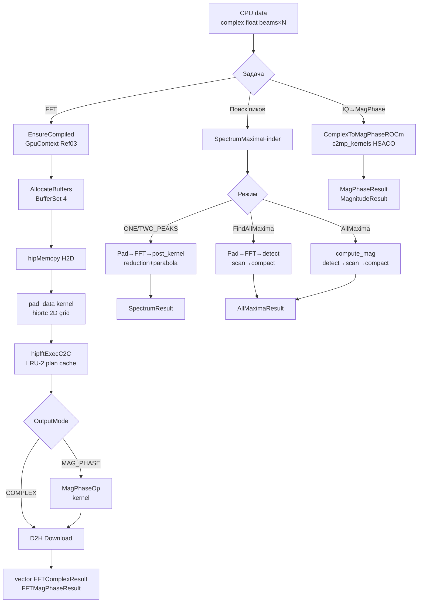

# fft_func — Полная документация

> Объединённый GPU-модуль: пакетное FFT + поиск максимумов спектра

**Namespace**: `fft_processor` (FFT-классы) + `antenna_fft` (SpectrumMaximaFinder)
**Каталог**: `modules/fft_func/`
**Зависимости**: DrvGPU (`IBackend*`), ROCm/hipFFT, hiprtc (ENABLE_ROCM=1, ветка `main`); OpenCL/clFFT только в ветке `nvidia`

---

## Содержание

1. [Обзор и история](#1-обзор-и-история)
2. [Математика](#2-математика)
3. [Пошаговые pipeline'ы](#3-пошаговые-pipelines)
4. [Kernels](#4-kernels)
5. [Архитектура C4](#5-архитектура-c4)
6. [API (C++ и Python)](#6-api)
7. [Тесты](#7-тесты)
8. [Бенчмарки](#8-бенчмарки)
9. [Файловое дерево](#9-файловое-дерево)
10. [Важные нюансы](#10-важные-нюансы)

---

## 1. Обзор и история

### История: слияние двух модулей

Модуль `fft_func` появился в результате **слияния** двух независимых модулей:

| Исходный модуль | Статус | Что перешло в fft_func |
|-----------------|--------|------------------------|
| `fft_processor` | Упразднён | `FFTProcessorROCm`, `ComplexToMagPhaseROCm` |
| `fft_maxima` | Упразднён | `SpectrumMaximaFinder`, `SpectrumProcessorROCm`, `AllMaximaPipelineROCm` |

Старая документация сохранена в `Doc/Modules/~!/fft_processor/` и `Doc/Modules/~!/fft_maxima/` — только как исторический архив. Все пути к файлам, инклюдам и тестам изменились.

### Назначение

`fft_func` — GPU-модуль для двух задач:

1. **FFT-обработка** (`FFTProcessorROCm`): пакетный 1D комплексный FFT для нескольких лучей с zero-padding. Возвращает спектр в трёх форматах: комплексный, mag+phase, mag+phase+частоты.

2. **Поиск максимумов** (`SpectrumMaximaFinder`): нахождение одного/двух/всех пиков в FFT-спектре с параболической интерполяцией и stream compaction.

3. **Вспомогательный** (`ComplexToMagPhaseROCm`): прямое преобразование IQ → амплитуда+фаза без FFT.

**Платформа**: ветка `main` — только ROCm/hipFFT (Linux, AMD GPU, RDNA4+ gfx1201+). Ветка `nvidia` — OpenCL/clFFT.

**Классы модуля**:

| Класс | Namespace | Назначение |
|-------|-----------|------------|
| `FFTProcessorROCm` | `fft_processor` | Пакетный FFT (hipFFT + hiprtc) |
| `ComplexToMagPhaseROCm` | `fft_processor` | IQ → mag+phase без FFT |
| `SpectrumMaximaFinder` | `antenna_fft` | Поиск пиков: 1/2/все максимумы |
| `SpectrumProcessorROCm` | `antenna_fft` | ROCm реализация ISpectrumProcessor |
| `AllMaximaPipelineROCm` | `antenna_fft` | Detect+Scan+Compact pipeline (ROCm) |
| `SpectrumProcessorFactory` | `antenna_fft` | Фабрика процессоров по BackendType |

---

## 2. Математика

### 2.1 DFT

$$
X[k] = \sum_{n=0}^{N-1} x[n] \cdot e^{-j 2\pi k n / N}, \quad k = 0, 1, \ldots, N-1
$$

где $N = \text{nFFT}$, $x[n]$ — zero-padded вход. hipFFT реализует 1D C2C FFT по алгоритму Cooley–Tukey (radix-2/4/8).

### 2.2 Zero-padding

$$
\text{nFFT} = \text{nextPow2}(n\_point) \times \text{repeat\_count}
$$

$$
\tilde{x}[n] = \begin{cases} x[n], & 0 \le n < n\_point \\ 0, & n\_point \le n < \text{nFFT} \end{cases}
$$

Пример: `n_point=1000`, `repeat_count=2` → `nFFT = 1024 × 2 = 2048`.

### 2.3 Частота бина

$$
f_k = k \cdot \frac{f_s}{\text{nFFT}}, \quad k = 0, 1, \ldots, \text{nFFT}-1
$$

### 2.4 Амплитуда и фаза

$$
|X[k]| = \sqrt{\operatorname{Re}(X[k])^2 + \operatorname{Im}(X[k])^2}
$$

$$
\angle X[k] = \operatorname{atan2}\!\big(\operatorname{Im}(X[k]),\; \operatorname{Re}(X[k])\big)
$$

GPU: `__fsqrt_rn(re*re + im*im)` (fast sqrt intrinsic), `atan2f(im, re)`.

### 2.5 Нормализация

hipFFT возвращает **ненормализованный** FFT — без деления на $N$. Для физической амплитуды:

$$|X_{\text{norm}}[k]| = \frac{|X[k]|}{N}$$

`FFTMagPhaseResult.phase` — в **радианах** (диапазон [-π, π]).

### 2.6 Параболическая интерполяция (SpectrumMaximaFinder)

Для пика на бине $k$:

$$y_L = |FFT[k-1]|, \quad y_C = |FFT[k]|, \quad y_R = |FFT[k+1]|$$

$$\delta = \frac{1}{2} \cdot \frac{y_L - y_R}{y_L - 2y_C + y_R}, \quad \delta \in [-0.5,\; +0.5]$$

$$f_{refined} = (k + \delta) \cdot \frac{f_s}{N_{FFT}}$$

**Применяется только к peak[0]** (главному пику). Остальные пики: $f = k \cdot f_s / N_{FFT}$.

`MaxValue.phase` — в **градусах** (не радианах!). Это важное отличие от `FFTMagPhaseResult.phase`.

### 2.7 Условие локального максимума (AllMaxima)

$$\text{isMax}(i) = \begin{cases} 1 & \text{если } m_i > m_{i-1} \text{ и } m_i > m_{i+1} \\ 0 & \text{иначе} \end{cases}$$

### 2.8 Blelloch Exclusive Scan

Scan превращает массив флагов $[0, 1, 1, 0, 1, ...]$ в массив позиций $[0, 0, 1, 2, 2, ...]$:

- **Up-sweep** (reduce): $O(\log N)$ шагов, суммирование снизу вверх
- **Down-sweep**: $O(\log N)$ шагов, распространение префикса
- Итог: каждый максимум пишет результат в уникальную позицию, без race conditions

### 2.9 Точность float32

| nFFT | log₂(N) стадий | Ожидаемая ошибка | Порог в тестах |
|------|----------------|-----------------|----------------|
| 1024 | 10 | < 1e-4 (relative) | 1e-4 |
| 4096 | 12 | < 1e-4 (relative) | 1e-4 |
| MagPhase (fast intrinsics) | — | < 1e-2 | 1e-2 |

---

## 3. Пошаговые pipeline'ы

### 3.1 FFTProcessorROCm — пакетный FFT

```
INPUT: CPU vector<complex<float>>[beam_count × n_point]
    │
    ▼
┌────────────────────────────────────────────────┐
│ 1. EnsureCompiled (lazy, one-time)             │  hiprtc: pad_data + complex_to_mag_phase
│    GpuContext per-module (Ref03 Layer 1)       │
└────────────────────────────────────────────────┘
    │
    ▼
┌────────────────────────────────────────────────┐
│ 2. AllocateBuffers (reuse if same size)        │  BufferSet<4>: input/fft_input/output/magphase
└────────────────────────────────────────────────┘
    │
    ▼
┌────────────────────────────────────────────────┐
│ 3. hipMemcpy H2D (Upload)                      │  CPU → kInputBuf
│   (пропускается при GPU-input overload)        │
└────────────────────────────────────────────────┘
    │
    ▼
┌────────────────────────────────────────────────┐
│ 4. pad_data kernel (hiprtc, PadDataOp)         │  kInputBuf → kFftInput
│    2D grid: (ceil(nFFT/256), beam_count)       │  n_point → nFFT, нули сверху
└────────────────────────────────────────────────┘
    │
    ▼
┌────────────────────────────────────────────────┐
│ 5. hipfftExecC2C (HIPFFT_FORWARD)              │  kFftInput → kFftOutput
│    LRU-2 plan cache                            │  batch FFT: beam_count планов
└────────────────────────────────────────────────┘
    │
    ├── если MAGNITUDE_PHASE / MAGNITUDE_PHASE_FREQ:
    ▼
┌────────────────────────────────────────────────┐
│ 6. complex_to_mag_phase kernel (MagPhaseOp)    │  kFftOutput → kMagPhaseInterleaved
│    interleaved: out[i].x=mag, out[i].y=phase  │  __fsqrt_rn, atan2f
└────────────────────────────────────────────────┘
    │
    ▼
┌────────────────────────────────────────────────┐
│ 7. hipMemcpy D2H (Download)                    │  GPU → CPU, repack per-beam
└────────────────────────────────────────────────┘
    │
    ▼
OUTPUT: vector<FFTComplexResult> или vector<FFTMagPhaseResult>
```

### 3.2 ComplexToMagPhaseROCm — без FFT

```
INPUT: CPU/GPU complex<float>[beam_count × n_point]
    │
    ▼
┌────────────────────────────────────────────────┐
│ 1. Upload (если CPU)   или CopyGpuData (GPU→GPU)│
└────────────────────────────────────────────────┘
    │
    ▼
┌────────────────────────────────────────────────┐
│ 2. complex_to_mag_phase / complex_to_magnitude │  per-element: |z|, atan2
│    hiprtc kernel (c2mp_kernels HSACO)          │  norm_coeff контролирует нормализацию
└────────────────────────────────────────────────┘
    │
    ├── Process()      → D2H → CPU vector<MagPhaseResult> / vector<MagnitudeResult>
    └── ProcessToGPU() → возвращает void* GPU (CALLER OWNS!)
```

### 3.3 SpectrumMaximaFinder: Process (ONE_PEAK / TWO_PEAKS)

```
INPUT: flat complex<float>[antennas × n_point]
    │
    ▼
┌────────────────────────────────────────────────┐
│ 1. PrepareParams                               │  nFFT = nextPow2(n_point) × repeat_count
│    search_range = nFFT/4 (если 0)             │
└────────────────────────────────────────────────┘
    │
    ▼
┌────────────────────────────────────────────────┐
│ 2. Upload / CopyGpuData                        │  CPU/GPU → input_buffer_
└────────────────────────────────────────────────┘
    │
    ▼
┌────────────────────────────────────────────────┐
│ 3. pad kernel (hiprtc)                         │  n_point → nFFT (zero-padding)
└────────────────────────────────────────────────┘
    │
    ▼
┌────────────────────────────────────────────────┐
│ 4. hipfftExecC2C (HIPFFT_FORWARD)              │  fft_input → fft_output
└────────────────────────────────────────────────┘
    │
    ▼
┌────────────────────────────────────────────────┐
│ 5. post_kernel (ONE_PEAK/TWO_PEAKS)            │  256 WI/луч, reduction → top-N пиков
│    параболическая интерполяция для peak[0]    │
└────────────────────────────────────────────────┘
    │
    ▼
┌────────────────────────────────────────────────┐
│ 6. ReadResults D2H                             │  → vector<SpectrumResult>[antennas]
└────────────────────────────────────────────────┘
```

### 3.4 SpectrumMaximaFinder: FindAllMaxima (все пики из сырого сигнала)

```
INPUT: flat complex<float>[antennas × n_point]
    │
    ▼
┌────────────────────────────────────────────────┐
│ 1. Pad → hipFFT → compute_magnitudes           │  fft_output → |FFT[i]|
└────────────────────────────────────────────────┘
    │
    ▼
┌────────────────────────────────────────────────┐
│ 2. detect_all_maxima                           │  flags[i] = mag[i]>mag[i-1] && mag[i]>mag[i+1]
│    2D NDRange: global=(nFFT, beam_count)       │  диапазон [search_start, search_end)
└────────────────────────────────────────────────┘
    │
    ▼
┌────────────────────────────────────────────────┐
│ 3. Blelloch Exclusive Scan (block_scan+add)    │  флаги → позиции (без race conditions)
│    BLOCK_SIZE=512, LDS +1 padding              │
└────────────────────────────────────────────────┘
    │
    ▼
┌────────────────────────────────────────────────┐
│ 4. compact_maxima                              │  пишет MaxValue в уникальную позицию
└────────────────────────────────────────────────┘
    │
    ▼
AllMaximaResult (CPU или GPU буферы)
```

### 3.5 SpectrumMaximaFinder: AllMaxima (из готового FFT-спектра)

```
INPUT: FFT-спектр complex<float>[beams × nFFT]    ← n_point = nFFT !
    │
    ▼
┌────────────────────────────────────────────────┐
│ compute_magnitudes kernel                      │  |FFT[i]| (отдельный kernel, без FFT)
└────────────────────────────────────────────────┘
    │
    ▼
detect → scan → compact (те же шаги 2-4)
```

### Диаграмма (mermaid)



---

## 4. Kernels

### 4.1 pad_data (hiprtc, FFTProcessorROCm)

**Файл**: `include/kernels/fft_processor_kernels_rocm.hpp` (`GetHIPKernelSource()`)
**HSACO cache**: `kernels/bin/FFTProc_kernels_rocm.hsaco`

Zero-padding входных данных перед hipFFT. 2D grid: `blockIdx.y = beam_id` — без операций div/mod.

```hip
__launch_bounds__(256)
__global__ void pad_data(
    const float2* __restrict__ in,
    float2* __restrict__ out,
    int n_point, int nFFT)
{
    int beam = blockIdx.y;
    int k    = blockIdx.x * blockDim.x + threadIdx.x;
    if (k >= nFFT) return;
    out[beam * nFFT + k] = (k < n_point) ? in[beam * n_point + k] : make_float2(0.0f, 0.0f);
}
```

**Grid**: `dim3(ceil(nFFT/256), beam_count)`. blockDim = 256.

### 4.2 complex_to_mag_phase (hiprtc, FFTProcessorROCm + ComplexToMagPhaseROCm)

**Файл**: `include/kernels/fft_processor_kernels_rocm.hpp` + `include/kernels/complex_to_mag_phase_kernels_rocm.hpp`
**HSACO**: `kernels/bin/FFTProc_kernels_rocm.hsaco` (FFTProcessorROCm) и `kernels/bin/c2mp_kernels_rocm.hsaco` (ComplexToMagPhaseROCm — отдельный)

```hip
__launch_bounds__(256)
__global__ void complex_to_mag_phase(
    const float2* __restrict__ in,
    float2* __restrict__ out,
    int total)
{
    int i = blockIdx.x * blockDim.x + threadIdx.x;
    if (i >= total) return;
    float re = in[i].x, im = in[i].y;
    out[i].x = __fsqrt_rn(re * re + im * im);  // fast sqrt intrinsic
    out[i].y = atan2f(im, re);                  // phase [radians]
}
```

**Interleaved layout**: `out[i].x = magnitude`, `out[i].y = phase` (радианы).

### 4.3 Kernels SpectrumProcessorROCm

**Файл**: `include/kernels/fft_kernel_sources_rocm.hpp`
**HSACO**: `kernels/bin/spectrum_kernels_rocm.hsaco`

Три кернела в одном hiprtc-модуле:

| Kernel | Назначение |
|--------|-----------|
| `pad_data` | Zero-padding n_point → nFFT (такой же как в 4.1) |
| `compute_magnitudes` | `|FFT[i]|` → magnitudes_buffer |
| `post_kernel` | ONE_PEAK/TWO_PEAKS: reduction (256 WI/луч) + параболическая интерполяция |

**post_kernel**: один work-group на луч, 256 потоков, local memory reduction:
- Стадия 1: 256 WI — каждый находит локальный максимум в диапазоне `[0, search_range)`
- Стадия 2: Thread 0 — top-N пиков последовательно (удаляет найденные)
- Стадия 3: Thread 0 — записывает MaxValue[] с параболической интерполяцией для peak[0]

### 4.4 AllMaxima pipeline kernels

**Файл**: `include/kernels/all_maxima_kernel_sources_rocm.hpp`
**HSACO**: `kernels/bin/all_maxima_kernels_rocm.hsaco`

| Kernel | Назначение |
|--------|-----------|
| `detect_all_maxima` | 2D NDRange `global=(nFFT, beam_count)`: флаги локальных максимумов |
| `block_scan` | Blelloch up-sweep+down-sweep, LDS +1 padding против bank conflicts |
| `block_add` | Добавление сумм предыдущих блоков |
| `compact_maxima` | Stream compaction: пишет MaxValue по позиции из scan |

**BLOCK_SIZE = 512** (2 × LOCAL_SIZE=256). LDS: `(BLOCK_SIZE+1)*sizeof(uint32_t)` — +1 для устранения bank conflicts.

`compact_maxima` заполняет `MaxValue`: index, real, imag, magnitude, **phase в градусах**, refined_frequency (без параболической интерполяции — `index × fs/nFFT`).

### 4.5 Op-классы — Ref03 Layer 5

Все HIP-ядра оборачиваются в Op-классы (наследники `drv_gpu_lib::GpuKernelOp`). Каждый Op — отдельный заголовочный файл в `include/operations/`, один ответственный за один kernel.

| Op-класс | Namespace | Файл | Kernel | Используется в |
|----------|-----------|------|--------|----------------|
| `PadDataOp` | `fft_processor` | `pad_data_op.hpp` | `pad_data` (2D grid) | `FFTProcessorROCm` |
| `MagPhaseOp` | `fft_processor` | `mag_phase_op.hpp` | `complex_to_mag_phase` (interleaved) | `FFTProcessorROCm`, `ComplexToMagPhaseROCm` |
| `MagnitudeOp` | `fft_processor` | `magnitude_op.hpp` | `complex_to_magnitude` (float + inv_n) | `ComplexToMagPhaseROCm` |
| `SpectrumPadOp` | `antenna_fft` | `spectrum_pad_op.hpp` | `pad_data` (с `beam_offset`) | `SpectrumProcessorROCm` |
| `ComputeMagnitudesOp` | `antenna_fft` | `compute_magnitudes_op.hpp` | `compute_magnitudes` | `SpectrumProcessorROCm` |
| `SpectrumPostOp` | `antenna_fft` | `spectrum_post_op.hpp` | `post_kernel` (ONE/TWO_PEAKS) | `SpectrumProcessorROCm` |

**MagnitudeOp** (добавлен 2026-03-22) — отдельный Op для пути "только амплитуда без фазы". Принимает `inv_n` для нормировки прямо в kernel:

```hip
__global__ void complex_to_magnitude(
    const float2* __restrict__ in, float* __restrict__ out,
    float inv_n, int total)
{
    int i = blockIdx.x * blockDim.x + threadIdx.x;
    if (i >= total) return;
    out[i] = __fsqrt_rn(in[i].x * in[i].x + in[i].y * in[i].y) * inv_n;
}
```

**SpectrumPadOp** отличается от `PadDataOp` параметром `beam_offset` для batch-обработки. Перед padding выполняет `hipMemsetAsync` всего FFT-буфера.

---

## 5. Архитектура C4

### Ref03 Unified Architecture (Layer 1-6)

**FFTProcessorROCm** — полностью на Ref03:

| Слой | Что используется |
|------|-----------------|
| 1 — GpuContext | `GpuContext ctx_` — per-module, компилирует pad_data + complex_to_mag_phase |
| 3 — GpuKernelOp | `PadDataOp`, `MagPhaseOp` |
| 4 — BufferSet\<3\> | `kInputBuf / kFftBuf / kMagPhaseInterleaved` |
| 5 — Concrete Ops | `PadDataOp`, `MagPhaseOp` |
| 6 — Facade | `FFTProcessorROCm` (тонкий facade, API неизменен) |

**Важно**: `kFftBuf` — in-place буфер: служит и padded-входом, и FFT-выходом. `hipfftExecC2C(idata==odata)` поддерживается. Уменьшает аллокации с 4 до 3 буферов.

**ComplexToMagPhaseROCm** — переведён на Ref03:

| Слой | Что используется |
|------|-----------------|
| 1 — GpuContext | `GpuContext ctx_` — компилирует complex_to_mag_phase + complex_to_magnitude |
| 3 — GpuKernelOp | `MagPhaseOp`, `MagnitudeOp` |
| 4 — BufferSet\<3\> | `kInput / kOutput / kMagOnly` |
| 5 — Concrete Ops | `MagPhaseOp` (Process/ProcessToGPU), `MagnitudeOp` (ProcessMagnitude*) |
| 6 — Facade | `ComplexToMagPhaseROCm` |

**SpectrumProcessorROCm** — частично Ref03 (GpuContext + Op-классы, буферы ещё raw `void*`):

| Слой | Что используется |
|------|-----------------|
| 1 — GpuContext | `GpuContext ctx_` — компилирует pad + compute_magnitudes + post_kernel |
| 5 — Concrete Ops | `SpectrumPadOp`, `ComputeMagnitudesOp`, `SpectrumPostOp` |
| 6 — Facade (Strategy) | `SpectrumProcessorROCm` реализует `ISpectrumProcessor` |

GPU буферы `SpectrumProcessorROCm` (input_buffer_, fft_input_, fft_output_, maxima_output_, magnitudes_buffer_) остаются raw `void*` — планируется миграция на `BufferSet<N>` в будущем.

### C1 — System Context

```
┌────────────────────────────────────────────────────────────────┐
│  GPUWorkLib                                                     │
│                                                                  │
│  [Приложение / тест]                                            │
│        │ vector<complex<float>>[beams × n_point]                │
│        ▼                                                         │
│  [fft_func module]  ─────────────────────► [AMD GPU, ROCm]     │
│    FFTProcessorROCm                         hipFFT, hiprtc      │
│    ComplexToMagPhaseROCm                    gfx1201+            │
│    SpectrumMaximaFinder                                          │
│        │                                                         │
│        │ spectrum / AllMaximaResult                              │
│        ▼                                                         │
│  [heterodyne / statistics / strategies / ...]                   │
└────────────────────────────────────────────────────────────────┘
```

### C2 — Container

```
┌────────────────────────────────────────────────────────────────┐
│  modules/fft_func/                                              │
│                                                                  │
│  [FFTProcessorROCm]          → GpuContext, BufferSet<4>        │
│       PadDataOp + MagPhaseOp → hiprtc compiled                 │
│       hipfftHandle LRU-2 cache                                  │
│                                                                  │
│  [ComplexToMagPhaseROCm]     → hipModule_t (c2mp_kernels)      │
│       HSACO disk cache        → KernelCacheService             │
│                                                                  │
│  [SpectrumMaximaFinder]      → Facade                          │
│       SpectrumProcessorFactory → Create(BackendType, backend)  │
│       SpectrumProcessorROCm  → hipFFT + hiprtc (3 kernels)     │
│       AllMaximaPipelineROCm  → detect+scan+compact (4 kernels) │
└────────────────────────────────────────────────────────────────┘
```

### C3 — Component

```
┌────────────────────────────────────────────────────────────────┐
│  FFTProcessorROCm (Ref03, Facade)                               │
│    ├── EnsureCompiled()    — lazy hiprtc + GpuContext           │
│    ├── AllocateBuffers()   — BufferSet<4> reuse                 │
│    ├── CreateFFTPlan()     — LRU-2 cache (plan_ + plan_last_)  │
│    ├── PadDataOp::Launch() — pad_data 2D grid                  │
│    ├── hipfftExecC2C       — batch FFT                          │
│    └── MagPhaseOp::Launch()— c2mp interleaved                  │
│                                                                  │
│  SpectrumMaximaFinder (Facade)                                  │
│    ├── Process<T>()        — ONE_PEAK / TWO_PEAKS               │
│    │   SpectrumProcessorROCm → pad+FFT+post_kernel             │
│    ├── FindAllMaxima<T>()  — полный pipeline                    │
│    │   SpectrumProcessorROCm → pad+FFT+detect+scan+compact     │
│    └── AllMaxima<T>()      — только detect+scan+compact         │
│        (требует FFT уже посчитан, n_point=nFFT!)               │
└────────────────────────────────────────────────────────────────┘
```

---

## 6. API

### 6.1 Типы данных FFTProcessorROCm

```cpp
// Параметры запуска
struct FFTProcessorParams {
    uint32_t beam_count   = 1;
    uint32_t n_point      = 0;
    float    sample_rate  = 1000.0f;
    FFTOutputMode output_mode = FFTOutputMode::COMPLEX;
    uint32_t repeat_count = 1;       // nFFT = nextPow2(n_point) × repeat_count
    float    memory_limit = 0.80f;
};

enum class FFTOutputMode { COMPLEX, MAGNITUDE_PHASE, MAGNITUDE_PHASE_FREQ };

struct FFTBeamResult {
    uint32_t beam_id;
    uint32_t nFFT;
    float    sample_rate;
};

struct FFTComplexResult : FFTBeamResult {
    std::vector<std::complex<float>> spectrum;  // [nFFT], ненормализован
};

struct FFTMagPhaseResult : FFTBeamResult {
    std::vector<float> magnitude;  // [nFFT], |X[k]|
    std::vector<float> phase;      // [nFFT], atan2 в РАДИАНАХ [-π, π]
    std::vector<float> frequency;  // [nFFT], Hz (только MAGNITUDE_PHASE_FREQ)
};

struct FFTProfilingData {
    double upload_time_ms, fft_time_ms,
           post_processing_time_ms, download_time_ms, total_time_ms;
};

// ROCm профилирование по стадиям
using ROCmProfEvents = std::vector<std::pair<const char*, drv_gpu_lib::ROCmProfilingData>>;
// stages: "Upload", "PadData", "FFT", "MagPhase", "Download"
```

### 6.2 FFTProcessorROCm — C++ API

```cpp
#include "fft_processor_rocm.hpp"

// Создать (ENABLE_ROCM=1)
fft_processor::FFTProcessorROCm fft(backend);

fft_processor::FFTProcessorParams params;
params.beam_count  = 64;
params.n_point     = 1024;
params.sample_rate = 1e6f;
params.output_mode = fft_processor::FFTOutputMode::COMPLEX;
params.repeat_count = 1;   // nFFT = nextPow2(1024) × 1 = 1024

// CPU вход → комплексный спектр
std::vector<std::complex<float>> data(64 * 1024);
auto results = fft.ProcessComplex(data, params);

// CPU вход → mag+phase
params.output_mode = fft_processor::FFTOutputMode::MAGNITUDE_PHASE_FREQ;
auto mp = fft.ProcessMagPhase(data, params);
// mp[b].magnitude[k], mp[b].phase[k] (радианы!), mp[b].frequency[k]

// GPU вход (void* — без upload)
void* gpu_ptr = backend->Allocate(byte_size);
auto results2 = fft.ProcessComplex(gpu_ptr, params, byte_size);

// С ROCm профилированием
fft_processor::ROCmProfEvents events;
fft.ProcessComplex(data, params, &events);
for (const auto& [stage, ev] : events) {
    double ms = (ev.end_ns - ev.start_ns) / 1e6;
    // stage: "Upload", "PadData", "FFT", "MagPhase", "Download"
}

// LRU-2 plan cache: два размера — планы не пересоздаются
fft.ProcessComplex(data_1024, params_1024);
fft.ProcessComplex(data_4096, params_4096);
fft.ProcessComplex(data_1024, params_1024);  // переиспользует план 1024

// Информация
uint32_t nfft = fft.GetNFFT();
auto prof = fft.GetProfilingData();
```

### 6.3 ComplexToMagPhaseROCm — C++ API

```cpp
#include "complex_to_mag_phase_rocm.hpp"

fft_processor::ComplexToMagPhaseROCm converter(backend);
fft_processor::MagPhaseParams params;
params.beam_count = 4;
params.n_point    = 2048;
params.norm_coeff = 1.0f;  // 0=без норм, -1=÷n_point, >0=умножить

// CPU → CPU
auto results = converter.Process(data, params);
// results[b].magnitude[k], .phase[k] (РАДИАНЫ!)

// GPU → CPU
auto results2 = converter.Process(gpu_data, params, byte_size);

// CPU → GPU (результат на GPU, CALLER OWNS!)
void* gpu_out = converter.ProcessToGPU(data, params);
// gpu_out: interleaved float2[beam_count × n_point]
//   gpu_out[i].x = magnitude[i],  gpu_out[i].y = phase[i]
backend->Free(gpu_out);  // ОБЯЗАТЕЛЬНО!

// GPU → GPU (zero-copy)
void* gpu_out2 = converter.ProcessToGPU(gpu_data, params, byte_size);
backend->Free(gpu_out2);

// Magnitude only (GPU → CPU)
params.norm_coeff = -1.0f;  // нормировать на n_point
auto mag = converter.ProcessMagnitude(gpu_data, params, byte_size);
// mag[b].magnitude[k] = |z[k]| / n_point

// GPU → GPU magnitude only (CALLER OWNS!)
void* mag_gpu = converter.ProcessMagnitudeToGPU(gpu_data, params, byte_size);
backend->Free(mag_gpu);

// GPU → GPU magnitude zero-alloc (заполнить чужой буфер)
converter.ProcessMagnitudeToBuffer(gpu_complex_in, gpu_magnitude_out, params);
```

### 6.4 Типы данных SpectrumMaximaFinder

```cpp
// Входные данные
template<typename T>
struct InputData {  // из DrvGPU/interface/input_data.hpp
    uint32_t antenna_count = 0;
    uint32_t n_point = 0;         // для AllMaxima: n_point = nFFT!
    T data{};                     // CPU vector или GPU void*/cl_mem
    size_t gpu_memory_bytes = 0;
    uint32_t repeat_count = 2;    // nFFT = nextPow2(n_point) × repeat_count
    float sample_rate = 1000.0f;
    uint32_t search_range = 0;    // 0 = auto = nFFT/4
    float memory_limit = 0.80f;
    size_t max_maxima_per_beam = 1000;
};

// Один максимум спектра (32 байта с pad)
struct MaxValue {
    uint32_t index;            // бин FFT [0, nFFT)
    float real, imag;          // Re/Im FFT[index]
    float magnitude;           // |FFT[index]|
    float phase;               // arg(FFT[index]) в ГРАДУСАХ (не радианы!)
    float freq_offset;         // δ ∈ [-0.5, +0.5] (параболическая интерп.)
    float refined_frequency;   // (index + δ) × sample_rate / nFFT [Hz]
    uint32_t pad;
};

// Результат одной антенны (ONE_PEAK / TWO_PEAKS)
struct SpectrumResult {
    uint32_t antenna_id;
    MaxValue interpolated;   // главный пик (параболически уточнён)
    MaxValue left_point;     // FFT[peak_bin - 1]
    MaxValue center_point;   // FFT[peak_bin]
    MaxValue right_point;    // FFT[peak_bin + 1]
};

// Все максимумы одного луча
struct AllMaximaBeamResult {
    uint32_t antenna_id;
    uint32_t num_maxima;
    std::vector<MaxValue> maxima;  // пусто при Dest=GPU
};

// Выходной контейнер FindAllMaxima/AllMaxima
struct AllMaximaResult {
    std::vector<AllMaximaBeamResult> beams;
    OutputDestination destination;
    void* gpu_maxima = nullptr;  // CALLER OWNS при GPU/ALL!
    void* gpu_counts = nullptr;  // CALLER OWNS при GPU/ALL!
    size_t total_maxima = 0;
    size_t gpu_bytes = 0;
    size_t TotalMaxima() const { return total_maxima; }
};

enum class PeakSearchMode { ONE_PEAK, TWO_PEAKS, ALL_MAXIMA };
using DriverType = drv_gpu_lib::BackendType;  // OPENCL, ROCm, AUTO
```

### 6.5 SpectrumMaximaFinder — C++ API

```cpp
#include "interface/spectrum_maxima_types.h"
#include "interface/spectrum_input_data.hpp"

// Создать (актуальный конструктор)
antenna_fft::SpectrumMaximaFinder finder(backend);
// Initialize() вызывается автоматически при первом Process

// Process — один или два пика
antenna_fft::InputData<std::vector<std::complex<float>>> input{
    .antenna_count = 5,
    .n_point = 100000,
    .data = my_signal,           // flat: antennas × n_point
    .repeat_count = 4,           // nFFT = nextPow2(100000) × 4 = 524288
    .sample_rate = 1000.0f,
    .memory_limit = 0.80f
};

auto results = finder.Process(input,
    antenna_fft::PeakSearchMode::ONE_PEAK,
    antenna_fft::DriverType::ROCm);

for (const auto& r : results) {
    float freq = r.interpolated.refined_frequency;  // Hz
    float mag  = r.interpolated.magnitude;
    float phase_deg = r.interpolated.phase;  // ГРАДУСЫ!
}

// FindAllMaxima — все пики из сырого сигнала
antenna_fft::InputData<std::vector<std::complex<float>>> input2{
    .antenna_count = 64,
    .n_point = 1024,
    .data = raw_signal,
    .sample_rate = 1000.0f,
    .max_maxima_per_beam = 1000
};

auto result = finder.FindAllMaxima(input2, antenna_fft::OutputDestination::CPU);
for (const auto& beam : result.beams) {
    for (uint32_t i = 0; i < beam.num_maxima; ++i) {
        const auto& mv = beam.maxima[i];
        // mv.index, mv.refined_frequency, mv.magnitude
    }
}

// FindAllMaxima из готового GPU FFT (низкоуровневый)
auto result = finder.FindAllMaxima(
    gpu_fft_result, beam_count, nFFT, sample_rate,
    antenna_fft::OutputDestination::CPU,
    /*search_start=*/1,   // пропуск DC
    /*search_end=*/0      // 0 = auto = nFFT/2
);

// AllMaxima — только detect+scan+compact, без FFT
antenna_fft::InputData<void*> fft_input{
    .antenna_count = 5,
    .n_point = 1024,    // ВАЖНО: n_point = nFFT (размер FFT, не сигнала!)
    .data = gpu_fft_result,
    .sample_rate = 1000.0f
};
auto result2 = finder.AllMaxima(fft_input, antenna_fft::OutputDestination::CPU);

// OutputDestination::GPU — caller освобождает!
if (result.gpu_maxima) hipFree(result.gpu_maxima);
if (result.gpu_counts) hipFree(result.gpu_counts);
```

### 6.6 Python API — FFTProcessorROCm

Биндинг: `python/py_fft_processor_rocm.hpp` → класс `gpuworklib.FFTProcessorROCm`

```python
import gpuworklib
import numpy as np

ctx = gpuworklib.ROCmGPUContext(0)
fft = gpuworklib.FFTProcessorROCm(ctx)

# Данные: flat complex64 [beam_count × n_point] или 2D [B, N]
beam_count, n_point = 8, 1024
fs = 1e6
signal = np.zeros(beam_count * n_point, dtype=np.complex64)

# Комплексный спектр
# ВАЖНО: sample_rate — второй ПОЗИЦИОННЫЙ аргумент
spectrum = fft.process_complex(signal, fs)
spectrum = fft.process_complex(signal, fs, beam_count=8, n_point=1024)

# 2D массив — автоопределение beam_count и n_point
signal_2d = signal.reshape(beam_count, n_point)
spectrum = fft.process_complex(signal_2d, fs)

# Амплитуда + фаза
result = fft.process_mag_phase(signal, fs, beam_count=8, n_point=1024)
# result — dict:
#   'magnitude'   : ndarray float32 [beam_count × nFFT]
#   'phase'       : ndarray float32 [beam_count × nFFT] — РАДИАНЫ
#   'frequency'   : ndarray float32 (если include_freq=True)
#   'nFFT'        : int
#   'sample_rate' : float

result = fft.process_mag_phase(signal, fs, include_freq=True)

# nFFT (property, read-only)
nfft = fft.nfft
```

**Сигнатуры**:
```python
FFTProcessorROCm(ctx: ROCmGPUContext)

process_complex(
    data: ndarray,        # flat или 2D, dtype=complex64
    sample_rate: float,   # позиционный!
    beam_count: int = 0,  # 0 → автоопределение
    n_point: int = 0
) -> ndarray[complex64]

process_mag_phase(
    data: ndarray,
    sample_rate: float,
    beam_count: int = 0,
    n_point: int = 0,
    include_freq: bool = True
) -> dict

nfft: int  # property read-only
```

### 6.7 Python API — SpectrumMaximaFinder

Биндинг в `python/gpu_worklib_bindings.cpp` → класс `gpuworklib.SpectrumMaximaFinder`.

**Важно**: Python принимает FFT-спектр (не сырой сигнал). FFT нужно сделать заранее.

```python
import gpuworklib
import numpy as np

ctx = gpuworklib.ROCmGPUContext(0)
fft = gpuworklib.FFTProcessorROCm(ctx)
finder = gpuworklib.SpectrumMaximaFinder(ctx)

fs = 1000.0
nFFT = 1024
t = np.arange(nFFT, dtype=np.float32)
signal = (np.sin(2 * np.pi * 100 * t / fs) +
          np.sin(2 * np.pi * 200 * t / fs)).astype(np.complex64)

# Шаг 1: FFT
spectrum = fft.process_complex(signal, sample_rate=fs)

# Шаг 2: поиск всех максимумов
result = finder.find_all_maxima(spectrum, sample_rate=fs)

# Один луч → dict
print(result['num_maxima'])   # int
print(result['positions'])    # np.array uint32: бины
print(result['magnitudes'])   # np.array float32
print(result['frequencies'])  # np.array float32 [Hz]

# Несколько лучей: signals shape = (beam_count, nFFT)
beam_count = 5
signals = np.zeros((beam_count, nFFT), dtype=np.complex64)
spectra = fft.process_complex(signals, sample_rate=fs)
result = finder.find_all_maxima(spectra, sample_rate=fs)
# Несколько лучей → list[dict]
for i, beam in enumerate(result):
    print(f"Beam {i}: {beam['num_maxima']} peaks")
    print(f"  frequencies: {beam['frequencies']}")
```

**Сигнатуры**:
```python
SpectrumMaximaFinder(ctx)  # GPUContext или ROCmGPUContext

find_all_maxima(
    fft_data: ndarray,    # complex64, 1D или 2D — FFT-спектр!
    sample_rate: float,
    beam_count: int = 0,  # 0 = auto
    nFFT: int = 0,        # 0 = auto
    search_start: int = 0, # 0 = auto = 1 (пропуск DC)
    search_end: int = 0    # 0 = auto = nFFT/2
) -> dict или list[dict]
```

---

## 7. Тесты

### 7.1 C++ тесты — активные (ROCm, ENABLE_ROCM=1)

Все тесты вызываются через `modules/fft_func/tests/all_test.hpp` → `fft_func_all_test::run()`.

**test_fft_processor_rocm.hpp** — `test_fft_processor_rocm::run()`

| # | Тест | Параметры | Что проверяет | Почему такие входные данные | Порог |
|---|------|-----------|---------------|-----------------------------|-------|
| 1 | `single_beam_complex` | f=100 Hz, N=1024, fs=1000 | hipFFT пик на ожидаемом бине | 100/1000×1024=102.4 — точный бин без интерполяции; простейший базовый случай | peak_bin == expected_bin |
| 2 | `multi_beam_batch` | 8 beams, f₀=50 Hz, Δf=25 Hz, N=1024, fs=1000 | Каждый луч в правильном бине | Разные частоты (Δf=25 Hz, ≈25 бин) — ловит cross-beam pollution при неверном смещении буфера | \|peak − expected\| ≤ 1 |
| 3 | `mag_phase_consistency` | f=200 Hz, N=512, fs=1000 | GPU intrinsics (`__fsqrt_rn`, `atan2f`) vs CPU (`std::abs`, `std::arg`) | N=512 (nextPow2=512) — тест без zero-padding; порог 1e-2 из-за fast math vs IEEE double | max_err < 1e-2 |
| 4 | `mag_phase_freq` | f=150 Hz, N=1024, fs=1000 | freq[k] = k×fs/nFFT — точность частотной оси | Проверяет формулу freq-массива, построенного на CPU; ошибка 1e-4 — предел float32 | \|freq − expected\| < 1e-4 |
| 5 | `gpu_input` | f=100 Hz, N=1024, fs=1000 | void* device pointer вход без H2D upload | Ловит баг неверного смещения при GPU-входе в ProcessComplex(void*) | peak_bin == expected_bin |

**test_complex_to_mag_phase_rocm.hpp** — `test_complex_to_mag_phase_rocm::run()`

| # | Тест | Параметры | Что проверяет | Почему такие входные данные | Порог |
|---|------|-----------|---------------|-----------------------------|-------|
| 1 | `single_beam_cpu` | amp=2.5, f=100 Hz, N=4096, fs=1000 | CPU→CPU: GPU `__fsqrt_rn`/`atan2f` vs `std::abs`/`std::arg` | amp=2.5 (не 1.0) — ловит ошибку нормировки; N=4096 — большой буфер | mag < 1e-3, phase < 1e-3 |
| 2 | `multi_beam_cpu` | 8 beams, N=4096, f=500 Hz, fs=12000, amp=0.5+b×0.5 | 8 лучей с разными амплитудами | Возрастающие амплитуды — ловит смещение буфера луча (beam×n_point) | max_mag_err < 1e-3 |
| 3 | `gpu_input` | f=200 Hz, N=2048, fs=1000 | GPU void* вход → CPU выход | Минимальный путь D2D copy + kernel | max_mag_err < 1e-3 |
| 4 | `cpu_to_gpu` | amp=3.0, f=300 Hz, N=1024, fs=2000 | CPU→GPU: interleaved `{raw[k*2]=mag, raw[k*2+1]=phase}` | Проверяет interleaved-раскладку вручную скачанного float-массива | mag < 1e-3, phase < 1e-3 |
| 5 | `gpu_to_gpu` | 4 beams, N=2048, f=150 Hz, amp=1..4 | GPU→GPU: ProcessToGPU(void*) zero-copy | amp=1..4 — ловит смешение лучей при GPU-GPU пути | max_mag_err < 1e-3 |
| 6 | `accuracy` | 16 специальных значений | Граничные: (0,0), (±1,0), (0,±1), {3,4,5}, 1e-6, 1000+2000j | `__fsqrt_rn(0)` может дать -0/NaN; {3,4}: mag должна быть ровно 5 | mag < 1e-2; mag{3,4}=5 ±1e-3 |

**test_process_magnitude_rocm.hpp** — `test_process_magnitude_rocm::run()` (Ref03 ProcessMagnitude)

| # | Тест | Параметры | Что проверяет | Почему такие входные данные | Порог |
|---|------|-----------|---------------|-----------------------------|-------|
| 1 | `gpu_input_no_norm` | N=4096, amp=2.5, norm=1.0, hipMalloc | GPU void* вход, inv_n=1.0 без нормировки | hipMalloc (не managed) — тест non-unified memory path; amp=2.5 проверяет non-unit амплитуду | AllClose(atol=1e-4) |
| 2 | `managed_norm_by_n` | N=2048, amp=3.0, norm=-1.0, hipMallocManaged | Managed memory, div by N (inv_n=1/N) | Managed memory проходит другой код-путь в `ProcessMagnitude(void*)` | AllClose(atol=1e-4) |
| 3 | `norm_zero_signal` | N=512, zeros, norm=0.0 | Нулевой вход → все magnitude=0 | Проверяет что `norm_coeff=0` работает как ×1, не как "всё в ноль" | sum < 1e-6 |
| 4 | `to_gpu` | N=1024, amp=1.0, norm=1.0 | ProcessMagnitudeToGPU: float[] остаётся на GPU | CALLER OWNS: проверяет что указатель валиден и данные корректны | AllClose(atol=1e-4) |
| 5 | `multi_beam_managed` | B=4, N=4096, amp=0.5..2.0, norm=-1.0 | 4 луча managed memory + нормировка на N | Комбинация multi-beam + managed + division by N — тест пути для pipeline статистики | AllClose(atol=1e-4) |
| 6 | `to_buffer` | B=2, N=2048, amp=1.5, norm=0.0 | ProcessMagnitudeToBuffer vs ProcessMagnitudeToGPU | Zero-alloc путь должен давать идентичный результат с allocating путём | AllClose(buf vs ref) |

**test_fft_matrix_rocm.hpp** — `test_fft_matrix_rocm::run()`

Матричный бенчмарк производительности. 20 значений beam_count (20, 40, ..., 400) × 13 значений nFFT (2⁴–2¹⁶) = 260 ячеек.

| Таблица | Что измеряет |
|---------|-------------|
| 1. FFT-only | `hipfftExecC2C` (мс) |
| 2. Pad+FFT | `pad_data` + `hipfftExecC2C` |
| 3. Full cycle | Upload + Pad + FFT + Download |

Результаты: `Results/Profiler/FFT_Matrix/fft_matrix_YYYY-MM-DD_HH-MM-SS.md`

**test_spectrum_maxima_rocm.hpp** — `test_spectrum_maxima_rocm::run()`

| # | Тест | Параметры | Что проверяет | Порог |
|---|------|-----------|---------------|-------|
| 1 | `one_peak` | N=1000, fs=10000, 4 ant, 100 Hz | ONE_PEAK, частота vs эталон | error < 5 Hz |
| 2 | `two_peaks` | N=1000, fs=10000, 2 ant, [100,300] Hz | TWO_PEAKS: results.size()==4 | count == 4 |
| 3 | `find_all_maxima` | N=1024, fs=1000, 2 ant, [50,120,200] Hz | FindAllMaximaFromCPU ≥3 peaks | num_maxima ≥ 3 |
| 4 | `all_maxima_fft` | nFFT=1024, синтетич. спектр (бины 50/120/200) | AllMaximaFromCPU (без FFT): detect+scan+compact | total_maxima ≥ 3 |
| 5 | `batch_16_beams` | 16 ant, N=1000, freq=100+b×10 Hz, fs=10000 | Batch 16 лучей, каждый на своей частоте | error < 10 Hz/луч |
| 6 | `compare_opencl` | — | SkipTest (OpenCL не доступен в этом тесте) | — |

### 7.2 C++ тесты — только ветка nvidia / ENABLE_CLFFT

| Файл | Описание |
|------|----------|
| `test_fft_processor.hpp` | FFTProcessor OpenCL, 4 теста (закомментированы — clFFT не работает на gfx1201) |
| `test_fft_vs_cpu.hpp` | GPU vs pocketfft, 5 тестов (закомментированы) |
| `test_spectrum_maxima.hpp` | SpectrumMaximaFinder OpenCL (закомментированы) |
| `test_find_all_maxima.hpp` | FindAllMaxima/AllMaxima полный pipeline |
| `test_gpu_generator_integration.hpp` | CwGenerator → SpectrumMaximaFinder GPU→GPU |

### 7.3 Python тесты

Размещены в `Python_test/fft_func/`.

| Файл | Классы | Кол-во тестов | Описание |
|------|--------|---------------|----------|
| `test_process_magnitude_rocm.py` | `TestProcessMagnitude` | 7 | `ComplexToMagROCm.process_magnitude` vs NumPy; pipeline → statistics; pipeline → median |
| `test_spectrum_find_all_maxima_rocm.py` | 2 функции | 2 | ROCmGPUContext создаётся; косвенная проверка spectrum pipeline через HeterodyneDechirp |
| `test_spectrum_maxima_finder_rocm.py` | `TestNumPyReference` + `TestSpectrumMaximaFinderROCm` | 8+6 | NumPy-эталон (всегда) + GPU тесты (skip без `SpectrumMaximaFinderROCm`) |

**TestNumPyReference** (8 тестов, GPU не нужен — математический эталон):

| # | Тест | Что проверяет |
|---|------|---------------|
| 1 | `test_single_tone_peak_position` | FFT единичного тона: пик в правильном бине |
| 2 | `test_two_tones_peaks_found` | scipy.find_peaks находит оба тона |
| 3 | `test_noise_floor_no_strong_peaks` | Белый шум: нет пика > 25×mean |
| 4 | `test_freq_resolution_formula` | Δf = fs/nFFT (точная формула) |
| 5 | `test_parabolic_interpolation` | δ ≈ 0 для точного тона (пик ровно в бине) |
| 6 | `test_all_maxima_count` | Двухтональный: ≥ 2 пика через scipy.find_peaks |
| 7 | `test_single_tone_magnitude` | \|FFT\|_peak = N (ненормализованный FFT) |
| 8 | `test_multi_beam_independence` | Каждый луч независим: 3 луча × 3 частоты |

**TestSpectrumMaximaFinderROCm** (6 GPU тестов, skip без `SpectrumMaximaFinderROCm`):

| # | Тест | Что проверяет | Порог |
|---|------|---------------|-------|
| 1 | `test_process_single_beam_peak_freq` | ONE_PEAK: freq_hz близка к эталону | < 2% |
| 2 | `test_process_multi_beam_list` | multi-beam → list[dict] | len == beams |
| 3 | `test_process_result_fields` | Поля: freq_hz, magnitude, phase, index, freq_offset | все присутствуют |
| 4 | `test_find_all_maxima_two_tones` | Двухтональный спектр → num_maxima ≥ 2 | ≥ 2 |
| 5 | `test_find_all_maxima_opencl_compat_format` | Поля: positions, magnitudes, frequencies, num_maxima | все присутствуют |
| 6 | `test_find_all_maxima_peak_frequency` | Найденная частота < 2×Δf от эталона | min_err < 2×(fs/N) |

Запуск:
```bash
python Python_test/fft_func/test_process_magnitude_rocm.py
python Python_test/fft_func/test_spectrum_maxima_finder_rocm.py
PYTHONPATH=build/debian-radeon9070/python python run_tests.py -m fft_func
```

**Python_test/integration/test_fft_integration.py** — интеграционные тесты FFT.

---

## 8. Бенчмарки

### Файлы бенчмарков

| Файл | Backend | Runner |
|------|---------|--------|
| `tests/fft_processor_benchmark_rocm.hpp` | ROCm | `tests/test_fft_benchmark_rocm.hpp` |
| `tests/test_fft_maxima_benchmark_rocm.hpp` | ROCm | — |

Запуск в `all_test.hpp` — закомментировано (долго):
```cpp
// test_fft_benchmark_rocm::run();
// test_fft_maxima_benchmark_rocm::run();
```

### Стадии профилирования

| Стадия | Описание |
|--------|----------|
| Upload | `hipMemcpy H2D` |
| PadData | `pad_data` hiprtc kernel |
| FFT | `hipfftExecC2C` |
| MagPhase | `complex_to_mag_phase` hiprtc kernel |
| Download | `hipMemcpy D2H` |

Результаты: `Results/Profiler/GPU_00_FFTFunc/`

### Матричный бенчмарк (test_fft_matrix_rocm)

Для matrix benchmark с 13 разными nFFT — создавать отдельный экземпляр `FFTProcessorROCm` на каждый размер (обход LRU-2 cache).

---

## 9. Файловое дерево

```
modules/fft_func/
├── CMakeLists.txt                              # ROCm/hipFFT only (ветка main)
├── include/
│   ├── fft_processor_rocm.hpp                 # FFTProcessorROCm (Ref03, Facade)
│   ├── fft_processor_types.hpp                # Агрегатор: include types/
│   ├── complex_to_mag_phase_rocm.hpp          # ComplexToMagPhaseROCm
│   ├── interface/
│   │   ├── spectrum_maxima_types.h            # Обёртка над spectrum_types.hpp
│   │   ├── i_spectrum_processor.hpp           # Strategy interface
│   │   ├── i_all_maxima_pipeline.hpp          # Pipeline interface
│   │   └── spectrum_input_data.hpp            # InputData<T>, DriverType = BackendType
│   ├── factory/
│   │   └── spectrum_processor_factory.hpp     # Create(BackendType, IBackend*)
│   ├── operations/
│   │   ├── pad_data_op.hpp                    # Ref03 Layer 5: PadDataOp (2D grid)
│   │   ├── mag_phase_op.hpp                   # Ref03 Layer 5: MagPhaseOp (interleaved {mag,phase})
│   │   ├── magnitude_op.hpp                   # Ref03 Layer 5: MagnitudeOp (float, inv_n) [2026-03-22]
│   │   ├── spectrum_pad_op.hpp                # Ref03 Layer 5: SpectrumPadOp (с beam_offset)
│   │   ├── compute_magnitudes_op.hpp          # Ref03 Layer 5: ComputeMagnitudesOp
│   │   └── spectrum_post_op.hpp               # Ref03 Layer 5: SpectrumPostOp (ONE/TWO_PEAKS)
│   ├── pipelines/
│   │   └── all_maxima_pipeline_rocm.hpp       # Detect+Scan+Compact (ROCm)
│   ├── processors/
│   │   └── spectrum_processor_rocm.hpp        # ROCm impl + stub (!ENABLE_ROCM)
│   ├── types/
│   │   ├── fft_params.hpp                     # FFTProcessorParams
│   │   ├── fft_modes.hpp                      # FFTOutputMode enum
│   │   ├── fft_results.hpp                    # FFTBeamResult, FFTComplexResult,
│   │   │                                      # FFTMagPhaseResult, FFTProfilingData
│   │   ├── fft_types.hpp                      # Агрегатор types/
│   │   ├── mag_phase_types.hpp                # MagPhaseParams, MagPhaseResult, MagnitudeResult
│   │   ├── spectrum_modes.hpp                 # PeakSearchMode enum
│   │   ├── spectrum_params.hpp                # SpectrumParams
│   │   ├── spectrum_result_types.hpp          # MaxValue, SpectrumResult,
│   │   │                                      # AllMaximaBeamResult, AllMaximaResult
│   │   ├── spectrum_profiling.hpp             # ProfilingData
│   │   └── spectrum_types.hpp                 # Агрегатор types/ (spectrum)
│   └── kernels/
│       ├── fft_processor_kernels_rocm.hpp     # pad_data + c2mp HIP source (FFTProcessorROCm)
│       ├── complex_to_mag_phase_kernels_rocm.hpp # C2MP standalone (ComplexToMagPhaseROCm)
│       ├── fft_kernel_sources_rocm.hpp        # pad + compute_mag + post_kernel (SpectrumProcessorROCm)
│       └── all_maxima_kernel_sources_rocm.hpp # detect + scan + compact (AllMaximaPipelineROCm)
├── src/
│   ├── fft_processor_rocm.cpp                 # FFTProcessorROCm реализация
│   ├── complex_to_mag_phase_rocm.cpp          # ComplexToMagPhaseROCm реализация
│   ├── spectrum_processor_rocm.cpp            # SpectrumProcessorROCm реализация
│   ├── all_maxima_pipeline_rocm.cpp           # AllMaximaPipelineROCm реализация
│   └── spectrum_processor_factory.cpp         # Factory impl
├── kernels/
│   ├── all_maxima_kernels.cl                  # OpenCL kernels (ветка nvidia)
│   ├── spectrum_kernels.cl                    # OpenCL post_kernel (ветка nvidia)
│   ├── fft_processor_kernels.hip              # HIP kernels source (для справки)
│   ├── c2mp_kernels.hip                       # HIP C2MP kernels source (для справки)
│   ├── manifest.json                          # HSACO cache manifest
│   └── bin/                                   # Скомпилированные HSACO кеши
│       ├── FFTProc_kernels_rocm.hsaco         # pad_data + c2mp (FFTProcessorROCm)
│       ├── c2mp_kernels_rocm.hsaco            # C2MP standalone
│       ├── spectrum_kernels_rocm.hsaco        # pad + compute_mag + post
│       └── all_maxima_kernels_rocm.hsaco      # detect + scan + compact
└── tests/
    ├── all_test.hpp                            # Точка входа из main.cpp
    ├── README.md                               # Обзор тестов
    ├── test_fft_processor_rocm.hpp             # 5 ROCm тестов FFTProcessorROCm (активны)
    ├── test_complex_to_mag_phase_rocm.hpp      # 6 тестов ComplexToMagPhaseROCm (активны)
    ├── test_process_magnitude_rocm.hpp         # ProcessMagnitude тесты (активны)
    ├── test_fft_matrix_rocm.hpp                # Матричный бенчмарк (активен)
    ├── test_spectrum_maxima_rocm.hpp           # 6 ROCm тестов SpectrumMaximaFinder (активны)
    ├── test_fft_benchmark_rocm.hpp             # Benchmark (закомментирован)
    ├── test_fft_maxima_benchmark_rocm.hpp      # Benchmark (закомментирован)
    ├── test_fft_benchmark.hpp                  # OpenCL benchmark
    ├── test_fft_benchmark_rocm.hpp             # ROCm benchmark runner
    ├── fft_maxima_benchmark_rocm.hpp           # SpectrumMaximaFinder ROCm benchmark
    ├── fft_processor_benchmark_rocm.hpp        # FFTProcessorROCm benchmark
    ├── test_fft_processor.hpp                  # OpenCL (закомментированы)
    ├── test_fft_vs_cpu.hpp                     # GPU vs pocketfft (закомментированы)
    ├── test_fft_maxima_benchmark_rocm.hpp      # Benchmark maxima (закомментирован)
    ├── test_helpers_rocm.hpp                   # Вспомогательные функции для тестов
    └── test_spectrum_maxima_rocm.hpp           # SpectrumMaximaFinder ROCm (активен)

python/
└── py_fft_processor_rocm.hpp                   # pybind11: FFTProcessorROCm (PyFFTProcessorROCm)
                                                 # (биндинг SpectrumMaximaFinder — в gpu_worklib_bindings.cpp)

Python_test/fft_func/
├── conftest.py                                  # Фикстуры: gw, rocm_ctx, mag_proc
├── test_process_magnitude_rocm.py               # 7 тестов ComplexToMagROCm
├── test_spectrum_find_all_maxima_rocm.py        # SpectrumMaximaFinder AllMaxima
└── test_spectrum_maxima_finder_rocm.py          # SpectrumMaximaFinder OnePeak/TwoPeaks

Doc/Modules/~!/                                  # Архив старой документации
├── fft_processor/Full.md                        # Исходная документация fft_processor
└── fft_maxima/Full.md                           # Исходная документация fft_maxima
```

### Смежные модули

- `modules/heterodyne/` — использует `SpectrumMaximaFinder` и `FFTProcessorROCm`
- `modules/statistics/` — pipeline: ProcessMagnitudeToBuffer → compute_statistics
- `modules/strategies/` — использует fft_func для FFT+MaximaFinder pipeline'ов
- `modules/signal_generators/` — генерирует тестовые сигналы для fft_func тестов

---

## 10. Важные нюансы

1. **MaxValue.phase — в ГРАДУСАХ, FFTMagPhaseResult.phase — в РАДИАНАХ.** Это критическое отличие двух классов одного модуля. `compact_maxima` kernel вычисляет `atan2(imag, real) * 180/π` (градусы). `complex_to_mag_phase` kernel возвращает `atan2f(im, re)` (радианы). Никогда не смешивай.

2. **AllMaxima требует `n_point = nFFT`**, а не `n_point` сигнала. При передаче сырого сигнала вместо FFT-спектра `compute_magnitudes` посчитает `|Re + j*Im|` исходных данных, что бессмысленно.

3. **Python принимает FFT-спектр**, а не сырой сигнал. `find_all_maxima(fft_data, fs)` ждёт комплексный FFT-спектр. Сначала вызвать `fft.process_complex(signal, fs)`.

4. **clFFT мёртв на AMD RDNA4+ (gfx1201)**. На Radeon RX 9070 использовать только ROCm тесты. Все OpenCL тесты закомментированы в `all_test.hpp`. Ветка `main` — только ROCm.

5. **HSACO дисковый кеш**: первый запуск hiprtc JIT ~100–500 мс. Последующие загружают `.hsaco` из `kernels/bin/` за ~1 мс. Кеш генерируется автоматически на целевом GPU. Файлы `kernels/bin/*.hsaco` не нужно коммитить в git — они архитектурно-специфичны.

6. **ProcessToGPU — caller owner**: метод возвращает `void*` на GPU. Caller обязан вызвать `backend->Free(ptr)` или `hipFree(ptr)`. Утечка не поймана RAII.

7. **OutputDestination::GPU в SpectrumMaximaFinder**: при `dest=GPU` буферы `gpu_maxima` и `gpu_counts` принадлежат caller'у. ROCm: `hipFree(result.gpu_maxima)`.

8. **LRU-2 plan cache в FFTProcessorROCm**: хранит два hipFFT плана (`plan_` и `plan_last_`). При чередовании двух размеров план не пересоздаётся. При трёх и более разных `n_point` вытесняется более старый. Для matrix benchmark — создавать отдельный экземпляр на каждый размер.

9. **search_start=0 → auto=1** в SpectrumMaximaFinder — ноль-бин (DC) пропускается автоматически. При `search_end=0` конец = `nFFT/2`. Для явного пропуска DC всегда использовать `search_start=1`.

10. **n_point=0 в Python**: автоопределение из формы массива. 2D array `[B, N]` → `beam_count=B`, `n_point=N`. 1D без `beam_count` → 1 луч, весь массив.

11. **Нормализация ComplexToMagPhaseROCm**: `norm_coeff=0` → без нормировки (×1); `norm_coeff=-1` → делить на n_point; `norm_coeff>0` → умножить на значение. Не путать: 0 и 1.0 дают одинаковый результат (×1), `0.0` не означает «по умолчанию».

12. **Deprecated конструктор SpectrumMaximaFinder**: `SpectrumMaximaFinder(SpectrumParams, IBackend*)` помечен `[[deprecated]]`. Использовать `SpectrumMaximaFinder(IBackend*)`.

13. **BackendType::ROCm** — строчная `m`. `BackendType::ROCM` не компилируется.

14. **Параболическая интерполяция только для peak[0]** — в `post_kernel` интерполяция применяется только к первому (наибольшему) пику. `compact_maxima` в AllMaxima НЕ применяет интерполяцию — только `index × fs/nFFT`.

---

*Обновлено: 2026-03-28*

*См. также: [Quick.md](Quick.md) — краткий справочник | [API.md](API.md) — API-справочник*
