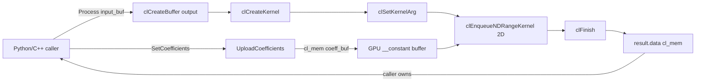

# Filters — Полная документация

> FIR и IIR фильтры на GPU (OpenCL + ROCm/HIP): прямая свёртка, biquad-каскад, скользящие средние (SMA/EMA/MMA/DEMA/TEMA), 1D Kalman, KAMA — для комплексных multi-channel сигналов

**Namespace**: `filters`
**Каталог**: `modules/filters/`
**Зависимости**: DrvGPU (`IBackend*`), OpenCL, ROCm/HIP (опционально, `ENABLE_ROCM=1`)

---

## Содержание

1. [Обзор и назначение](#1-обзор-и-назначение)
2. [Когда GPU-фильтры выгодны](#2-когда-gpu-фильтры-выгодны)
3. [Математика алгоритмов](#3-математика-алгоритмов)
4. [Архитектура kernel](#4-архитектура-kernel)
5. [Pipeline](#5-pipeline)
6. [C4 — Архитектурные диаграммы](#6-c4--архитектурные-диаграммы)
7. [API (C++ и Python)](#7-api)
8. [JSON формат конфигурации](#8-json-формат-конфигурации)
9. [KernelCacheService и FilterConfigService](#9-kernelcacheservice-и-filterconfigservice)
10. [Тесты — описание и ратionale](#10-тесты)
11. [Профилирование (бенчмарки)](#11-профилирование)
12. [Файловое дерево модуля](#12-файловое-дерево)
13. [Важные нюансы](#13-важные-нюансы)
14. [Ссылки](#14-ссылки)

---

## 1. Обзор и назначение

Модуль `filters` — GPU-фильтрация **комплексных** multi-channel сигналов в формате `float2` (complex64). Каждый канал обрабатывается параллельно.

| Класс | Backend | Алгоритм | Конфигурация |
|-------|---------|----------|--------------|
| **FirFilter** | OpenCL | Direct-form convolution (2D NDRange) | `SetCoefficients()`, JSON |
| **IirFilter** | OpenCL | Biquad cascade DFII-T (1D NDRange) | `SetBiquadSections()`, JSON |
| **FirFilterROCm** | ROCm/HIP | Direct-form + hiprtc | `SetCoefficients()` |
| **IirFilterROCm** | ROCm/HIP | Biquad cascade DFII-T + hiprtc | `SetBiquadSections()` |
| **MovingAverageFilterROCm** | ROCm/HIP | SMA/EMA/MMA/DEMA/TEMA | `SetParams(MAType, N)` |
| **KalmanFilterROCm** | ROCm/HIP | 1D scalar Kalman (Re/Im независимо) | `SetParams(Q, R, x0, P0)` |
| **KaufmanFilterROCm** | ROCm/HIP | KAMA (адаптивная MA по ER) | `SetParams(er_period, fast, slow)` |

**Workflow Stage 1**: scipy → коэффициенты → GPU (Python генерирует, передаёт в C++).
**Workflow Stage 3**: Natural language → AI → scipy params → GPU → plot.

---

## 2. Когда GPU-фильтры выгодны

GPU эффективен **только при multi-channel** (≥ 8 каналов):

| Тип | Каналов | Ускорение GPU vs CPU |
|-----|---------|----------------------|
| FIR direct | 1 | ~1× (нет выигрыша) |
| FIR direct | 64 | ~40–60× |
| IIR cascade | 1 | ~0.5× (CPU быстрее!) |
| IIR cascade | 64 | ~50–80× |
| MovingAverage (ROCm) | 256 | ~100–200× |
| Kalman 1D (ROCm) | 256 | ~80–150× |
| KAMA (ROCm) | 256 | ~60–120× |

**Вывод**: Single-channel IIR — лучше на CPU. Multi-channel — GPU даёт значительный выигрыш.
ROCm-only фильтры (MA, Kalman, KAMA) — 1 thread per channel, эффективны при ≥ 64 каналах.

---

## 3. Математика алгоритмов

### 3.1 FIR (Finite Impulse Response)

$$
y[ch][n] = \sum_{k=0}^{N-1} h[k] \cdot x[ch][n-k]
$$

- **Прямая форма** (direct-form convolution): каждый выходной отсчёт — свёртка с импульсной характеристикой $h[k]$.
- **Тип**: линейно-фазовый (симметричные коэффициенты → линейная фаза).
- **Параллелизм**: по каналам и по семплам (2D NDRange).
- **Нулевые граничные условия**: при $n - k < 0$ отсчёт считается нулевым (causal filtering).

```
FIR kernel (OpenCL):
  work-item (ch, n) вычисляет y[ch][n]
  for k = 0..N-1:
    if (n - k >= 0): acc += h[k] * x[ch, n-k]
  output[ch * P + n] = acc
```

### 3.2 IIR (Infinite Impulse Response) — Biquad cascade

Передаточная функция одной секции (second-order section, SOS):

$$
H(z) = \frac{b_0 + b_1 z^{-1} + b_2 z^{-2}}{1 + a_1 z^{-1} + a_2 z^{-2}}
$$

**Direct Form II Transposed** (численно стабильная форма):

$$
y[n] = b_0 \cdot x[n] + w_1[n-1]
$$
$$
w_1[n] = b_1 \cdot x[n] - a_1 \cdot y[n] + w_2[n-1]
$$
$$
w_2[n] = b_2 \cdot x[n] - a_2 \cdot y[n]
$$

- **Параллелизм**: только по каналам (1D NDRange, 1 work-item = 1 канал).
- **Последовательность**: внутри канала зависимость по времени — $y[n]$ зависит от $y[n-1]$.
- **Cascade**: несколько секций обрабатываются последовательно в одном kernel.
  - Секция 0 читает из `input`, пишет в `output`.
  - Секции 1..N читают из `output` (переиспользование буфера).

**SOS матрица** (буфер на GPU): `[num_sections × 5]` float:

```
sos[sec * 5 + 0] = b0
sos[sec * 5 + 1] = b1
sos[sec * 5 + 2] = b2
sos[sec * 5 + 3] = a1
sos[sec * 5 + 4] = a2
```

### 3.3 Скользящие средние (ROCm)

**SMA (Simple MA)** — равновесное взвешивание, ring buffer (max N ≤ 128):

$$\text{SMA}[n] = \frac{1}{N} \sum_{k=0}^{N-1} x[n-k]$$

**EMA (Exponential MA)** — экспоненциальное взвешивание, $\alpha = \frac{2}{N+1}$:

$$\text{EMA}[n] = \alpha \cdot x[n] + (1 - \alpha) \cdot \text{EMA}[n-1]$$

**MMA (Modified / Wilder)** — $\alpha = \frac{1}{N}$:

$$\text{MMA}[n] = \frac{1}{N} \cdot x[n] + \frac{N-1}{N} \cdot \text{MMA}[n-1]$$

**DEMA (Double EMA)**:

$$\text{DEMA}[n] = 2 \cdot \text{EMA}_1[n] - \text{EMA}_2[n], \quad \text{где EMA}_2 = \text{EMA of EMA}_1$$

**TEMA (Triple EMA)** — минимальная задержка:

$$\text{TEMA}[n] = 3 \cdot \text{EMA}_1 - 3 \cdot \text{EMA}_2 + \text{EMA}_3$$

**Параллелизм**: 1D NDRange — 1 thread per channel, последовательный цикл по семплам внутри.
**Ограничение SMA**: ring buffer `N ≤ 128` (хранится в thread-local регистрах/LDS).

### 3.4 Kalman 1D scalar (ROCm)

Скалярный Kalman применяется **независимо к Re и Im** частям каждого канала.

**Predict:**

$$\hat{x}^{-}[n] = \hat{x}[n-1], \quad P^{-}[n] = P[n-1] + Q$$

**Update:**

$$K[n] = \frac{P^{-}[n]}{P^{-}[n] + R}$$

$$\hat{x}[n] = \hat{x}^{-}[n] + K[n] \cdot (z[n] - \hat{x}^{-}[n])$$

$$P[n] = (1 - K[n]) \cdot P^{-}[n]$$

**Параметры** (`KalmanParams`):

| Параметр | По умолчанию | Описание |
|----------|-------------|----------|
| `Q` | 0.1 | Process noise variance. Q/R ≪ 1: сильное сглаживание |
| `R` | 25.0 | Measurement noise variance. Стартовое: R = (FFT_bin_size)² / 12 |
| `x0` | 0.0 | Начальное состояние |
| `P0` | 25.0 | Начальная ковариация ошибки (обычно = R) |

**Параллелизм**: 1 thread per channel, последовательный predict-update цикл.

### 3.5 KAMA — Kaufman Adaptive Moving Average (ROCm)

KAMA автоматически адаптирует скорость сглаживания по **Efficiency Ratio (ER)**:

$$\text{ER}[n] = \frac{|x[n] - x[n-N]|}{\sum_{k=1}^{N} |x[n-k+1] - x[n-k]|}$$

$$\text{SC}[n] = \left(\text{ER}[n] \cdot (\alpha_\text{fast} - \alpha_\text{slow}) + \alpha_\text{slow}\right)^2$$

$$\text{KAMA}[n] = \text{KAMA}[n-1] + \text{SC}[n] \cdot (x[n] - \text{KAMA}[n-1])$$

где $\alpha_\text{fast} = \frac{2}{\text{fast\_period}+1}$, $\alpha_\text{slow} = \frac{2}{\text{slow\_period}+1}$.

**Интерпретация**:
- ER ≈ 1 (чистый тренд) → SC ≈ α_fast → быстрое следование за сигналом
- ER ≈ 0 (шум) → SC ≈ α_slow → KAMA почти заморожен

**Параметры стандарта Kaufman**: `er_period=10, fast_period=2, slow_period=30`
**Ограничение**: `er_period ≤ 128` (ring buffer в thread-local регистрах).

---

## 4. Архитектура kernel

### FIR kernel

| Параметр | Значение |
|----------|----------|
| NDRange | 2D `(channels, ceil(points/256)×256)` |
| Local size | `(1, 256)` |
| Work-item | 1 выходной отсчёт `(ch, n)` |
| Коэффициенты | `__constant float*` (≤ 16 000 тапов) или `__global float*` (авто-fallback) |
| Флаги компиляции | `-cl-fast-relaxed-math` |

**Лимит**: `kMaxConstantTaps = 16000` (~64 KB). При `num_taps > 16000` → автоматически `fir_filter_cf32_global` (коэффициенты в `__global`).

**Два kernel в одном `.cl` файле**:
- `fir_filter_cf32` — константная память
- `fir_filter_cf32_global` — глобальная память (при большом количестве тапов)

### IIR kernel

| Параметр | Значение |
|----------|----------|
| NDRange | 1D `(channels,)` |
| Work-item | 1 канал (все семплы + все секции последовательно) |
| SOS буфер | `__constant float*` `[num_sections × 5]` |
| Флаги компиляции | `-cl-fast-relaxed-math` |

### Формат данных (layout)

**Channel-sequential** (рекомендуется, coalesced access):

```
Buffer: [ch0_s0, ch0_s1, ..., ch0_sN-1,  ch1_s0, ch1_s1, ...]
Access: input[channel * points + sample]
```

---

## 5. Pipeline

### FIR Pipeline (OpenCL)

```
    ┌─────────────────────────────────────────────────────────────────┐
    │ Host (C++ / Python)                                             │
    │                                                                 │
    │  SetCoefficients(h)                                             │
    │    └─► UploadCoefficients() → coeff_buf_ (cl_mem, __constant) │
    │                                                                 │
    │  Process(input_buf, ch, pts)                                    │
    │    ├─► clCreateBuffer(output_buf)                               │
    │    ├─► clCreateKernel("fir_filter_cf32" | "_global")            │
    │    ├─► clSetKernelArg(0..4)                                     │
    │    ├─► clEnqueueNDRangeKernel [channels, ⌈pts/256⌉×256]        │
    │    ├─► clFinish()                                               │
    │    └─► CollectOrRelease(kernel_event, "Kernel", pe)             │
    │                                                                 │
    │  result.data = output_buf  ← caller clReleaseMemObject!         │
    └─────────────────────────────────────────────────────────────────┘
```

### IIR Pipeline (OpenCL)

```
    ┌─────────────────────────────────────────────────────────────────┐
    │ Host (C++ / Python)                                             │
    │                                                                 │
    │  SetBiquadSections(sections)                                    │
    │    └─► UploadSosMatrix() → sos_buf_ [S×5 float]                │
    │                                                                 │
    │  Process(input_buf, ch, pts)                                    │
    │    ├─► clCreateBuffer(output_buf)                               │
    │    ├─► clCreateKernel("iir_biquad_cascade_cf32")                │
    │    ├─► clSetKernelArg(0..4)                                     │
    │    ├─► clEnqueueNDRangeKernel [channels]  ← 1D!                │
    │    ├─► clFinish()                                               │
    │    └─► CollectOrRelease(kernel_event, "Kernel", pe)             │
    │                                                                 │
    │  result.data = output_buf  ← caller clReleaseMemObject!         │
    └─────────────────────────────────────────────────────────────────┘
```

### Mermaid (полный pipeline FIR)



---

## 6. C4 — Архитектурные диаграммы

### C1 — System Context

```
┌─────────────────────────────────────────────────────────────────┐
│ GPUWorkLib System                                               │
│                                                                 │
│  ┌─────────────────────────────┐                               │
│  │  filters module             │                               │
│  │  FIR/IIR GPU filtering      │◄──── Python / C++ App         │
│  └─────────────────────────────┘                               │
│              │                                                  │
│              ▼                                                  │
│  ┌─────────────────────────────┐                               │
│  │  DrvGPU                     │                               │
│  │  OpenCL / ROCm backend      │                               │
│  └─────────────────────────────┘                               │
└─────────────────────────────────────────────────────────────────┘
```

### C2 — Container

```
┌─────────────────── filters module ─────────────────────────────┐
│                                                                 │
│  ┌────────────────────────┐   ┌────────────────────────────┐   │
│  │  FirFilter (OpenCL)    │   │  IirFilter (OpenCL)        │   │
│  │  fir_filter.hpp/.cpp   │   │  iir_filter.hpp/.cpp       │   │
│  └────────────┬───────────┘   └────────────┬───────────────┘   │
│               │                            │                   │
│  ┌────────────┴────────────────────────────┴───────────────┐   │
│  │  FirFilterROCm / IirFilterROCm (ROCm/HIP, ENABLE_ROCM) │   │
│  └─────────────────────────────────────────────────────────┘   │
│                                                                 │
│  ┌────────────────────────────────────────────────────────┐     │
│  │  types: BiquadSection, FirParams, IirParams,           │     │
│  │         FilterConfig (JSON), filter_modes.hpp          │     │
│  └────────────────────────────────────────────────────────┘     │
│                                                                 │
│  ┌────────────────────────────────────────────────────────┐     │
│  │  kernels: fir_filter_cf32.cl, iir_filter_cf32.cl       │     │
│  │  + kernels/bin/ (KernelCacheService)                   │     │
│  └────────────────────────────────────────────────────────┘     │
└────────────────────────────────────────────────────────────────┘
                        │
            ┌───────────▼────────────────┐
            │  DrvGPU                    │
            │  IBackend / OpenCLBackend  │
            │  ROCmBackend               │
            │  KernelCacheService        │
            └────────────────────────────┘
```

### C3 — Component (FirFilter, OpenCL)

```
FirFilter
├── Constructor(IBackend*)
│     ├── GetNativeContext/Queue/Device
│     ├── KernelCacheService::Load("fir_filter_cf32")
│     └── CompileKernel() ← clCreateProgramWithSource + clBuildProgram
│
├── SetCoefficients(h[])
│     ├── coefficients_ = h
│     ├── use_global_coeffs_ = (size > 16000)
│     └── UploadCoefficients() → coeff_buf_ (cl_mem)
│
├── Process(input_buf, ch, pts, prof_events)
│     ├── clCreateBuffer(output_buf)
│     ├── clCreateKernel("fir_filter_cf32" | "_global")
│     ├── clSetKernelArg(input, output, coeffs, num_taps, points)
│     ├── clEnqueueNDRangeKernel [ch, ⌈pts/256⌉×256] local=[1,256]
│     ├── clFinish()
│     └── CollectOrRelease(ev, "Kernel", pe)
│
└── ProcessCpu(input, ch, pts) → CPU reference (validation)
```

### C4 — Code (Kernel)

```opencl
// fir_filter_cf32.cl (упрощённо)
__kernel void fir_filter_cf32(
    __global const float2* restrict input,   // [ch * pts + n]
    __global       float2* restrict output,
    __constant     float*  coeffs,           // h[0..N-1]
    const uint num_taps,
    const uint points)
{
    const uint ch = get_global_id(0);  // канал
    const uint n  = get_global_id(1);  // семпл
    if (n >= points) return;

    float2 acc = (float2)(0.0f, 0.0f);
    for (uint k = 0; k < num_taps; k++) {
        int idx = (int)n - (int)k;
        if (idx >= 0) {
            float2 x = input[ch * points + (uint)idx];
            acc.x += coeffs[k] * x.x;
            acc.y += coeffs[k] * x.y;
        }
    }
    output[ch * points + n] = acc;
}
```

---

## 7. API

### 7.1 C++ — OpenCL

```cpp
#include "filters/fir_filter.hpp"
#include "filters/iir_filter.hpp"

// ─── FirFilter ───────────────────────────────────────────────────
filters::FirFilter fir(backend);

// Из кода:
fir.SetCoefficients(std::vector<float>{ 0.1f, 0.2f, 0.4f, 0.2f, 0.1f });

// Из JSON:
fir.LoadConfig("modules/filters/configs/lowpass_64tap.json");

// GPU processing
drv_gpu_lib::InputData<cl_mem> result = fir.Process(input_buf, channels, points);
// result.data — cl_mem, caller must clReleaseMemObject(result.data)

// CPU reference (validation)
auto cpu_ref = fir.ProcessCpu(input_vector, channels, points);

// Getters
uint32_t n_taps = fir.GetNumTaps();
const auto& coeffs = fir.GetCoefficients();
bool ready = fir.IsReady();

// ─── IirFilter ───────────────────────────────────────────────────
filters::IirFilter iir(backend);

// Из кода:
filters::BiquadSection sec;
sec.b0 = 0.02008337f;  sec.b1 = 0.04016673f;  sec.b2 = 0.02008337f;
sec.a1 = -1.56101808f; sec.a2 = 0.64135154f;
iir.SetBiquadSections({ sec });

// Из JSON:
iir.LoadConfig("modules/filters/configs/butterworth4.json");

// GPU processing
auto result = iir.Process(input_buf, channels, points);
clReleaseMemObject(result.data);  // caller owns!

// CPU reference
auto cpu_ref = iir.ProcessCpu(input_vector, channels, points);

uint32_t n_sec = iir.GetNumSections();
```

### 7.2 C++ — ROCm/HIP (`ENABLE_ROCM=1`, Linux)

```cpp
#include "filters/fir_filter_rocm.hpp"
#include "filters/iir_filter_rocm.hpp"

// ─── FirFilterROCm ───────────────────────────────────────────────
filters::FirFilterROCm fir_rocm(rocm_backend);
fir_rocm.SetCoefficients(coeffs);

// Из GPU-указателя (void* device ptr)
drv_gpu_lib::InputData<void*> res = fir_rocm.Process(
    gpu_input_ptr, channels, points);
hipFree(res.data);  // caller owns!

// Из CPU данных (upload + process)
auto res2 = fir_rocm.ProcessFromCPU(cpu_data, channels, points);
hipFree(res2.data);

// CPU reference
auto cpu_ref = fir_rocm.ProcessCpu(cpu_data, channels, points);

// ─── IirFilterROCm ───────────────────────────────────────────────
filters::IirFilterROCm iir_rocm(rocm_backend);
iir_rocm.SetBiquadSections({ sec0, sec1 });

auto res = iir_rocm.ProcessFromCPU(cpu_data, channels, points);
hipFree(res.data);
```

### 7.3 Python — OpenCL

```python
import gpuworklib as gw
import scipy.signal as sig
import numpy as np

ctx = gw.GPUContext(0)

# ─── FirFilter ───────────────────────────────────────────────────
fir = gw.FirFilter(ctx)

# Дизайн через scipy
taps = sig.firwin(64, 0.1).astype(np.float32)
fir.set_coefficients(taps.tolist())

# Фильтрация: signal.shape = (channels, points) complex64
result = fir.process(signal)   # возвращает (channels, points) complex64

# Или 1D:
result_1d = fir.process(signal[0])   # ndarray shape (points,)

# Properties
print(fir.num_taps)              # int
print(fir.coefficients)          # list[float]
print(repr(fir))                 # "FirFilter(num_taps=64)"

# ─── IirFilter ───────────────────────────────────────────────────
iir = gw.IirFilter(ctx)

sos = sig.butter(2, 0.1, output='sos').astype(np.float64)
sections = [
    {'b0': float(r[0]), 'b1': float(r[1]), 'b2': float(r[2]),
     'a1': float(r[4]), 'a2': float(r[5])}
    for r in sos
]
iir.set_sections(sections)

result = iir.process(signal)  # (channels, points) complex64

print(iir.num_sections)        # int
print(iir.sections)            # list[dict]
```

### 7.4 Python — ROCm

```python
import gpuworklib as gw
import scipy.signal as sig

ctx = gw.ROCmGPUContext(0)

fir = gw.FirFilterROCm(ctx)
coeffs = sig.firwin(64, 0.1).tolist()
fir.set_coefficients(coeffs)

result = fir.process(data)   # data: np.ndarray complex64 1D или 2D

print(fir.num_taps)
print(repr(fir))   # "FirFilterROCm(num_taps=64)"
```

### 7.5 C++ — MovingAverageFilterROCm (`ENABLE_ROCM=1`, Linux)

```cpp
#include "filters/moving_average_filter_rocm.hpp"

filters::MovingAverageFilterROCm ma(rocm_backend);

// Из структуры
filters::MovingAverageParams p;
p.type = filters::MAType::EMA;
p.window_size = 10;
ma.SetParams(p);

// Или напрямую
ma.SetParams(filters::MAType::SMA, 8);   // SMA N=8

// GPU processing
auto res = ma.Process(gpu_input_ptr, channels, points);  // void* out
hipFree(res.data);  // caller owns!

// Из CPU данных
auto res2 = ma.ProcessFromCPU(cpu_data, channels, points);
hipFree(res2.data);

// CPU reference
auto ref = ma.ProcessCpu(cpu_data, channels, points);

// Getters
filters::MAType t   = ma.GetType();        // MAType::EMA
uint32_t        win = ma.GetWindowSize();  // 10
bool            rdy = ma.IsReady();

// MAType enum: SMA, EMA, MMA, DEMA, TEMA
```

### 7.6 C++ — KalmanFilterROCm (`ENABLE_ROCM=1`, Linux)

```cpp
#include "filters/kalman_filter_rocm.hpp"

filters::KalmanFilterROCm kalman(rocm_backend);

// Из структуры
filters::KalmanParams kp;
kp.Q = 0.1f;   // process noise variance
kp.R = 25.0f;  // measurement noise variance
kp.x0 = 0.0f; kp.P0 = 25.0f;
kalman.SetParams(kp);

// Или напрямую: SetParams(Q, R, x0, P0)
kalman.SetParams(0.001f, 0.09f, 0.0f, 0.09f);  // LFM radar tuning

// GPU processing
auto res = kalman.Process(gpu_input_ptr, channels, points);
hipFree(res.data);

auto res2 = kalman.ProcessFromCPU(cpu_data, channels, points);
hipFree(res2.data);

// CPU reference
auto ref = kalman.ProcessCpu(cpu_data, channels, points);

const auto& params = kalman.GetParams();  // KalmanParams
bool rdy = kalman.IsReady();
```

### 7.7 C++ — KaufmanFilterROCm (`ENABLE_ROCM=1`, Linux)

```cpp
#include "filters/kaufman_filter_rocm.hpp"

filters::KaufmanFilterROCm kauf(rocm_backend);

// Из структуры
filters::KaufmanParams kp;
kp.er_period   = 10;   // N — период Efficiency Ratio (max 128)
kp.fast_period = 2;    // fast EMA period (ER≈1)
kp.slow_period = 30;   // slow EMA period (ER≈0)
kauf.SetParams(kp);

// Или напрямую
kauf.SetParams(10, 2, 30);   // стандартные параметры Kaufman

// GPU processing
auto res = kauf.Process(gpu_input_ptr, channels, points);
hipFree(res.data);

auto res2 = kauf.ProcessFromCPU(cpu_data, channels, points);
hipFree(res2.data);

// CPU reference
auto ref = kauf.ProcessCpu(cpu_data, channels, points);

const auto& params = kauf.GetParams();  // KaufmanParams
bool rdy = kauf.IsReady();
```

---

## 8. JSON формат конфигурации

### FIR

```json
{
  "type": "fir",
  "description": "Low-pass FIR, fc=0.1 (normalized), 64 taps, Hamming window",
  "coefficients": [0.0008, 0.0012, ..., 0.0012, 0.0008]
}
```

### IIR (SOS)

```json
{
  "type": "iir",
  "description": "Butterworth 4th order low-pass, fc=0.1",
  "sections": [
    {"b0": 0.0675, "b1": 0.1349, "b2": 0.0675, "a1": -1.1430, "a2": 0.4128},
    {"b0": 1.0000, "b1": 2.0000, "b2": 1.0000, "a1": -1.5529, "a2": 0.6562}
  ]
}
```

**`a0` всегда 1.0** (нормированная форма SciPy: `sos = butter(N, Wn, output='sos')`).

Парсинг реализован без внешних зависимостей (`FilterConfig::LoadJson` — minimal parser, no nlohmann).

---

## 9. KernelCacheService и FilterConfigService

### KernelCacheService — on-disk кэш скомпилированных kernel

FirFilter и IirFilter используют DrvGPU `KernelCacheService`:

| Этап | Действие |
|------|----------|
| **Первый запуск** | `CompileKernel()` → JIT из source → `Save()` в `modules/filters/kernels/bin/` |
| **Повторный** | `Load()` binary (~1 мс вместо ~50 мс компиляции) |
| **Fallback** | При отсутствии/ошибке cache — компиляция из source |

**Cache key:** `fir_filter_cf32` / `iir_filter_cf32`.
**Бинари:** `kernels/bin/fir_filter_cf32_opencl.bin`, `kernels/bin/iir_filter_cf32_opencl.bin`.
**Примечание:** ROCm (hiprtc) использует другой механизм кэширования — HSACO в `kernels/bin/`.

### FilterConfigService — сохранение конфигов фильтров

DrvGPU `FilterConfigService` — сохранение/загрузка коэффициентов в JSON:
- **FIR:** type, coefficients[]
- **IIR:** type, sections[] (b0,b1,b2,a1,a2)
- **Ключи:** `filters/{name}.json`
- **Версионирование:** при перезаписи → `name_00.json`, `name_01.json`

**⚠️ Интеграция** `SaveFilterConfig`/`LoadFilterConfig` в FirFilter/IirFilter — планируется (TASK-006). Пока используется `FilterConfig::LoadJson` напрямую.

---

## 10. Тесты

### 10.1 C++ тесты (OpenCL)

Вызов: `filters_all_test::run()` из `main.cpp` через `modules/filters/tests/all_test.hpp`

| # | Файл | Функция | Сигнал | Порог | Что проверяет и почему |
|---|------|---------|--------|-------|------------------------|
| 1 | `test_fir_basic.hpp` | `run_fir_basic()` | 8 ch × 4096 pts, CW 100 Hz + CW 5000 Hz, fs=50 kHz, 64-tap LP FIR (Hamming) | < 1e-3 | **GPU ≈ CPU reference.** Два тона: 100 Hz должен пройти, 5000 Hz — подавиться. Выбран Hamming window (good stopband attenuation). Порог 1e-3 учитывает `-cl-fast-relaxed-math` (float32 precision ~1e-6, т.к. суммирование 64 членов). Ловит ошибки индексации в kernel, неверную раскладку буфера. |
| 2 | `test_iir_basic.hpp` | `run_iir_basic()` | 8 ch × 4096 pts, то же CW-сигнал, Butterworth 2nd order LP, fc=0.1, 1 секция | < 1e-3 | **GPU biquad ≈ CPU DFII-T reference.** Butterworth — минимально-пульсирующий АЧХ. 1 секция проверяет базовый цикл state-machine. Порог 1e-3 — граница float32 precision при каскадном накоплении ошибки. Ловит баги в state переменных w1/w2, ошибку в порядке операций DFII-T. |

**Коэффициенты теста FIR**: `kTestFirCoeffs64` — предвычислены из `scipy.signal.firwin(64, 0.1, window='hamming')`.

### 10.2 C++ тесты (ROCm, `test_filters_rocm.hpp`)

Запуск: `test_filters_rocm::run()`. На Windows — compile-only (ENABLE_ROCM не определён). На Linux + AMD GPU — 6 тестов:

| # | Функция | Сигнал | Порог | Что проверяет и почему |
|---|---------|--------|-------|------------------------|
| 1 | `test_fir_basic` | 8 ch × 4096 pts, 64-tap LP, hipMemcpy | < 1e-3 | ROCm FIR basic: GPU (HIP) ≈ CPU reference. Аналог OpenCL теста #1, верифицирует hiprtc-компиляцию и HIP NDRange. |
| 2 | `test_fir_large` | 16 ch × 8192 pts, 256-tap LP (sinc×Hamming, синтезируется в тесте) | < 1e-3 | **Масштабируемость**: 256 тапов — проверяет производительность при больших фильтрах. Коэффициенты синтезируются в тесте (sinc × Hamming window), что исключает зависимость от scipy. |
| 3 | `test_fir_gpu_ptr` | 4 ch × 2048 pts, ручной hipMalloc+hipMemcpyHtoDAsync | < 1e-3 | **`Process(void* gpu_ptr, ...)` overload** — GPU pipeline без лишнего upload. Ловит ошибки в overload, принимающем уже-на-GPU данные (без пере-upload). |
| 4 | `test_iir_basic` | 8 ch × 4096 pts, Butterworth 2nd order (1 секция) | < 1e-3 | ROCm IIR basic: GPU (HIP) biquad ≈ CPU reference. |
| 5 | `test_iir_multi_section` | 8 ch × 4096 pts, Butterworth 4th order (2 секции) | < 1e-3 | **Cascade**: 2 секции → Butterworth 4th order. Проверяет корректность цикла по секциям, правильный re-read из output при sec>0. |
| 6 | `test_iir_gpu_ptr` | 4 ch × 2048 pts, ручной hipMalloc | < 1e-3 | **`Process(void*, ...)` overload для IIR** — аналог теста #3. |

### 10.3 C++ бенчмарки (GpuBenchmarkBase)

| Файл | Класс | Стейджи | Результаты |
|------|-------|---------|------------|
| `filters_benchmark.hpp` | `FirFilterBenchmark` | `Kernel` | `Results/Profiler/GPU_00_FirFilter/` |
| `filters_benchmark.hpp` | `IirFilterBenchmark` | `Kernel` | `Results/Profiler/GPU_00_IirFilter/` |
| `filters_benchmark_rocm.hpp` | `FirFilterROCmBenchmark` | `Upload + Kernel` | `Results/Profiler/GPU_00_FirFilter_ROCm/` |
| `filters_benchmark_rocm.hpp` | `IirFilterROCmBenchmark` | `Upload + Kernel` | `Results/Profiler/GPU_00_IirFilter_ROCm/` |

Вызов benchmark: `test_filters_benchmark::run()` (закомментирован в `all_test.hpp`).

### 10.4 Python тесты (OpenCL)

**Файл**: `Python_test/filters/test_filters_stage1.py`
**Запуск**: `python Python_test/filters/test_filters_stage1.py`

| # | Функция | Сигнал | Порог | Что проверяет и почему |
|---|---------|--------|-------|------------------------|
| 1 | `test_fir_gpu_vs_scipy` | 8 ch × 4096 pts, CW 100+5000 Hz, firwin(64, 0.1) | < 1e-2 | **GPU FIR ≈ scipy.lfilter**. Внешний эталон (не CPU-reference класса). Порог 1e-2 шире 1e-3 из-за разницы в boundary conditions (`lfilter` vs GPU causal). |
| 2 | `test_fir_basic_properties` | — | `num_taps == 64` | Проверяет Python API: `fir.num_taps`, `fir.coefficients`, `repr(fir)`. |
| 3 | `test_fir_single_channel` | 1D input (4096 pts), firwin(32, 0.2) | `ndim==1` | 1D input — выход тоже 1D. Ловит ошибки binding'а при одноканальном случае. |
| 4 | `test_iir_gpu_vs_scipy` | 8 ch × 4096 pts, butter(2, 0.1, sos) | < 5e-2 | **GPU IIR ≈ scipy.sosfilt**. Порог 5e-2 — IIR больше накапливает ошибку из-за рекурсии. |
| 5 | `test_iir_basic_properties` | 1 секция | `num_sections == 1` | Проверяет `iir.num_sections`, `iir.sections`, `repr(iir)`. |

**Результаты (типичные)**: FIR err ≈ 4.77e-7 ✅ | IIR err ≈ 1.31e-6 ✅

### 10.5 Python тесты (ROCm, Linux)

**Файл**: `Python_test/filters/test_fir_filter_rocm.py` и `test_iir_filter_rocm.py`
**Context**: `gw.ROCmGPUContext(0)`, класс `gw.FirFilterROCm` / `gw.IirFilterROCm`

**FIR ROCm тесты** (`test_fir_filter_rocm.py`):

| # | Функция | Что проверяет | Порог |
|---|---------|---------------|-------|
| 1 | `test_fir_single_channel_basic` | 1D complex, GPU vs scipy.lfilter | atol=1e-4 |
| 2 | `test_fir_multi_channel` | 2D (8ch × 4096pts), per-channel vs scipy | atol=1e-4 |
| 3 | `test_fir_all_pass` | Delta-filter [1.0] → output == input | atol=1e-4 |
| 4 | `test_fir_lowpass_attenuation` | Two-tone: power ratio < 0.9 после LP | energy |
| 5 | `test_fir_properties` | `num_taps`, `coefficients`, `repr` | exact |

**Ключевые идеи ROCm Python тестов**:
- Тест 3 (delta): `h=[1.0]` → `y[n] = x[n]` — идентичное преобразование. Ловит ошибки инициализации kernel (case h→0).
- Тест 4 (attenuation): физическая проверка без точного эталона: высокочастотная компонента должна ослабляться, `ratio < 0.9`.
- Порог `atol=1e-4` (строже 1e-2 OpenCL) — ROCm не использует `-cl-fast-relaxed-math`, точность выше.

**Другие Python тесты**:

| Файл | Назначение |
|------|------------|
| `test_iir_filter_rocm.py` | IIR ROCm: multi-section, GPU ptr, properties |
| `test_iir_plot.py` | IIR order 2/4/8: сравнение АЧХ, сохраняет граф |
| `test_ai_filter_pipeline.py` | Stage 3: natural language → AI → scipy → GPU → plot |
| `test_ai_fir_demo.py` | AI demo: описание фильтра в тексте → GPU |

### 10.6 C++ тесты — MovingAverageFilterROCm (`test_moving_average_rocm.hpp`)

Запуск: `test_moving_average_rocm::run()`. На Windows — compile-only. На Linux + AMD GPU — 6 тестов:

| # | Функция | Сигнал | Порог | Что проверяет и почему |
|---|---------|--------|-------|------------------------|
| 1 | `test_ema()` | 8 ch × 4096 pts, random complex, EMA(N=10) | < 1e-4 | **GPU EMA ≈ CPU reference.** Random signal обеспечивает все граничные случаи (разные начальные состояния). Порог 1e-4 — ROCm без fast-relaxed-math, точность выше OpenCL. |
| 2 | `test_sma()` | 8 ch × 4096 pts, random complex, SMA(N=8) | < 1e-4 | **GPU SMA ≈ CPU reference** с ring buffer. Ловит ошибки wraparound в кольцевом буфере SMA. |
| 3 | `test_mma()` | 8 ch × 4096 pts, MMA(N=10) | < 1e-4 | Wilder smoothing: α=1/N. Проверяет корректность отличного от EMA alpha. |
| 4 | `test_dema()` | 8 ch × 4096 pts, DEMA(N=10) | < 1e-4 | **DEMA = 2×EMA1 - EMA2**: проверяет правильность двойного EMA-прохода. Ловит ошибки в двуступенчатом вычислении. |
| 5 | `test_tema()` | 8 ch × 4096 pts, TEMA(N=10) | < 1e-4 | **TEMA = 3×EMA1 - 3×EMA2 + EMA3**: тройной EMA. Ловит ошибки знаков в формуле TEMA. |
| 6 | `test_step_response()` | 1 ch × 120 pts, step: 20 нулей / 50 единиц / 50 нулей | plateau @ t=55 < 5% | **Step demo** для всех 5 типов: все должны достичь ~1.0 на плато и TEMA должен реагировать быстрее EMA на фронте (t=23). Наглядно проверяет скорость реакции разных MA. |

**Ключевая идея test 6**: ступенчатый сигнал — классический способ сравнить задержку фильтров. TEMA должен иметь меньшую задержку чем EMA — это свойство тройного EMA. Если нарушено — ошибка в формуле.

### 10.7 C++ тесты — KalmanFilterROCm (`test_kalman_rocm.hpp`)

Запуск: `test_kalman_rocm::run()`. На Linux + AMD GPU — 5 тестов:

| # | Функция | Сигнал | Критерий | Что проверяет и почему |
|---|---------|--------|----------|------------------------|
| 1 | `test_gpu_vs_cpu()` | 8 ch × 4096 pts, random, Q=0.1 R=25 | max_err < 1e-4 | **GPU ≈ CPU Kalman.** Случайный сигнал гарантирует разнообразие значений K[n]. Ловит ошибки в HIP predict-update цикле. |
| 2 | `test_const_signal()` | 8 ch × 1024 pts, const + AWGN(σ=5), Q=0.01 R=25 | improvement > 10 dB | **Convergence**: Kalman должен сходиться к константе и уменьшить шум на >10 дБ. Константа с шумом — идеальный случай для Kalman (Q≪R). Если <10 дБ — неверная настройка или баг в Update. |
| 3 | `test_channel_independence()` | 256 ch × 512 pts, ch_i = i×10 + noise(σ=0.1), Q=0.1 R=1 | err < 1.0 для всех 256 | **Channel isolation**: каждый канал имеет свою уникальную константу. Ловит race condition или перекрёстное загрязнение состояний между каналами. |
| 4 | `test_step_response()` | 1 ch × 1024 pts, step at n=512 (0→100), Q=1 R=25 | val@612 > 60, val@end ≈ 100 | **Step tracking**: после 100 отсчётов должны достичь >60% от уровня (реакция) и ≈100 к концу (сходимость). Проверяет Q/R ratio для быстрого отслеживания. |
| 5 | `test_lfm_radar_demo()` | 5 ch × 16384 pts, beat signal + AWGN(σ=0.3), Q=0.001 R=0.09 | > 5 dB per channel | **LFM radar application demo**: 5 антенн, 5 целей (50–250 км), beat signal + AWGN. Kalman должен дать >5 дБ улучшения SNR на каждой антенне. Демонстрирует реальный use-case. |

**Ключевая идея test 5 (LFM demo)**: Kalman в ЛЧМ-радаре применяется для сглаживания огибающей/фазы перед FFT. Параметры Q=0.001, R=0.09 настроены для beat signal с σ_noise=0.3.

### 10.8 C++ тесты — KaufmanFilterROCm (`test_kaufman_rocm.hpp`)

Запуск: `test_kaufman_rocm::run()`. На Linux + AMD GPU — 5 тестов:

| # | Функция | Сигнал | Критерий | Что проверяет и почему |
|---|---------|--------|----------|------------------------|
| 1 | `test_gpu_vs_cpu()` | 8 ch × 4096 pts, random, er=10 fast=2 slow=30 | max_err < 1e-4 | **GPU KAMA ≈ CPU reference.** Random signal — ER меняется случайно, проверяет все ветви SC-вычисления. |
| 2 | `test_trend()` | 1 ch × 256 pts, линейный тренд x[n]=n×0.1 | max_lag < 2.0 после warmup | **Fast tracking при ER≈1**: линейный тренд → ER≈1 → SC≈α_fast. KAMA должен следовать с минимальным лагом. Если лаг большой — ошибка в ER или SC вычислении. |
| 3 | `test_noise()` | 1 ch × 512 pts, white noise σ=1 | std(KAMA)/std(signal) < 0.2 | **Freezing при ER≈0**: белый шум → ER≈0 → SC≈α_slow → KAMA почти неподвижен. std ratio < 0.2 означает что KAMA в 5× стабильнее входного. |
| 4 | `test_adaptive_transition()` | 1 ch × 2048 pts: тренд[0..511] + шум[512..1023] + тренд[1024..2047] | err_trend<0.5, delta_noise<3.0, err_recover<1.0 | **Адаптивность**: 3 фазы — KAMA должен (1) отслеживать тренд, (2) быть стабильным на шуме, (3) восстановить слежение после шума. Ловит баги в ring buffer ER-периода при смене режима. |
| 5 | `test_step_kama_demo()` | Step signal 120 pts + trend-noise-step 120 pts | plateau<1%, noise_delta<0.5, GPU err<1e-4 | **Комбо-демо**: (a) ступенчатый сигнал — KAMA должен достичь плато; (b) trend→noise→step демонстрирует адаптивность; (c) GPU vs CPU verificationна шаговом сигнале. |

### 10.9 Python тесты — MovingAverage, Kalman, KAMA (ROCm, Linux)

| Файл | Что тестирует |
|------|---------------|
| `test_moving_average_rocm.py` | Python bindings: `gw.MovingAverageFilterROCm`, все 5 типов MA |
| `test_kalman_rocm.py` | Python bindings: `gw.KalmanFilterROCm`, GPU vs CPU, convergence |
| `test_kaufman_rocm.py` | Python bindings: `gw.KaufmanFilterROCm`, adaptive behavior |

---

## 11. Профилирование

### OpenCL стейджи

| Бенчмарк | Класс | Стейджи | Описание |
|----------|-------|---------|----------|
| FirFilter | `FirFilterBenchmark` | `Kernel` | Время выполнения NDRange kernel |
| IirFilter | `IirFilterBenchmark` | `Kernel` | Время выполнения biquad cascade kernel |

### ROCm стейджи

| Бенчмарк | Класс | Стейджи | Описание |
|----------|-------|---------|----------|
| FirFilterROCm | `FirFilterROCmBenchmark` | `Upload`, `Kernel` | H2D + kernel через `ProcessFromCPU` |
| IirFilterROCm | `IirFilterROCmBenchmark` | `Upload`, `Kernel` | H2D + kernel через `ProcessFromCPU` |

### Запуск бенчмарка

```cpp
// ⚠️ OpenCL queue нужен с CL_QUEUE_PROFILING_ENABLE!
cl_command_queue queue = clCreateCommandQueue(
    context, device, CL_QUEUE_PROFILING_ENABLE, &err);

auto backend = std::make_unique<drv_gpu_lib::OpenCLBackend>();
backend->InitializeFromExternalContext(context, device, queue);

filters::FirFilter fir(backend.get());
fir.SetCoefficients(kTestFirCoeffs64);

test_filters::FirFilterBenchmark bench(
    backend.get(), fir, input_buf, 8, 4096,
    {.n_warmup = 5, .n_runs = 20,
     .output_dir = "Results/Profiler/GPU_00_FirFilter"});

bench.Run();
bench.Report();
```

---

## 12. Файловое дерево

```
modules/filters/
├── CMakeLists.txt
├── include/
│   ├── filters/
│   │   ├── fir_filter.hpp              # OpenCL FIR filter class
│   │   ├── iir_filter.hpp              # OpenCL IIR biquad cascade class
│   │   ├── fir_filter_rocm.hpp         # ROCm FIR (hiprtc), stub на Windows
│   │   ├── iir_filter_rocm.hpp         # ROCm IIR (hiprtc), stub на Windows
│   │   ├── moving_average_filter_rocm.hpp  # ROCm MA: SMA/EMA/MMA/DEMA/TEMA
│   │   ├── kalman_filter_rocm.hpp      # ROCm 1D scalar Kalman (Re/Im)
│   │   └── kaufman_filter_rocm.hpp     # ROCm KAMA (er_period ≤ 128)
│   ├── kernels/
│   │   ├── fir_kernels.hpp             # GetFirDirectSource_opencl()
│   │   ├── fir_kernels_rocm.hpp        # GetFirDirectSource_rocm()
│   │   ├── iir_kernels.hpp             # GetIirBiquadSource_opencl()
│   │   ├── iir_kernels_rocm.hpp        # GetIirBiquadSource_rocm()
│   │   ├── moving_average_kernels_rocm.hpp  # GetMASource_rocm() (5 kernels)
│   │   ├── kalman_kernels_rocm.hpp     # GetKalmanSource_rocm()
│   │   └── kaufman_kernels_rocm.hpp    # GetKaufmanSource_rocm()
│   └── types/
│       ├── filter_params.hpp       # BiquadSection, FirParams, IirParams, FilterConfig (JSON),
│       │                           # MAType, MovingAverageParams, KalmanParams, KaufmanParams
│       ├── filter_types.hpp        # ProfEvents, ROCmProfEvents
│       └── filter_modes.hpp        # FilterMode enum
├── kernels/
│   ├── fir_filter_cf32.cl          # FIR OpenCL kernel (2 kernels: __constant + __global)
│   ├── iir_filter_cf32.cl          # IIR biquad cascade OpenCL kernel
│   ├── manifest.json               # KernelCacheService manifest
│   └── bin/                        # On-disk binary cache (создаётся при первом запуске)
│       ├── fir_filter_cf32_opencl.bin
│       └── iir_filter_cf32_opencl.bin
├── src/
│   ├── fir_filter.cpp              # FirFilter implementation
│   ├── iir_filter.cpp              # IirFilter implementation
│   ├── fir_filter_rocm.cpp         # FirFilterROCm (hiprtc, Linux only)
│   └── iir_filter_rocm.cpp         # IirFilterROCm (hiprtc, Linux only)
└── tests/
    ├── all_test.hpp                     # Entry point: filters_all_test::run()
    ├── test_fir_basic.hpp               # OpenCL FIR test (kTestFirCoeffs64)
    ├── test_iir_basic.hpp               # OpenCL IIR test (Butterworth 2nd order)
    ├── test_filters_rocm.hpp            # ROCm: 6 тестов FIR/IIR (Linux + AMD GPU)
    ├── test_moving_average_rocm.hpp     # ROCm: 6 тестов MA (SMA/EMA/MMA/DEMA/TEMA + step demo)
    ├── test_kalman_rocm.hpp             # ROCm: 5 тестов Kalman (GPU vs CPU, convergence, LFM demo)
    ├── test_kaufman_rocm.hpp            # ROCm: 5 тестов KAMA (trend/noise/adaptive)
    ├── filters_benchmark.hpp            # OpenCL benchmark classes (FirFilterBenchmark, IirFilterBenchmark)
    ├── test_filters_benchmark.hpp       # OpenCL benchmark runner
    ├── filters_benchmark_rocm.hpp       # ROCm benchmark classes
    ├── test_filters_benchmark_rocm.hpp  # ROCm benchmark runner
    └── README.md                        # Tests overview

Python_test/filters/
├── test_filters_stage1.py          # FIR + IIR vs scipy (5 тестов)
├── test_fir_filter_rocm.py         # FirFilterROCm: 5 тестов (Linux)
├── test_iir_filter_rocm.py         # IirFilterROCm: multi-section, GPU ptr
├── test_moving_average_rocm.py     # MovingAverageFilterROCm: все 5 типов MA (Linux)
├── test_kalman_rocm.py             # KalmanFilterROCm: GPU vs CPU, convergence (Linux)
├── test_kaufman_rocm.py            # KaufmanFilterROCm: adaptive behavior (Linux)
├── test_iir_plot.py                # IIR order 2/4/8 сравнение (графики)
├── test_ai_filter_pipeline.py      # Stage 3: NL → AI → scipy → GPU → plot
└── test_ai_fir_demo.py             # AI demo

Doc/Modules/filters/
├── Full.md                         # Этот файл
├── Quick.md                        # Краткий справочник
├── README.md                       # Overview
└── gpu_filters_research.md         # Исследование: Overlap-Save/Add, tiled FIR, будущие алгоритмы
```

---

## 13. Важные нюансы

| # | Нюанс |
|---|-------|
| ⚠️ | **`result.data` — caller owns**: `clReleaseMemObject(result.data)` (OpenCL) или `hipFree(result.data)` (ROCm). Не забыть! |
| ⚠️ | **GPU IIR одноканальный — медленнее CPU**: Single-channel IIR вычисляется лучше на CPU. GPU оправдан только при ≥8 каналах. |
| ⚠️ | **`-cl-fast-relaxed-math`**: точность GPU ~1e-4..1e-6, а не IEEE 754. Если нужна точность — убрать флаг. |
| ⚠️ | **`SetCoefficients` vs `SetBiquadSections`**: вызов загружает буфер на GPU немедленно. При повторном вызове предыдущий буфер освобождается и создаётся новый. |
| ⚠️ | **`kMaxConstantTaps = 16000`**: при num_taps > 16000 автоматически переключается на `fir_filter_cf32_global` (глобальная память — медленнее). |
| ⚠️ | **IIR boundary conditions**: нулевые начальные условия (w1=w2=0). Первые `num_taps/order` отсчётов — переходный процесс. |
| ⚠️ | **SOS формат scipy**: `sos = butter(N, Wn, output='sos')`. Row: `[b0, b1, b2, a0, a1, a2]`, но `a0=1` пропускается. Передавать `a1=row[4], a2=row[5]`. |
| ⚠️ | **ROCm FirFilter**: компиляция hiprtc занимает ~100–500 мс при первом запуске. На Windows — compile-only stub (throws). |
| ⚠️ | **CL_QUEUE_PROFILING_ENABLE**: для бенчмарков OpenCL обязателен флаг при создании queue. Иначе `cl_event` timing вернёт 0. |
| ⚠️ | **Граничные условия FIR**: sample `n-k < 0` считается 0 (causal). Результат первых `num_taps-1` семплов отличается от `scipy.lfilter` не из-за бага, а из-за метода (`lfilter` тоже нулевые IC). Расхождение мало (< 1e-3). |
| ⚠️ | **SMA max N = 128**: ring buffer SMA хранится в thread-local регистрах/LDS. При N > 128 — undefined behavior или compilation error. |
| ⚠️ | **KAMA er_period max = 128**: ring buffer ER тоже ограничен 128. Стандартный Kaufman (er_period=10) безопасен. |
| ⚠️ | **Kalman независимо Re/Im**: 1D scalar Kalman применяется к Re и Im независимо. Для комплексного сигнала это корректно если Re/Im статистически независимы (AWGN). |
| ⚠️ | **Kalman Q/R tuning**: Q/R ≪ 1 → медленная реакция (strong smoothing). Q/R ≫ 1 → быстрая реакция (слабое сглаживание). Стартовое: Q ≈ R/100, R = (noise_sigma)². |
| ⚠️ | **ROCm MA/Kalman/KAMA hiprtc**: компиляция при первом `SetParams()` (~100–500 мс). На Windows — compile-only stub (throws `runtime_error`). |
| ⚠️ | **MovingAverage — 1 thread per channel**: нет параллелизма по семплам. При очень большом числе семплов (> 1M) и малом числе каналов (<8) CPU может быть быстрее. GPU выгоден при ≥ 64 каналах. |
| ⚠️ | **Python bindings для MA/Kalman/KAMA НЕ зарегистрированы**: `MovingAverageFilterROCm`, `KalmanFilterROCm`, `KaufmanFilterROCm` отсутствуют в `python/gpu_worklib_bindings.cpp`. Тесты `test_moving_average_rocm.py`, `test_kalman_rocm.py`, `test_kaufman_rocm.py` ссылаются на `gw.MovingAverageFilterROCm` и т.д. — регистрация через `py_filters_rocm.hpp` запланирована. |

---

## 14. Ссылки

### Статьи и стандарты

| Источник | Описание |
|----------|----------|
| [SciPy firwin](https://docs.scipy.org/doc/scipy/reference/generated/scipy.signal.firwin.html) | FIR design (Parks-McClellan, windowed sinc) |
| [SciPy butter + SOS](https://docs.scipy.org/doc/scipy/reference/generated/scipy.signal.butter.html) | Butterworth IIR, SOS output |
| [Direct Form II Transposed](https://en.wikipedia.org/wiki/Digital_biquad_filter#Direct_form_2_transposed) | Biquad DFII-T — численно стабильная форма |
| [OpenCL __constant memory](https://registry.khronos.org/OpenCL/specs/3.0-unified/html/OpenCL_C.html) | Limits: device-dependent (~64 KB типично) |

### Локальная документация

| Файл | Описание |
|------|----------|
| [Quick.md](Quick.md) | Краткий справочник (шпаргалка) |
| [API.md](API.md) | Полный API-справочник: все классы, сигнатуры, цепочки вызовов |
| [gpu_filters_research.md](gpu_filters_research.md) | Overlap-Save/Add, tiled FIR, будущие алгоритмы |
| [Doc/DrvGPU/Services/Full.md](../../DrvGPU/Services/Full.md) | KernelCacheService, FilterConfigService |

### Out of Scope (Post-MVP)

| Фича | Когда |
|------|-------|
| Overlap-Save/Overlap-Add | После стабильного FIR. См. `gpu_filters_research.md` |
| Адаптивные LMS/NLMS/RLS | Отдельная задача |
| Полифазные фильтры / децимация | Отдельная задача |
| Stage 2: text→kernel кэш | После Stage 1 |
| ROCm HSACO disk cache (для FIR/IIR) | После AMD GPU тестирования |

---

*Обновлено: 2026-03-09*
