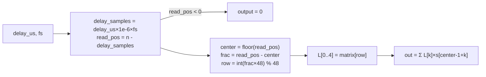

# LchFarrow — Полная документация

> Standalone GPU-процессор дробной задержки (Lagrange 48×5)

**Namespace**: `lch_farrow`
**Каталог**: `modules/lch_farrow/`
**Зависимости**: DrvGPU (`IBackend*`), OpenCL / ROCm (HIP)

---

## Содержание

1. [Обзор и назначение](#1-обзор-и-назначение)
2. [Зачем нужна дробная задержка в ЛЧМ-радаре с ФАР](#2-зачем-нужна-дробная-задержка)
3. [Математика алгоритма](#3-математика-алгоритма)
4. [Матрица 48×5](#4-матрица-485)
5. [Пошаговый алгоритм](#5-пошаговый-алгоритм)
6. [OpenCL Kernel](#6-opencl-kernel)
7. [C4 Диаграммы](#7-c4-диаграммы)
8. [API (C++ и Python)](#8-api)
9. [Тесты — что читать и где смотреть](#9-тесты)
10. [Бенчмарки](#10-бенчмарки)
11. [Ссылки на статьи и метод](#11-ссылки)

---

## 1. Обзор и назначение

LchFarrow — **независимый** от генераторов сигналов процессор. Применяет дробную задержку к любому входному комплексному сигналу.

**Метод**: 5-точечная интерполяция Лагранжа с предвычисленной таблицей коэффициентов 48×5.

**Вход**: комплексный сигнал (float2), задержки в микросекундах per-antenna.
**Выход**: задержанный сигнал той же размерности.

**Реализации**:
- `LchFarrow` — OpenCL backend (Windows + Linux, универсальная)
- `LchFarrowROCm` — ROCm/HIP backend (Linux + AMD GPU, `ENABLE_ROCM=1`)

---

## 2. Зачем нужна дробная задержка

### Проблема: волна приходит «между сэмплами»

В фазированной антенной решётке (ФАР) задержка на элемент определяется геометрией:

$$
\tau_n = \frac{n \cdot d \cdot \sin\theta}{c}
$$

где `n` — номер элемента, `d` — шаг решётки (обычно λ/2), `θ` — угол прихода, `c` — скорость света.

**Проблема:** τ_n в общем случае **не кратна** периоду дискретизации. При `f_s = 100 МГц` и `τ = 23.7 нс` задержка = **2.37 сэмпла** — дробное число.

### Почему для ЛЧМ это критично

ЛЧМ: `s(t) = A·exp(j·2π·(f₀·t + μ·t²/2))`, мгновенная частота `f(t) = f₀ + μ·t`.

При **только целочисленной** задержке ошибка фазы:
$$
\Delta\phi \approx 2\pi \cdot f_{\text{мгн}} \cdot \Delta\tau
$$

На краях полосы ЛЧМ это даёт:
- разрушение когерентного сложения
- смещение луча ДН
- рост боковых лепестков

**Вывод:** для корректного фазирования ЛЧМ нужна **субсэмпловая точность** — её даёт Lagrange 48×5.

---

## 3. Математика алгоритма

### Разбиение задержки

$$
\tau = D + \mu, \quad D \in \mathbb{Z}, \quad \mu \in [0, 1)
$$

- **Целая часть D**: простой сдвиг `output[n] = input[n - D]`
- **Дробная часть μ**: интерполяция между сэмплами

### 5-точечная интерполяция Лагранжа

$$
\text{input}(n - \mu) \approx L_0 \cdot x[n-2] + L_1 \cdot x[n-1] + L_2 \cdot x[n] + L_3 \cdot x[n+1] + L_4 \cdot x[n+2]
$$

где `L₀…L₄` — коэффициенты Лагранжа, зависящие от μ.

### Формулы коэффициентов (5 точек, позиции -2..+2)

```
L₀(μ) = μ(μ-1)(μ-2)(μ-3) / 24 × (-1)
L₁(μ) = μ(μ+1)(μ-1)(μ-2) / (-6)
L₂(μ) = (μ+2)(μ+1)(μ-1)(μ-2) / 4
L₃(μ) = μ(μ+2)(μ+1)(μ-1) / (-6)
L₄(μ) = μ(μ+2)(μ+1)(μ-2) / 24
```

**В реализации** вместо вычисления полиномов на лету используется **таблица 48×5** — быстрее на GPU.

### Farrow vs Lagrange 48×5 — что реализовано

| По ТЗ (Farrow) | Текущая реализация |
|----------------|---------------------|
| Полином по μ, схема Горнера в ядре | **Выборка строки** матрицы: `row = (uint)(μ×48) % 48` |
| Базисные фильтры фиксированы, μ передаётся | 48 дискретных строк, 5 коэффициентов на строку |
| Пересчёт только μ при смене задержки | Lagrange 48×5 по строкам |

### Связь с классической структурой Farrow

Классический Farrow (1988): коэффициенты FIR как полиномы по μ:
$$
h_n(\mu) = \sum_m c_{n,m} \cdot \mu^m
$$

Вычисление по схеме Горнера. **Наша реализация** — выборка готовой строки матрицы по дискретному μ (row = μ×48). Это Lagrange-таблица, не «чистый» Farrow, но даёт тот же результат при 48 уровнях квантования μ.

---

## 4. Матрица 48×5

### Структура

| Размерность | Значение |
|-------------|----------|
| Строки (48) | Шаги μ = 0/48, 1/48, …, 47/48 |
| Столбцы (5) | Коэффициенты L₀, L₁, L₂, L₃, L₄ |

**Формат**: float32. **Источник**: `modules/lch_farrow/lagrange_matrix_48x5.json` (копия из LCH-Farrow01).

В C++ матрица встроена как `kBuiltinLagrangeMatrix`; опционально `LoadMatrix(json_path)` для тестов и смены коэффициентов. JSON и встроенная матрица совпадают.

### Примеры строк (из JSON)

| row | μ | L₀ | L₁ | L₂ | L₃ | L₄ |
|-----|---|-----|-----|-----|-----|-----|
| 0 | 0/48 | 0 | 1 | 0 | 0 | 0 |
| 1 | 1/48 | -0.0052 | 1.0417 | -0.0417 | 0.0052 | 0 |
| 24 | 24/48 | 0.5355 | -4.0521 | 5.0521 | -0.5355 | 0 |

При μ=0 (row=0) выход = centre-сэмпл без интерполяции.

### Выбор строки

$$
\text{row} = \lfloor \mu \cdot 48 \rfloor \bmod 48
$$

Шаг квантования `1/48 ≈ 0.0208` сэмпла. При `f_s = 100 МГц` ≈ 0.2 нс точности задержки.

### Почему 48 и 5?

- **48 строк** — компромисс: таблица мала (960 байт), умещается в L1 кэш GPU
- **5 точек** — 4-й порядок, достаточная точность для ЛЧМ при BW < 0.4·f_s

---

## 5. Пошаговый алгоритм

Для выходного сэмпла `n`:

```
delay_samples = delay_us * 1e-6 * sample_rate
read_pos = n - delay_samples
```

### Шаги

1. **delay_samples** = delay_us × 1e-6 × sample_rate
2. **read_pos** = n − delay_samples
3. Если read_pos < 0 → output[n] = 0
4. **center** = floor(read_pos), **frac** = read_pos − center
5. **row** = (uint)(frac × 48) % 48
6. **L[0..4]** = lagrange_matrix[row]

> **Важно:** `row` определяется дробной частью **позиции чтения** (frac), а не дробной частью задержки (μ = delay_samples − floor(delay_samples)). Ошибка в ранних спецификациях: при `row = (uint)(μ×48)` получалось неверное окно интерполяции и искажение формы сигнала.

7. Чтение 5 сэмплов: input[center-1], …, input[center+3] (0 за границами)
8. **output[n]** = L₀·s₀ + L₁·s₁ + L₂·s₂ + L₃·s₃ + L₄·s₄

### Окно интерполяции

```
  ...  [center-1]  [center]  [center+1]  [center+2]  [center+3]  ...
         s₀           s₁          s₂          s₃          s₄
                                    ↑
                         read_pos = center + frac
```

### Семантика границ (когда output = 0)

| Случай | Поведение |
|--------|-----------|
| **Целая задержка 5** | output[0..4] = 0; с output[5] идёт задержанный сигнал |
| **Дробная задержка 5.23** | output[0..5] = 0; **первое ненулевое** — в output[6] (ceil(delay_samples)) |
| **Чтение за границами** | Индекс < 0 или ≥ num_samples → подставляется 0 |

Условие в kernel: `if (read_pos < 0) output[gid] = 0`.

---

## 6. OpenCL Kernel

### Сигнатура (`lch_farrow_delay`)

```c
__kernel void lch_farrow_delay(
    __global const float2* input,      // [antennas * points]
    __global float2* output,           // [antennas * points]
    __constant float* lagrange_matrix, // [48 * 5]
    __global const float* delay_us,    // [antennas]
    const uint antennas,
    const uint points,
    const float sample_rate,
    const float noise_amplitude,       // 0 = без шума
    const float norm_val,
    const uint noise_seed)
```

- **Глобальный размер**: `antennas × points` (один поток = один выходной сэмпл)
- **Матрица**: `__constant` — умещается в L1/L2 кэш (48×5×4 = 960 байт)
- **PRNG**: Philox-2x32-10 + Box-Muller (опциональный шум, `noise_amplitude > 0`)

### Pipeline на GPU

```
CPU → clEnqueueWriteBuffer(delay_us) → GPU:
         gid = antenna_id * points + sample_id
         delay_samples = delay_us[antenna_id] * 1e-6 * sample_rate
         read_pos = sample_id - delay_samples
         if read_pos < 0 → 0
         center = floor(read_pos); frac = read_pos - center
         row = int(frac * 48) % 48
         L[0..4] = lagrange_matrix[row * 5 .. row * 5 + 4]
         out = L[0]*s[c-1] + L[1]*s[c] + L[2]*s[c+1] + L[3]*s[c+2] + L[4]*s[c+3]
```

### ROCm kernel (`lch_farrow_kernels_rocm.hpp`)

Идентичный алгоритм, скомпилированный через **hiprtc** (runtime compilation). Хранится как строка-источник в `include/kernels/lch_farrow_kernels_rocm.hpp`. Разница: `float2_t` вместо `float2`, `__global` заменяется на прямые pointer-аргументы HIP.

---

## 7. C4 Диаграммы

### C1 — Контекст системы

```
┌─────────────────────────────────────────────┐
│  ЛЧМ-радар / ФАР-система                   │
│                                              │
│  ┌──────────────┐   delay_us[]   ┌─────────┐│
│  │ Antenna array│ ─────────────► │LchFarrow││
│  └──────────────┘  complex[N×A]  └────┬────┘│
│                                        │     │
│                              delayed[N×A]    │
└────────────────────────────────────────┼─────┘
                                         ▼
                                   FFT / Гетеродин
```

### C2 — Контейнеры

```
┌───────────────────────────────────────────────────────┐
│  modules/lch_farrow/                                  │
│                                                        │
│  ┌──────────────────┐    ┌────────────────────────┐   │
│  │   LchFarrow      │    │   LchFarrowROCm        │   │
│  │  (OpenCL)        │    │  (HIP, ENABLE_ROCM=1)  │   │
│  │  lch_farrow.cpp  │    │  lch_farrow_rocm.cpp   │   │
│  └──────────┬───────┘    └──────────┬─────────────┘   │
│             │                       │                  │
│    LCH_FARROW_KERNEL_SOURCE   lch_farrow_kernels_rocm  │
│    (embedded in .cpp)         (hiprtc via .hpp)        │
│                                                        │
│  ┌────────────────────────────────┐                   │
│  │  lagrange_matrix_48x5.json     │ ← kBuiltinMatrix  │
│  └────────────────────────────────┘                   │
└───────────────────────────────────────────────────────┘
```

### C3 — Компоненты (OpenCL)

```
  LchFarrow
    ├── SetDelays(vector<float> delay_us)
    ├── SetSampleRate(float fs)
    ├── SetNoise(float amp, float norm, uint seed)
    ├── LoadMatrix(string json_path)   [optional]
    │
    ├── Process(cl_mem input, uint A, uint N, ProfEvents*)
    │     ├── UploadMatrix() → matrix_buf_ (cl_mem __constant)
    │     ├── clEnqueueWriteBuffer(delay_us) → [ProfEvents: Upload_delay]
    │     └── clEnqueueNDRangeKernel(lch_farrow_delay, A*N) → [ProfEvents: Kernel]
    │
    └── ProcessCpu(vector<vector<complex>> input, A, N)
          └── CPU Lagrange reference (for verification)
```

### C4 — Kernel (lch_farrow_delay)

```
  Thread: gid = [0 .. A*N)
    antenna_id = gid / N
    sample_id  = gid % N
    │
    delay_samples = delay_us[antenna_id] * 1e-6 * sample_rate
    read_pos = sample_id - delay_samples
    │
    ┌── read_pos < 0 ──► output[gid] = (0, 0)
    │
    center = floor(read_pos)
    frac   = read_pos - center
    row    = int(frac * 48) % 48
    │
    L[0..4] = lagrange_matrix[row*5 .. row*5+4]  ← __constant cache
    │
    s[0..4] = input[base + center-1 .. center+3]  ← boundary-safe READ
    │
    output[gid] = L[0]*s[0] + L[1]*s[1] + L[2]*s[2] + L[3]*s[3] + L[4]*s[4]
    [+ optional Philox noise]
```

---

## 8. API

### C++ — OpenCL (LchFarrow)

```cpp
#include "lch_farrow.hpp"

lch_farrow::LchFarrow proc(backend);
proc.SetSampleRate(1e6f);
proc.SetDelays({0.0f, 2.7f, 5.0f});  // per-antenna, мкс
proc.SetNoise(0.1f, 0.707f, 0);     // опционально
proc.LoadMatrix("lagrange_matrix_48x5.json");  // опционально

// GPU (из GPU-буфера)
drv_gpu_lib::InputData<cl_mem> result = proc.Process(input_buf, antennas, points);
// result.data — cl_mem; caller вызывает clReleaseMemObject(result.data)

// CPU reference
auto cpu_ref = proc.ProcessCpu(input_2d, antennas, points);
// input_2d = vector<vector<complex<float>>>[antennas][points]
```

**Профилирование (бенчмарки)**:
```cpp
lch_farrow::ProfEvents events;
auto result = proc.Process(input_buf, antennas, points, &events);
// events = [{"Upload_delay", cl_event}, {"Kernel", cl_event}]
```

---

### C++ — ROCm (LchFarrowROCm, `ENABLE_ROCM=1`)

```cpp
#include "lch_farrow_rocm.hpp"

lch_farrow::LchFarrowROCm proc(rocm_backend);
proc.SetSampleRate(1e6f);
proc.SetDelays({0.0f, 2.7f, 5.0f});

// GPU→GPU (вход уже на GPU)
drv_gpu_lib::InputData<void*> result = proc.Process(gpu_ptr, antennas, points);
// result.data — void* HIP device pointer; caller вызывает hipFree(result.data)

// CPU→GPU (входные данные на CPU)
std::vector<std::complex<float>> flat_signal(antennas * points);
// ...заполнить...
auto result2 = proc.ProcessFromCPU(flat_signal, antennas, points);
```

**Профилирование**:
```cpp
lch_farrow::ROCmProfEvents events;
auto result = proc.ProcessFromCPU(flat_signal, antennas, points, &events);
// events = [{"Upload_input", ROCmProfilingData},
//           {"Upload_delay", ROCmProfilingData},
//           {"Kernel",       ROCmProfilingData}]
```

**Отличие ROCm от OpenCL**:

| Аспект | LchFarrow (OpenCL) | LchFarrowROCm (HIP) |
|--------|-------------------|---------------------|
| Handle | `cl_mem` | `void*` (device ptr) |
| Очередь | `cl_command_queue` | `hipStream_t` |
| Компиляция | clBuildProgram | hiprtc runtime |
| CPU→GPU | `Process(cl_mem)` | `ProcessFromCPU(vector)` |
| Стейдж Upload_input | нет | есть (в ProcessFromCPU) |
| Освобождение | `clReleaseMemObject` | `hipFree` |

---

### Python

```python
proc = gpuworklib.LchFarrow(ctx)
proc.set_sample_rate(1e6)
proc.set_delays([0.0, 2.7, 5.0])
delayed = proc.process(signal)
```

**Полный Python API**: [Doc/Python/lch_farrow_api.md](../../Python/lch_farrow_api.md)

---

## 9. Тесты — что читать и где смотреть

### C++ тесты — OpenCL

**Файл**: `modules/lch_farrow/tests/test_lch_farrow.hpp`
**Namespace**: `test_lch_farrow`
**Вызов**: через `all_test.hpp` из `main.cpp`

**Сигнал**: CW 50 kHz, fs=1 MHz, 4096 точек. `generate_cw(points, fs, freq)`.

| Тест | Входные данные | Ожидаемый результат | Что ловит | Порог |
|------|---------------|---------------------|-----------|-------|
| **Test 1: Zero delay** | CW, delay=0 мкс | output ≈ input (Lagrange row=0 → L₁=1, остальные≈0) | Ошибку индексации: row≠0 при μ=0 даёт ненулевые L₀,L₂ | < 1e-4 |
| **Test 2: Integer delay (5)** | CW, delay=5 мкс = 5 сэмплов | output[n] == cpu_ref[n]; output[0..4]=0 | Корректность целой части D, граничные нули | < 1e-2 |
| **Test 3: Fractional delay (2.7)** | CW, delay=2.7 мкс = 2.7 сэмплов | GPU vs CPU Lagrange (ProcessCpu) | Корректность выбора row по frac, ошибку row-по-μ | < 1e-2 |

**Типичные результаты**: Zero delay max_err < 1e-4 ✅ | Integer (5) max_err ≈ 1.35e-4 ✅ | Fractional (2.7) max_err ≈ 1.85e-3 ✅

---

### C++ тесты — ROCm

**Файл**: `modules/lch_farrow/tests/test_lch_farrow_rocm.hpp`
**Namespace**: `test_lch_farrow_rocm`
**Платформа**: Linux + AMD GPU (`ENABLE_ROCM=1`). На Windows — compile-only.
**Метод входа**: `ProcessFromCPU(flat_signal, antennas, points)` — CPU flat-вектор.

| Тест | Входные данные | Ожидаемый результат | Что ловит | Порог |
|------|---------------|---------------------|-----------|-------|
| **Test 1: Zero delay** | CW flat, 1 антенна, delay=0 | output ≈ input | Корректность HIP kernel и hiprtc компиляции | < 1e-4 |
| **Test 2: Integer delay (5)** | CW flat, 1 антенна, delay=5 мкс | GPU vs CPU reference | Целочисленный сдвиг на ROCm, корректность hipMemcpy | < 1e-2 |
| **Test 3: Fractional delay (2.7)** | CW flat, 1 антенна, delay=2.7 мкс | GPU vs CPU reference | Дробная задержка на AMD GPU, совпадение с OpenCL | < 1e-2 |
| **Test 4: Multi-antenna (4 ch)** | CW flat, 4 антенны, delays=[0, 1.5, 3.0, 5.0] мкс | Per-channel GPU vs CPU | Параллельная обработка нескольких каналов, независимость per-antenna | < 1e-2 |

---

### Python тесты

**Файл**: `Python_test/lch_farrow/test_lch_farrow.py`
**Запуск**: `python Python_test/lch_farrow/test_lch_farrow.py`

| Тест | Что проверяет | Эталон | Порог |
|------|---------------|--------|-------|
| **Test 1: Zero delay** | delay=0 → output ≈ input | `apply_delay_numpy()` — NumPy Lagrange 48×5 | < 1e-4 |
| **Test 2: Integer delay (5)** | delay=5 сэмплов, первые 5 нули | `load_lagrange_matrix()` из JSON | < 1e-2 |
| **Test 3: Fractional delay (2.7)** | GPU vs NumPy Lagrange | `apply_delay_numpy(signal, delay_samples, matrix)` | < 1e-2 |
| **Test 4: Multi-antenna** | 4 канала с delays [0, 1.5, 3.0, 5.0] мкс | Per-channel NumPy | < 1e-2 |
| **Test 5: LchFarrow vs Analytical** | LFM + LchFarrow vs LfmAnalyticalDelay (идеальная задержка) | Пропуск boundary (skip), сравнение Farrow vs analytical | < 0.1 |

**Матрица**: загружается из `modules/lch_farrow/lagrange_matrix_48x5.json` — тот же набор что в `kBuiltinLagrangeMatrix`.

**Эталон**: `apply_delay_numpy()` — CPU реализация того же алгоритма (D, μ, row, 5-точечная сумма). Используется для верификации GPU.

---

### Что смотреть при отладке

| Вопрос | Где искать |
|-------|------------|
| Как устроен CPU-эталон? | `apply_delay_numpy()` в `test_lch_farrow.py` |
| Откуда матрица? | `modules/lch_farrow/lagrange_matrix_48x5.json` |
| OpenCL kernel? | `src/lch_farrow.cpp` — `LCH_FARROW_KERNEL_SOURCE` |
| ROCm kernel? | `include/kernels/lch_farrow_kernels_rocm.hpp` |
| Результаты C++ тестов? | Консоль (через `ConsoleOutput`), `Results/Profiler/` |

---

## 10. Бенчмарки

### OpenCL (`GpuBenchmarkBase`)

**Класс**: `LchFarrowBenchmark` в `tests/lch_farrow_benchmark.hpp`
**Test runner**: `tests/test_lch_farrow_benchmark.hpp`, namespace `test_lch_farrow_benchmark`

```cpp
// Запуск бенчмарка
test_lch_farrow_benchmark::run();
```

**Параметры**:
| Параметр | Значение |
|----------|----------|
| antennas | 8 |
| points | 4096 |
| sample_rate | 1 MHz |
| delays | {0.3, 1.7, 2.1, 3.5, 4.0, 5.3, 6.7, 7.9} мкс |
| n_warmup | 5 |
| n_runs | 20 |
| output_dir | `Results/Profiler/GPU_00_LchFarrow/` |

**Стейджи** (профилируемые события):
| Стейдж | Операция |
|--------|---------|
| `Upload_delay` | `clEnqueueWriteBuffer` — задержки → GPU (каждый вызов) |
| `Kernel` | `lch_farrow_delay` kernel (Lagrange 48×5 интерполяция) |

> `input_buf` загружается **один раз** до бенчмарка — не входит в замер.

**Паттерн** (GpuBenchmarkBase):
- `ExecuteKernel()` — warmup без ProfEvents (нулевой overhead)
- `ExecuteKernelTimed()` — замер с `ProfEvents`, `RecordEvent()` → GPUProfiler

---

### ROCm (`ENABLE_ROCM=1`)

**Класс**: `LchFarrowBenchmarkROCm` в `tests/lch_farrow_benchmark_rocm.hpp`
**Test runner**: `tests/test_lch_farrow_benchmark_rocm.hpp`, namespace `test_lch_farrow_benchmark_rocm`

```cpp
#if ENABLE_ROCM
test_lch_farrow_benchmark_rocm::run();
#endif
```

**Параметры**: идентичны OpenCL (antennas=8, points=4096, delays=[0.3..7.9] мкс).

**Стейджи**:
| Стейдж | Операция |
|--------|---------|
| `Upload_input` | `hipMemcpyHtoDAsync` — входной сигнал → GPU |
| `Upload_delay` | `hipMemcpyHtoDAsync` — задержки → GPU |
| `Kernel` | `lch_farrow_delay` (hipModuleLaunchKernel) |

> ROCm использует `ProcessFromCPU()` — Upload_input является частью замера.
> Если нет AMD GPU → `[SKIP]`.

---

### Как запустить бенчмарки

1. В `configGPU.json` установить `"is_prof": true`
2. Раскомментировать в `tests/all_test.hpp`:

```cpp
// OpenCL
test_lch_farrow_benchmark::run();

// ROCm (только Linux + AMD GPU)
#if ENABLE_ROCM
test_lch_farrow_benchmark_rocm::run();
#endif
```

### Результаты

Сохраняются в `Results/Profiler/GPU_00_LchFarrow*/`:
- `report.md` — Markdown (min/max/avg по стейджам)
- `report.json` — JSON для автоматической обработки

Вывод только через GPUProfiler: `bench.Report()` → `PrintReport()` + `ExportMarkdown()` + `ExportJSON()`.

---

## 11. Ссылки

### Статьи и метод

| Источник | Описание |
|----------|----------|
| **Farrow C.W.** "A continuously variable digital delay element" (ISCAS, 1988) | Оригинальная статья |
| [CCRMA J.O. Smith — Farrow Structure](https://ccrma.stanford.edu/~jos/pasp/Farrow_Structure.html) | Структура Farrow, схема Горнера |
| [CCRMA — Farrow Structure for Variable Delay](https://ccrma.stanford.edu/~jos/pasp05/Farrow_Structure_Variable_Delay.html) | Lagrange через Farrow, finite difference filters |
| [CCRMA — Lagrange Interpolation](https://ccrma.stanford.edu/~jos/Interpolation/Lagrange_Interpolation.html) | Интерполяция Лагранжа |
| [MathWorks — Fractional Delay FIR Filters](https://www.mathworks.com/help/dsp/ug/design-of-fractional-delay-fir-filters.html) | FIR-фильтры дробной задержки |
| [liquid-dsp firfarrow](https://github.com/jgaeddert/liquid-dsp) | Референсная реализация |
| [Tom Roelandts — Fractional Delay Filter](https://tomroelandts.com/articles/how-to-create-a-fractional-delay-filter) | Практика |

### Внутренняя документация

| Документ | Описание |
|----------|----------|
| [API.md](API.md) | Полный API reference C++ и Python (сигнатуры, цепочки вызовов) |
| [Doc_Addition/Info_FarrowFractionalDelay.md](../../../Doc_Addition/Info_FarrowFractionalDelay.md) | Подробное описание алгоритма, kernel, верификация |
| [Doc/Python/lch_farrow_api.md](../../Python/lch_farrow_api.md) | Полный Python API |

### Дополнительные материалы (ЛЧМ, дечирп, beat-фаза)

| Документ | Описание |
|----------|----------|
| [Анализ дробной задержки/delay_methods_report.md](Анализ%20дробной%20задержки/delay_methods_report.md) | 6 методов оценки дробной задержки ЛЧМ (МНК beat-фазы, FFT+ZP, ML Newton, Zoom-FFT). Граница Крамера-Рао. МонтеКарло 1000 прогонов. **Вывод: МНК beat-фазы — O(N), достигает КРБ, лучший выбор для GPU** |
| [Распиши более подробнл МНК фазы beat.md](Распиши%20более%20подробнл%20МНК%20фазы%20beat.md) | МНК фазы beat — метод для радаров с высоким разрешением, дечирп, связь задержки и частоты биений |

### Референсная реализация

**LCH-Farrow01** (внешний проект): `fractional_delay_processor.hpp/.cpp` — процессор Lagrange 48×5, форматы буферов, DelayParams, загрузка матрицы из JSON, IN-PLACE через temp-буфер. Матрица `lagrange_matrix_48x5.json` — копия из LCH-Farrow01.

---

## Файлы модуля

```
modules/lch_farrow/
├── CMakeLists.txt
├── lagrange_matrix_48x5.json        # Матрица коэффициентов (48×5 float32)
│
├── include/
│   ├── lch_farrow.hpp               # API OpenCL (LchFarrow, ProfEvents)
│   ├── lch_farrow_rocm.hpp          # API ROCm (LchFarrowROCm, ROCmProfEvents)
│   └── kernels/
│       └── lch_farrow_kernels_rocm.hpp  # HIP kernel source (hiprtc)
│
├── src/
│   ├── lch_farrow.cpp               # OpenCL impl + kBuiltinLagrangeMatrix + LCH_FARROW_KERNEL_SOURCE
│   └── lch_farrow_rocm.cpp          # ROCm/HIP impl
│
└── tests/
    ├── all_test.hpp                  # Точка входа (из main.cpp)
    ├── README.md                     # Описание тестов и бенчмарков
    ├── test_lch_farrow.hpp           # OpenCL: 3 функц. теста
    ├── test_lch_farrow_rocm.hpp      # ROCm: 4 функц. теста (Linux+AMD)
    ├── lch_farrow_benchmark.hpp      # OpenCL: LchFarrowBenchmark (GpuBenchmarkBase)
    ├── lch_farrow_benchmark_rocm.hpp # ROCm: LchFarrowBenchmarkROCm
    ├── test_lch_farrow_benchmark.hpp # OpenCL: test runner (namespace test_lch_farrow_benchmark)
    └── test_lch_farrow_benchmark_rocm.hpp  # ROCm: test runner
```

---

### Диаграмма pipeline



---

*Обновлено: 2026-03-09*
